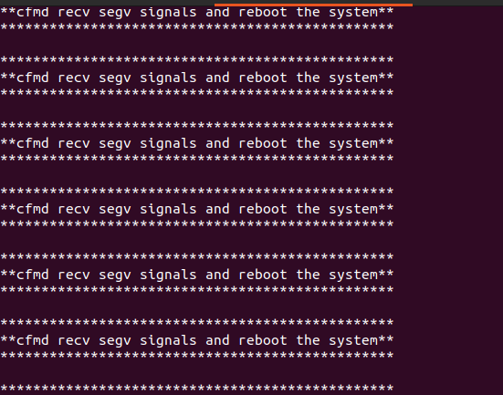

## Linux固件仿真

### QEMU

* 安装

```shell
sudo apt install qemu-system
sudo apt install qemu-user-static
```

#### qemu-user-static + binfmt_misc +chroot动态调试程序

* qemu-user-static：用户态的固件仿真，一般结合chroot使用，运行固件程序时，使用的内核是宿主机内核
* chroot：将根目录切换为指定目录，即切换要运行程序的系统环境
* binfmt_misc ： 让 Linux 内核可以根据 ELF 文件头自动选择 QEMU 来运行不同架构的二进制

```shell
sudo apt install binfmt-support

# 开启对arm的支持
sudo update-binfmts --enable qemu-arm

# 将对应架构的qemu staic复制到rootfs目录
cp `which qemu-arm-static` /home/you/rootfs/usr/bin/

# 手动挂载一些必要目录
sudo mount -t proc /proc /home/you/rootfs/proc
sudo mount -t sysfs sys /home/you/rootfs/sys
sudo mount --bind /dev /home/you/rootfs/dev
sudo mount --bind /dev/pts /home/you/rootfs/dev/pts

# /bin/sh是固件的,/usr/bin/qemu-arm-static是相对于rootfs的路径
sudo chroot /home/you/rootfs/ /usr/bin/qemu-arm-static /bin/sh
```

* 仿真和退出的脚本

```shell
#!/bin/bash
set -euo pipefail

STATE_FILE="/tmp/emulate_rootfs.last"

# ------------------------------
# Detect architecture from rootfs
# ------------------------------
detect_arch() {
    local rootfs="$1"
    if [ -z "$rootfs" ]; then
        echo "unknown"
        return 1
    fi

    local candidates=(
        "$rootfs/bin/sh"
        "$rootfs/bin/busybox"
        "$rootfs/usr/bin/busybox"
        "$rootfs/bin/bash"
        "$rootfs/sbin/init"
    )

    local found=""
    for c in "${candidates[@]}"; do
        if [ -e "$c" ]; then
            realpath=$(readlink -f "$c" 2>/dev/null || printf "%s" "$c")
            if [ -f "$realpath" ]; then
                found="$realpath"
                break
            fi
        fi
    done

    if [ -z "$found" ]; then
        found="$(find "$rootfs" -maxdepth 3 -type f -executable -print 2>/dev/null | head -n 1 || true)"
        [ -z "$found" ] && { echo "unknown"; return 1; }
    fi

    local info
    info="$(file -L "$found" 2>/dev/null || true)"
    local info_lc
    info_lc="$(printf '%s' "$info" | tr '[:upper:]' '[:lower:]')"

    if grep -q 'aarch64\|arm64' <<<"$info_lc"; then
        echo "aarch64"; return 0
    fi
    if grep -q '\barm\b\|armv' <<<"$info_lc"; then
        echo "arm"; return 0
    fi
    if grep -q 'mips' <<<"$info_lc"; then
        echo "mips"; return 0
    fi
    if grep -q 'powerpc\|ppc' <<<"$info_lc"; then
        echo "ppc"; return 0
    fi
    if grep -q 'sparc' <<<"$info_lc"; then
        echo "sparc"; return 0
    fi
    if grep -q 'intel 80386' <<<"$info_lc"; then
        echo "x86"; return 0
    fi
    if grep -q 'x86-64\|x86_64' <<<"$info_lc"; then
        echo "x86_64"; return 0
    fi

    echo "unknown"
    return 1
}

# ------------------------------
# QEMU binary mapping
# ------------------------------
get_qemu_for_arch() {
    local arch="$1"
    case "$arch" in
        arm)       echo "qemu-arm-static" ;;
        aarch64)   echo "qemu-aarch64-static" ;;
        mips)      echo "qemu-mipsel-static" ;; # 按需改成 qemu-mips-static
        ppc)       echo "qemu-ppc-static" ;;
        sparc)     echo "qemu-sparc-static" ;;
        x86|x86_64) echo "" ;;
        *)         echo "" ;;
    esac
}

# ------------------------------
# Start emulation
# ------------------------------
start_emulation() {
    local rootfs="$1"
    [ -d "$rootfs" ] || { echo "Rootfs not found: $rootfs"; exit 1; }

    echo "[*] Detecting architecture..."
    local arch
    arch=$(detect_arch "$rootfs")
    echo "    -> $arch"

    local qemu_binname
    qemu_binname=$(get_qemu_for_arch "$arch")

    if [ -n "$qemu_binname" ]; then
        local qemu_path
        qemu_path="$(command -v "$qemu_binname" 2>/dev/null || true)"
        [ -z "$qemu_path" ] && { echo "QEMU binary $qemu_binname not found. Install qemu-user-static."; exit 1; }

        mkdir -p "$rootfs/usr/bin"
        cp "$qemu_path" "$rootfs/usr/bin/"
        echo "[*] Copied $qemu_binname into $rootfs/usr/bin/"
    else
        echo "[*] No QEMU binary needed for $arch"
    fi

    # 挂载必要目录
    for d in proc sys dev dev/pts; do
        mkdir -p "$rootfs/$d"
    done

    mount -t proc /proc "$rootfs/proc"
    mount -t sysfs /sys "$rootfs/sys"
    mount --bind /dev "$rootfs/dev"
    mount --bind /dev/pts "$rootfs/dev/pts"

    echo "$rootfs" > "$STATE_FILE"
    echo "[*] Saved rootfs path to $STATE_FILE"

    echo "[*] Entering chroot..."
    if [ -n "$qemu_binname" ]; then
        chroot "$rootfs" /usr/bin/"$qemu_binname" /bin/sh
    else
        chroot "$rootfs" /bin/sh
    fi
}

# ------------------------------
# Stop emulation
# ------------------------------
stop_emulation() {
    local rootfs="${1:-}"

    if [ -z "$rootfs" ] && [ -f "$STATE_FILE" ]; then
        rootfs=$(cat "$STATE_FILE")
        echo "[*] Using saved rootfs from $STATE_FILE: $rootfs"
    fi

    if [ -z "$rootfs" ]; then
        echo "No rootfs specified and no saved state found."
        exit 1
    fi

    echo "[*] Unmounting from $rootfs"
    umount -l "$rootfs/proc" 2>/dev/null || true
    umount -l "$rootfs/sys" 2>/dev/null || true
    umount -l "$rootfs/dev/pts" 2>/dev/null || true
    umount -l "$rootfs/dev" 2>/dev/null || true

    echo "[*] Remaining QEMU processes:"
    ps aux | grep qemu | grep -v grep || true

    rm -f "$STATE_FILE"
}

# ------------------------------
# Main
# ------------------------------
if [ $# -lt 1 ]; then
    echo "Usage: $0 {start|stop} [rootfs_path]"
    exit 1
fi

cmd="$1"
rootfs="${2:-}"

case "$cmd" in
    start) 
        if [ -z "$rootfs" ]; then
            echo "Please provide rootfs path."
            exit 1
        fi
        start_emulation "$rootfs"
        ;;
    stop)  
        stop_emulation "$rootfs"
        ;;
    *) 
        echo "Unknown command: $cmd"
        exit 1 
        ;;
esac

```

##### 移植gdb到仿真目录下

##### 安装包管理器

```shell
# 1. 安装 Entware
wget -O - http://bin.entware.net/{对应架构}/installer/generic.sh | sh

# 2. 配置环境变量
export PATH=/opt/bin:/opt/sbin:$PATH

# 3. 安装 gcc
opkg install gcc gdb
```

##### 下载静态二进制文件

##### 交叉编译

### qemu -L +  GDB-Multiarch

* chroot的方式比较麻烦，只需要调试单个较为轻量级的程序时，可以考虑使用该方法

```shell
sudo apt install qemu-arm

# logsrv会自动到-L指定目录下的lib /usr/lib寻找动态链接库
qemu-arm -g 1234 -L /home/kali/firmware/GDS3710/rootfs/ ./logsrv

# gdb-multiarch支持多架构的调试
sudo apt install gdb-multiarch

gdb-multiarch ./logsrv
# 在 GDB 内部执行：
(gdb) set architecture arm          # 设置架构为 ARM
(gdb) target remote localhost:1234  # 连接 QEMU
(gdb) i r                           # 查看寄存器（注意 r11 是 ARM 的 fp，sp 是栈指针）
```

* 相对于rootfs的仿真方式，这里只需要可执行程序和lib就可以仿真，因此难免缺失运行所需的其他内容，可以通过以下方式寻找原因
  * gdb调试细节
  * qemu-arm -strace -L /home/kali/firmware/GDS3710/rootfs ./logsrv 通过-strace追踪调用

### 系统级仿真

* 仿真Tenda AC6 V15.03.05.16固件

```shell
# Linux 内核镜像
wget https://people.debian.org/~aurel32/qemu/armhf/debian_wheezy_armhf_standard.qcow2 
# 临时根文件系统
wget https://people.debian.org/~aurel32/qemu/armhf/initrd.img-3.2.0-4-vexpress 
# 主文件系统镜像
wget https://people.debian.org/~aurel32/qemu/armhf/vmlinuz-3.2.0-4-vexpress
```

```shell
# 设置qemu网络
sudo ip tuntap add dev tap0 mode tap
sudo ip link set tap0 up
sudo sysctl -w net.ipv4.ip_forward=1
sudo iptables -F
sudo iptables -X
sudo iptables -t nat -F
sudo iptables -t nat -X
sudo iptables -t mangle -F
sudo iptables -t mangle -X
sudo iptables -P INPUT ACCEPT
sudo iptables -P FORWARD ACCEPT
sudo iptables -P OUTPUT ACCEPT
sudo iptables -t nat -A POSTROUTING -o ens33 -j MASQUERADE
sudo iptables -I FORWARD 1 -i tap0 -j ACCEPT
sudo iptables -I FORWARD 1 -o tap0 -m state --state RELATED,ESTABLISHED -j ACCEPT
sudo ifconfig tap0 192.168.100.1 netmask 255.255.255.0
```

```shell
# 调整镜像大小
qemu-img resize debian_wheezy_armhf_standard.qcow2 32G
# 启动qemu虚拟机
sudo qemu-system-arm -M vexpress-a9 -kernel vmlinuz-3.2.0-4-vexpress -initrd initrd.img-3.2.0-4-vexpress 
-drive if=sd,file=debian_wheezy_armhf_standard.qcow2 
-append "root=/dev/mmcblk0p2 console=ttyAMA0" 
-net nic -net tap,ifname=tap0,script=no,downscript=no -nographic
```

```shell
# 配置虚拟机网络
ifconfig eth0 192.168.100.2 netmask 255.255.255.0
 
route add default gw 192.168.100.1
```

```shell
# 文件传输
binwalk -e gj.bin

tar -czvf squashfs-root.tar squashfs-root

# 宿主机起http.server
python3 -m http.server

# qemu下载压缩包
wget http://192.168.100.1:8000/squashfs-root.tar

mv ./squashfs-root.tar /root/

cd root/
 
tar -xzvf squashfs-root.tar
```

```shell
# 新建网卡
ip link add name br0 type bridge
 
ip link set dev br0 up
 
ip addr add 192.168.100.2/24 dev br0
```

```shell
chroot ./squashfs-root sh
 
cp -rf webroot_ro/* webroot/
 
./bin/httpd
```

* 环境补齐，目前只是在arm虚拟机上chroot了固件，而没有真的从固件的Bootloader 启动，初始化操作没有进行

```shell
# 初始化操作
cat /etc_ro/inittab
cat /etc_ro/init.d/rcS

# 跟随初始化脚本进行操作，还要额外进行一些目录挂在操作，但是核心的cfmd起不来，导致httpd还是起不来
```



### FirmAE 

* 端口转发

```shell
#!/bin/bash

# ========================================
# ip.sh - 通用端口映射脚本（FirmAE 仿真机）
# 作者: 你懂的
# 用法: sudo ./ip.sh tcp 10080 80 udp 10088 88 tcp 10089 89
# ========================================

set -e

# 固定参数
TARGET_IP="192.168.0.1"          # 仿真机 IP
HOST_IP="192.168.108.21"         # Ubuntu 外网 IP（ens33）
IF_IN="ens33"                    # 外网接口
IF_OUT="tap2_0.1"                # 连接仿真机的接口
VLAN_IF="tap2_0"                 # 父接口（确保 UP）

# 检查是否 root
if [[ $EUID -ne 0 ]]; then
   echo "错误: 请使用 sudo 运行此脚本"
   exit 1
fi

# 开启 IP forward
enable_ip_forward() {
    echo 1 > /proc/sys/net/ipv4/ip_forward
    sysctl -w net.ipv4.ip_forward=1 >/dev/null
}

# 清理旧规则（防止重复）
cleanup_old_rules() {
    echo "[*] 正在清理旧的映射规则..."

    # PREROUTING: 外部 → 本机端口
    iptables -t nat -D PREROUTING -p tcp -m tcp --dport 10080 -j DNAT --to-destination "$TARGET_IP:80" 2>/dev/null || true
    iptables -t nat -D PREROUTING -p udp -m udp --dport 10088 -j DNAT --to-destination "$TARGET_IP:88" 2>/dev/null || true
    iptables -t nat -D PREROUTING -p tcp -m tcp --dport 10089 -j DNAT --to-destination "$TARGET_IP:89" 2>/dev/null || true

    # POSTROUTING: 回包 MASQUERADE
    iptables -t nat -D POSTROUTING -d "$TARGET_IP/32" -j MASQUERADE 2>/dev/null || true

    # FORWARD 链
    while iptables -D FORWARD -i "$IF_IN" -o "$IF_OUT" -d "$TARGET_IP" -j ACCEPT 2>/dev/null; do :; done
    while iptables -D FORWARD -i "$IF_OUT" -o "$IF_IN" -s "$TARGET_IP" -j ACCEPT 2>/dev/null; do :; done

    # OUTPUT 链（本机访问）
    iptables -t nat -D OUTPUT -p tcp -d "$HOST_IP" --dport 10080 -j DNAT --to-destination "$TARGET_IP:80" 2>/dev/null || true
    iptables -t nat -D OUTPUT -p udp -d "$HOST_IP" --dport 10088 -j DNAT --to-destination "$TARGET_IP:88" 2>/dev/null || true
    iptables -t nat -D OUTPUT -p tcp -d "$HOST_IP" --dport 10089 -j DNAT --to-destination "$TARGET_IP:89" 2>/dev/null || true

    # 清理 DOCKER-USER 干扰
    iptables -D DOCKER-USER -j RETURN 2>/dev/null || true
}

# 添加新映射规则
add_port_mapping() {
    local proto="$1"
    local host_port="$2"
    local target_port="$3"

    echo "[+] 添加映射: $proto://$HOST_IP:$host_port → $TARGET_IP:$target_port"

    # 1. PREROUTING: 外部访问本机端口 → 转发到仿真机
    iptables -t nat -A PREROUTING -i "$IF_IN" -p "$proto" -m "$proto" --dport "$host_port" \
             -j DNAT --to-destination "$TARGET_IP:$target_port"

    # 2. OUTPUT: 本机访问自己（127.0.0.1 或 $HOST_IP）也能走映射
    iptables -t nat -A OUTPUT -p "$proto" -d "$HOST_IP" --dport "$host_port" \
             -j DNAT --to-destination "$TARGET_IP:$target_port"

    # 3. FORWARD: 允许双向流量
    iptables -A FORWARD -i "$IF_IN" -o "$IF_OUT" -d "$TARGET_IP" -p "$proto" --dport "$target_port" -j ACCEPT
    iptables -A FORWARD -i "$IF_OUT" -o "$IF_IN" -s "$TARGET_IP" -p "$proto" --sport "$target_port" -j ACCEPT
}

# 主逻辑
main() {
    if [[ $# -eq 0 || $(( $# % 3 )) -ne 0 ]]; then
        echo "用法: $0 [proto host_port target_port] ..."
        echo "示例: $0 tcp 10080 80 udp 10088 88 tcp 10089 89"
        exit 1
    fi

    enable_ip_forward
    cleanup_old_rules

    # 插入 DOCKER-USER RETURN（防止 Docker 干扰）
    iptables -I DOCKER-USER -j RETURN 2>/dev/null || true

    # 全局 MASQUERADE：回包源地址改为 Ubuntu 外网 IP
    iptables -t nat -A POSTROUTING -d "$TARGET_IP/32" -j MASQUERADE

    # 解析参数
    while [[ $# -ge 3 ]]; do
        proto="$1"
        host_port="$2"
        target_port="$3"

        case "$proto" in
            tcp|udp) ;;
            *) echo "错误: 协议必须是 tcp 或 udp"; exit 1 ;;
        esac

        [[ "$host_port" =~ ^[0-9]+$ ]] || { echo "错误: 本机端口必须是数字"; exit 1; }
        [[ "$target_port" =~ ^[0-9]+$ ]] || { echo "错误: 目标端口必须是数字"; exit 1; }

        add_port_mapping "$proto" "$host_port" "$target_port"
        shift 3
    done

    # 放通 FORWARD（生产建议只 ACCEPT 必要流量，这里为方便）
    iptables -P FORWARD ACCEPT

    echo
    echo "映射完成！"
    echo "   Windows 访问: http://$HOST_IP:10080  →  固件 Web"
    echo "   UDP 测试: nc -u $HOST_IP 10088"
    echo
    echo "验证本机直连是否正常："
    echo "   curl http://$TARGET_IP"
    echo "   curl http://127.0.0.1:10080"
}

# 执行
main "$@"
```

* 结束仿真

### FirmAFL

### FirmFuzz 

### EMUX 

## RTOS固件仿真


## 环境补齐

### 移植辅助程序

### 更换shell环境

## 仿真失败

### 用户态

* 依赖其他程序的运行

### 系统态

