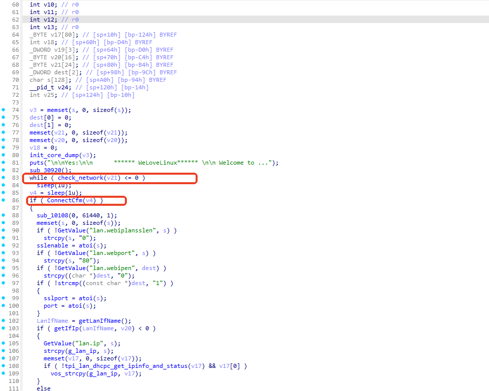
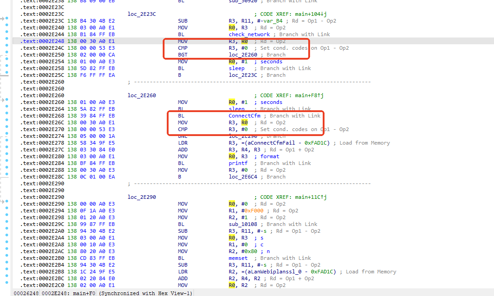
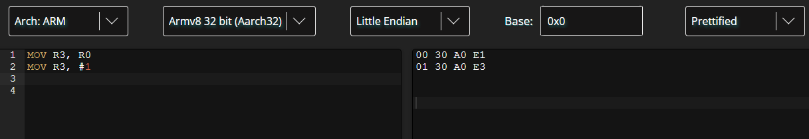
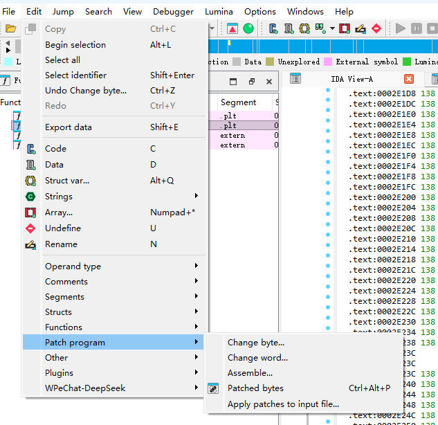
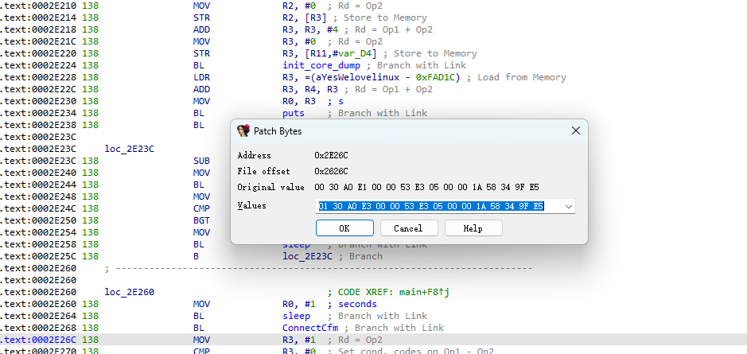
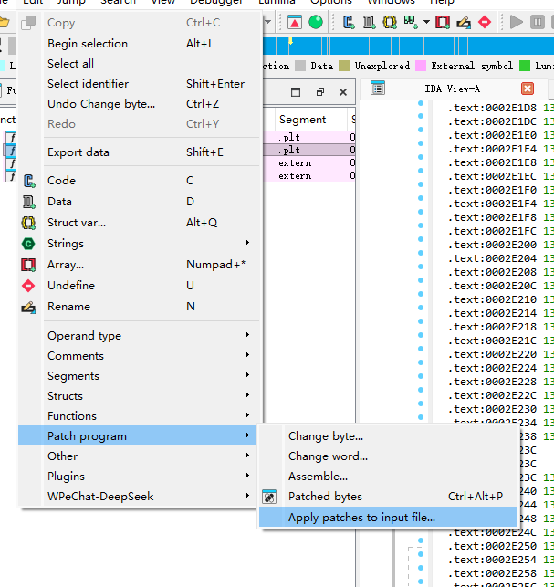

### patch

https://disasm.will.gl/

#### hexedit

```txt
<,> : 转到文件的开头/结尾
Right: 下一个字符
Left: 前一个字符
Down: 下一行
Up: 前一行
Home: 行的第一个字符
End: 行的最后一个字符
PUp: 向上翻页
PDown: 向下翻页


F2: 保存
F3: 打开其他文件
F1: 帮助
Ctrl-L: redraw
Ctrl-Z: 暂时停办（推出后使用fg回来，使用jobs 查看 停办的任务）
Ctrl-X:保存并推出
Ctrl-C: 退出不保存
Tab: hex和ascii之间切换
Return: 跳到指定地址（不区分大小写）
Backspace: 撤消前一个修改的字符
Ctrl-U: 撤销所有的修改
Ctrl-S: 向前搜索 16进制值
Ctrl-R: 向后搜索 16进制值


Ctrl-Space: set mark
Esc-W: copy
Ctrl-Y: paste
Esc-Y: paste into a file
Esc-I: fill
```

#### ida

patch tenda路由器的httpd程序，需要跳过while和保证if为真



在汇编代码中定位到关键代码



需要将两个`MOV R3, R0`都改成`MOV R3, #1`以控制函数返回值导致if永真









### **LD_PRELOAD **