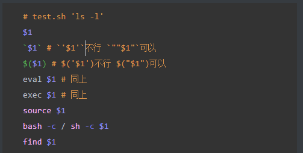

### 常用命令

```shell
grep -rl "" /

# 每个文件执行一次命令
find . -name "*.txt" -exec cat {} \;
# 所有文件作为参数一次传入
find . -name "*.txt" -exec cat {} +
```


### 常用脚本

#### iptables端口转发

```shell
# 查看 PREROUTING 链（修改目的地址/端口的规则）
sudo iptables -t nat -L PREROUTING -v -n
# 查看FORWARD链
sudo iptables -L FORWARD -v -n
# 查看 POSTROUTING 链（修改源地址的规则，通常用于 SNAT/MASQUERADE）
sudo iptables -t nat -L POSTROUTING -v -n


# 列出行号
sudo iptables -L FORWARD --line-numbers
sudo iptables -t nat -L PREROUTING --line-numbers
sudo iptables -t nat -L POSTROUTING --line-numbers

# 删除第2条规则
sudo iptables -D FORWARD 3
sudo iptables -t nat -D PREROUTING 2
sudo iptables -t nat -D POSTROUTING 2
```

```shell
# 1. 开启 IP forward
echo 1 > /proc/sys/net/ipv4/ip_forward
sysctl -w net.ipv4.ip_forward=1

# 2. 先清掉所有你加的错误规则（防止重复）
iptables -t nat -D PREROUTING -p tcp --dport 10080 -j DNAT --to-destination 192.168.0.1:80 2>/dev/null
iptables -t nat -D POSTROUTING -p tcp -d 192.168.0.1 --dport 80 -j SNAT --to-source 192.168.108.21:10080 2>/dev/null
iptables -D FORWARD -i ens33 -o tap2_0.1 -p tcp --dport 80 -d 192.168.0.1 -j ACCEPT 2>/dev/null
iptables -D FORWARD -i tap2_0.1 -o ens33 -p tcp --sport 80 -s 192.168.0.1 -j ACCEPT 2>/dev/null

# 3. 正确的 NAT + FORWARD
# 3.1 外部进来的 10080 → 仿真机 80
iptables -t nat -A PREROUTING -p tcp -m tcp --dport 10080 \
         -j DNAT --to-destination 192.168.0.1:80

# 3.2 回包：把仿真机的源地址改成 Ubuntu 的外网 IP（MASQUERADE 自动处理端口）
iptables -t nat -A POSTROUTING -d 192.168.0.1/32 -p tcp --dport 80 \
         -j MASQUERADE

# 3.3 FORWARD 允许双向
iptables -A FORWARD -i ens33 -o tap2_0.1 -d 192.168.0.1 -p tcp --dport 80 -j ACCEPT
iptables -A FORWARD -i tap2_0.1 -o ens33 -s 192.168.0.1 -p tcp --sport 80 -j ACCEPT

# 3.4 （可选）让本机自己也能通过 10080 访问仿真机
iptables -t nat -A OUTPUT -p tcp -d 192.168.108.21 --dport 10080 \
         -j DNAT --to-destination 192.168.0.1:80

# 4. 确保 FORWARD 链默认 ACCEPT（或者至少不 DROP 需要的流量）
iptables -P FORWARD ACCEPT   # 生产环境建议只 ACCEPT 需要的，测试时先放开
```

#### 进程监控

```shell
# 需要使用tee
while true; do ts=$(date '+%Y-%m-%d %H:%M:%S');ps www | sed "s/^/$ts | /" | grep -E 'ldalda|ldalda`|ldalda\$|ldalda&|ldalda\|(sh -c)' | grep -Ev '(grep -E)|gs_keepalived_fifo|(sed s/\^/)' | tee -a /tmp/pid.txt; done

 while true; do ts=$(date '+%Y-%m-%d %H:%M:%S');ps www | sed "s/^/$ts | /" | grep -E 'ldalda|ldalda`|ldalda\$|ldalda&|ldalda\|(sh -c)|/tmp/' | grep -Ev '(grep -E)|gs_keepalived_fi
fo|(/tmp/pid.log)' | awk '{print; print >> "/tmp/pid.log"}'; done
```

#### 脚本审计

* 查找所有shell脚本

```shell
#!/bin/sh
# find_sh_scripts.sh
# 用法: /bin/sh find_sh_scripts.sh [输出文件]
# 默认输出文件为 ./sh_scripts.txt

OUT="${1:-./sh_scripts.txt}"

# 创建临时文件
TMP="$(mktemp /tmp/shlist.XXXXXX)" || { echo "mktemp failed"; exit 1; }

# 要排除的顶级路径（以避免进入虚拟/伪文件系统）
EXCLUDE='
/proc
/sys
/dev
'

# helper: build -path … -o -path …  (注意：此段在 /bin/sh 中拼接为一行)
PRUNE_EXPR=""
for p in $EXCLUDE; do
  [ -z "$p" ] && continue
  if [ -z "$PRUNE_EXPR" ]; then
    PRUNE_EXPR="-path $p"
  else
    PRUNE_EXPR="$PRUNE_EXPR -o -path $p"
  fi
done

# 1) 找 *.sh 文件
# 2) 找第一行 shebang 中包含 "sh" 的文件（比如 #!/bin/sh, #!/usr/bin/env bash 也会匹配到）
# 将结果写入临时文件，忽略错误输出（权限等）
# 使用 -prune 来跳过排除路径
# 注意：find 的语法使用 -prune -o 来组合条件
sh -c '
find / \
  \( '"$PRUNE_EXPR"' \) -prune -o -type f -name "*.sh" -print 2>/dev/null >> "'"$TMP"'" \
  || true

find / \
  \( '"$PRUNE_EXPR"' \) -prune -o -type f -exec sh -c '\''head -n 1 "$1" 2>/dev/null | grep -q "^#\\!.*sh" && printf "%s\n" "$1"'\'' sh {} \; 2>/dev/null >> "'"$TMP"'" \
  || true
' || true

# 去重并写入目标文件（保持排序，便于查看）
sort -u "$TMP" > "$OUT" 2>/dev/null || { cat "$TMP" > "$OUT"; }

# 整理权限并清理临时文件
chmod 644 "$OUT" 2>/dev/null || true
rm -f "$TMP"

echo "完成：已把结果写入 $OUT"

```

* 审计指定文件是否包含敏感调用

```shell
#!/bin/sh
# checkSh.sh - 从列表扫描 shell 脚本中的不安全操作（兼容无 mktemp 的系统）
# 用法: ./checkSh.sh -s /path/to/script.sh
#       ./checkSh.sh -L /path/to/list.txt

usage() {
  echo "Usage: $0 -s <script-file> | -L <list-file>"
  exit 1
}

[ "$#" -ge 2 ] || usage

MODE=
TARGET=
while [ "$#" -gt 0 ]; do
  case "$1" in
    -s) MODE=single; TARGET="$2"; shift 2;;
    -L) MODE=list; TARGET="$2"; shift 2;;
    *) usage;;
  esac
done

[ -n "$MODE" ] || usage
[ -n "$TARGET" ] || usage

# 生成安全的临时文件名（不依赖 mktemp）
TS=$(date +%s 2>/dev/null || printf '%s' "$$")
PID=$$
TMPSFX="${PID}_${TS}"
TMP_PAT="/tmp/checksh_patterns_${TMPSFX}.tmp"
TMP_LIST="/tmp/checksh_files_${TMPSFX}.tmp"

# 确保临时目录可写
if [ ! -d /tmp ]; then
  echo "/tmp not found or not a directory"
  exit 1
fi

# 在退出时清理临时文件
cleanup() {
  rm -f "$TMP_PAT" "$TMP_LIST"
}
trap 'cleanup' EXIT INT TERM

# 写入规则（pattern<TAB>LABEL）
cat > "$TMP_PAT" <<'EOF'
(^|[[:space:]])export[[:space:]]+[A-Za-z_][A-Za-z0-9_]*=.*\$	EXPORT_DYNAMIC_ASSIGNMENT
(^|[[:space:]])(env|export)[[:space:]]+[A-Za-z_][A-Za-z0-9_]*=.*(\$\([^)]+\)|`[^`]+`)  EXPORT_CMD_SUBST
(^|[[:space:]])IFS=[^[:space:]]*	IFS_ASSIGNMENT
(^|[[:space:]])eval[[:space:]]+	USE_OF_EVAL
(^|[[:space:]])exec[[:space:]]+\$	EXEC_DYNAMIC
\b(bash|sh)[[:space:]]+-c[[:space:]]+(\$|\"?\$)	SH_BASH_C_DYNAMIC
(^|[[:space:]])(source|\.)[[:space:]]+\$	SOURCE_DYNAMIC
(^|[[:space:]])\./\$	RELATIVE_SCRIPT_EXEC
\b(find|tar|cat|rsync|wget|curl|scp|ssh|rm|dd|cp|mv|gzip|gunzip|awk|sed)[[:space:]].*\$	COMMAND_WITH_POS_PARAM
\$\([^)]+\)	COMMAND_SUBSTITUTION
`[^`]*\$[^`]*`	BACKTICK_WITH_VAR
(^|[[:space:]])[^\"]\$[A-Za-z_][A-Za-z0-9_]*([[:space:]]|$)	UNQUOTED_VAR_USAGE
\b(curl|wget)[^|]*\|[[:space:]]*(sh|bash)\b	DOWNLOAD_PIPE_TO_SHELL
(^|[[:space:]])sudo[[:space:]]+\$	SUDO_DYNAMIC
(^|[[:space:]])chmod[[:space:]]+777\b	CHMOD_WORLD_WRITABLE
(^|[[:space:]])chown[[:space:]]+[^[:space:]]*:[^[:space:]]*\$	CHOWN_DYNAMIC
EOF

# helper: 扫描单个文件
scan_file() {
  file="$1"
  [ -z "$file" ] && return
  [ ! -f "$file" ] && return
  [ ! -r "$file" ] && return

  # 对每条规则运行 grep
  while IFS= read -r patline || [ -n "$patline" ]; do
    # 使用 awk 拆分 pattern 和 label（脚本中已假定 awk 可用）
    pattern=$(printf '%s\n' "$patline" | awk -F '\t' '{print $1}')
    label=$(printf '%s\n' "$patline" | awk -F '\t' '{print $2}')
    [ -z "$pattern" ] && continue

    # grep 并输出 file:lineno:LABEL:snippet
    grep -nE "$pattern" "$file" 2>/dev/null | while IFS= read -r match; do
      lineno=$(printf '%s\n' "$match" | sed -n 's/:.*//p')
      snippet=$(printf '%s\n' "$match" | sed -n 's/^[0-9]*://p' | sed 's/^[[:space:]]*//;s/[[:space:]]*$//')
      printf '%s:%s:%s:%s\n' "$file" "$lineno" "$label" "$snippet"
    done
  done < "$TMP_PAT"
}

# 读取 list 或单文件，写入临时文件 TMP_LIST 以便统一处理（避免空行/注释问题）
if [ "$MODE" = "single" ]; then
  printf '%s\n' "$TARGET" > "$TMP_LIST"
else
  # 去掉空行与注释
  awk 'NF && $0 !~ /^#/ { print }' "$TARGET" > "$TMP_LIST" 2>/dev/null || {
    echo "Cannot read list file: $TARGET"
    exit 1
  }
fi

# 遍历 TMP_LIST
while IFS= read -r f || [ -n "$f" ]; do
  # trim 空白
  f=$(printf '%s' "$f" | sed 's/^[[:space:]]*//;s/[[:space:]]*$//')
  [ -z "$f" ] && continue
  scan_file "$f"
done < "$TMP_LIST"

# cleanup 由 trap 完成
exit 0

```


### shell安全

#### 环境变量操控

```shell
#!/bin/sh

# 没有使用命令的完整路径
ls /tmp
```

```shell
# 若攻击者可以操控环境变量
# 由于恶意二进制文件的路径位于搜索路径中的第一个，因此会执行恶意命令而不是实际命令
export PATH=/path/to/malicious/binary:$PATH
/path/to/above/script
```

* 缓解：使用命令的绝对路径

#### 注入攻击

* 直接注入



* 二次注入

```shell
# 写入另一个脚本

echo $1>a.sh
```


### 工具

[UOTAN Shell脚本安全检测工具](https://shell.uotan.cn/#rules)