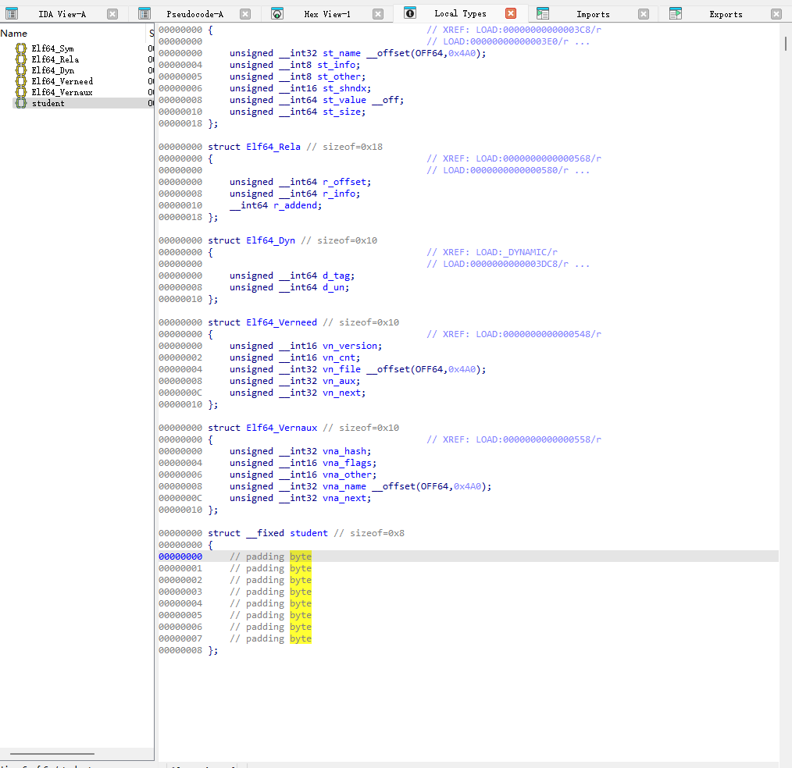
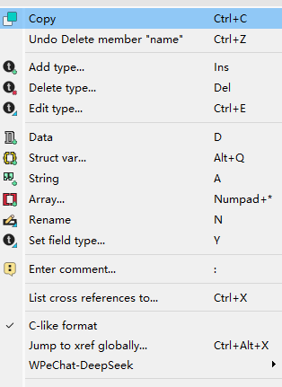
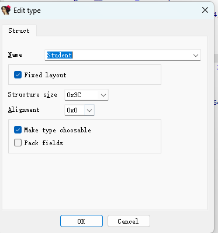
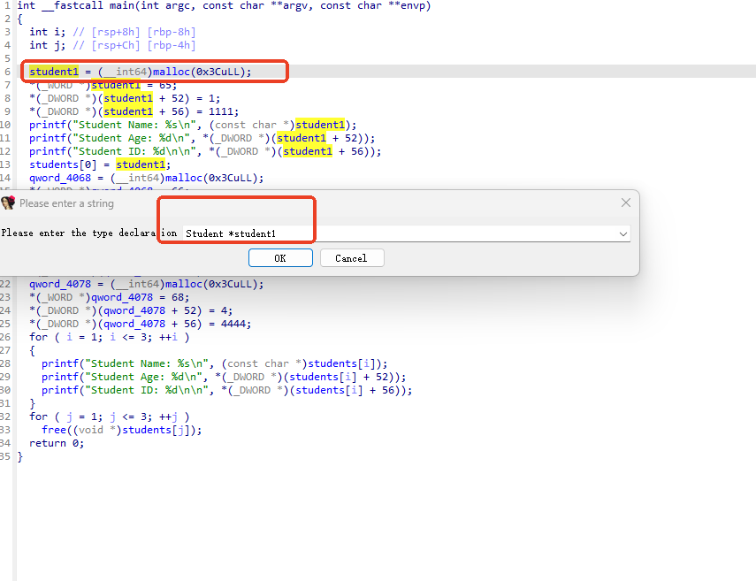

### 插件

* 漏洞挖掘
  * [Accenture/VulFi: IDA Pro plugin for query based searching within the binary useful mainly for vulnerability research.](https://github.com/Accenture/VulFi)
* ai
  * [WPeace-HcH/WPeChatGPT: A plugin for IDA that can help to analyze binary file, it can be based on commonly used AI big models such as OpenAI and DeepSeek.](https://github.com/WPeace-HcH/WPeChatGPT)

### 代码修复

#### 还原结构体

* 定位如下窗口



* `insert`或者右键创建结构体，设置结构体，要预先确定大小





```assembly
00000000 ; Ins/Del : create/delete structure
00000000 ; D/A/*   : create structure member (data/ascii/array)
00000000 ; N       : rename structure or structure member
00000000 ; U       : delete structure member
```

* 找到需要还原结构体的代码，`Set item type`设置为对应类型

