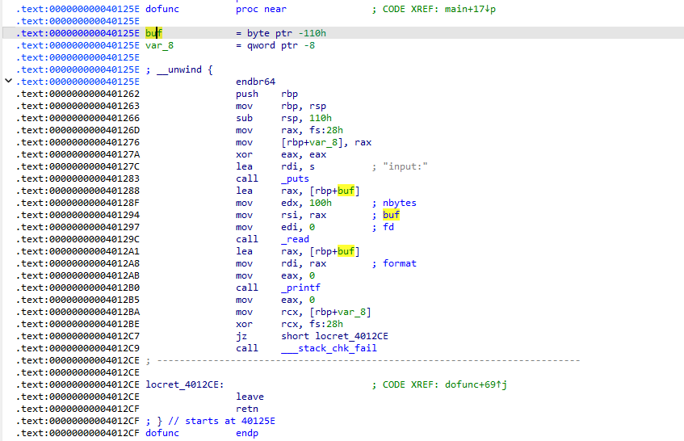
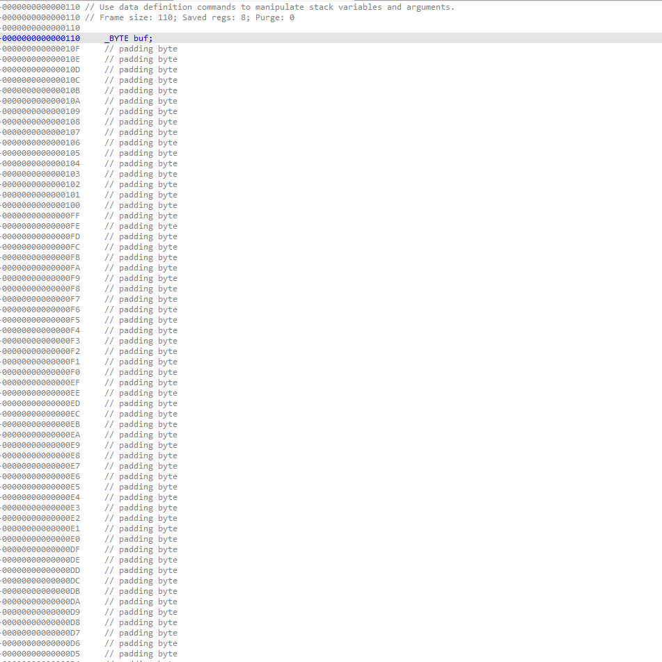
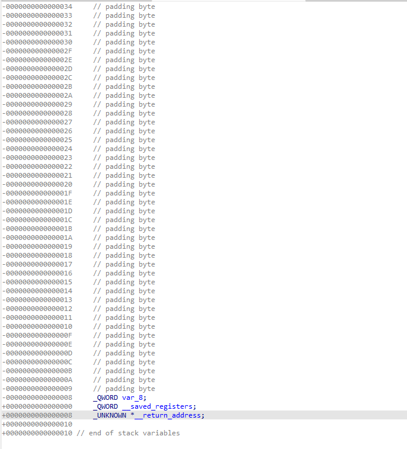
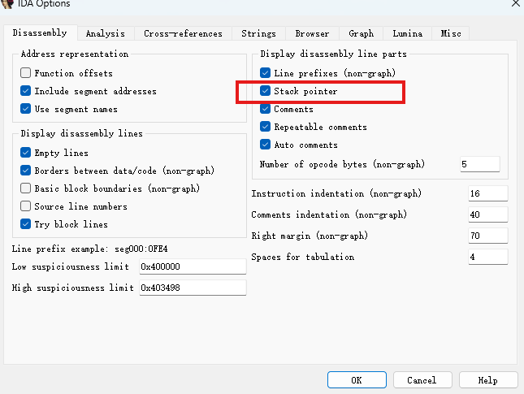
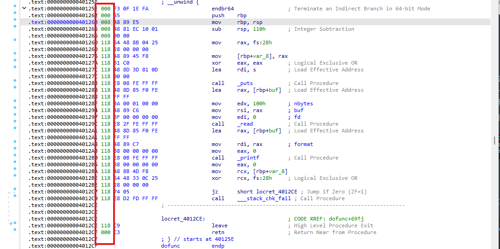
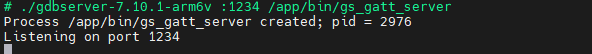
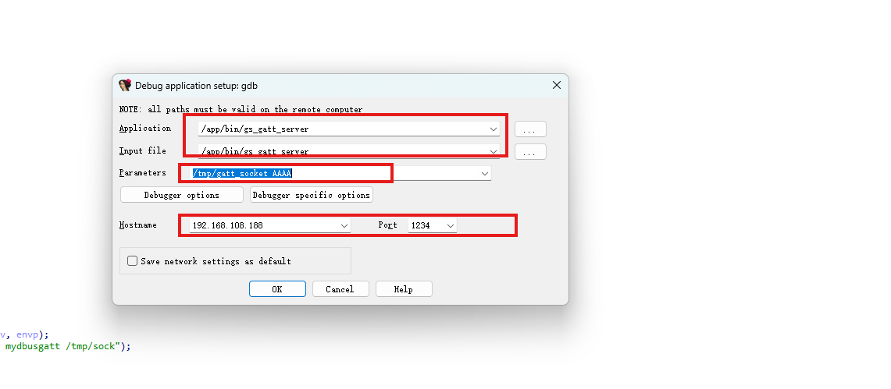
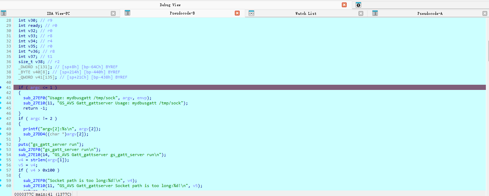
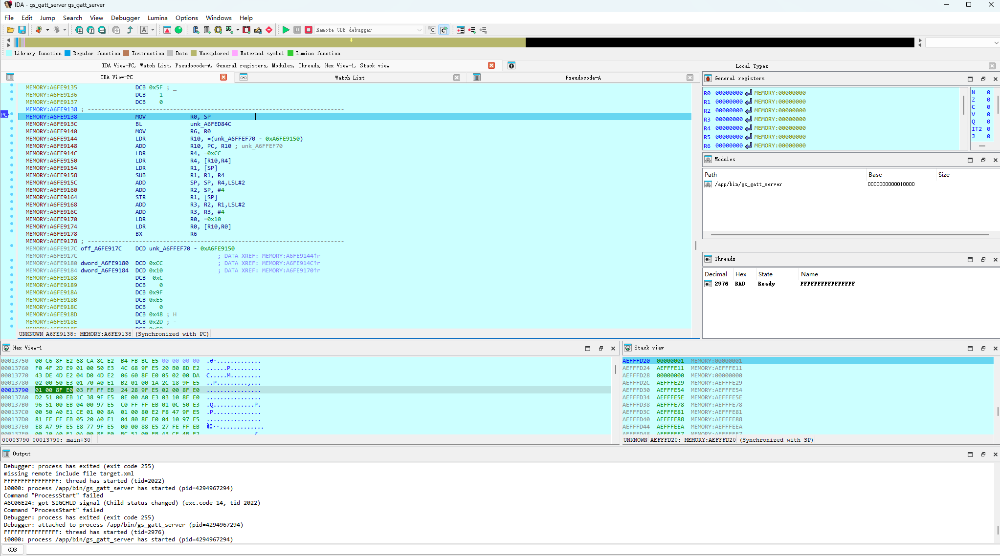
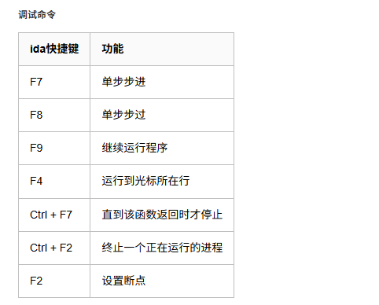

### 插件

* 漏洞挖掘 VulFI
  * [Accenture/VulFi: IDA Pro plugin for query based searching within the binary useful mainly for vulnerability research.](https://github.com/Accenture/VulFi)
* ai
  * [WPeace-HcH/WPeChatGPT: A plugin for IDA that can help to analyze binary file, it can be based on commonly used AI big models such as OpenAI and DeepSeek.](https://github.com/WPeace-HcH/WPeChatGPT)

* 导出代码

```python
import idaapi
import idautils
import idc
import ida_hexrays
import os

def export_all_decompiled_functions(output_dir="/tmp"):
    if not ida_hexrays.init_hexrays_plugin():
        idaapi.msg("Hex-Rays decompiler is not available.\n")
        return

    if not os.path.exists(output_dir):
        try:
            os.makedirs(output_dir)
        except OSError as e:
            idaapi.msg(f"Failed to create directory {output_dir}: {e}\n")
            return

    idaapi.msg(f"Exporting decompiled functions to {output_dir}\n")

    for func_ea in idautils.Functions():
        func_name = idc.get_func_name(func_ea)
        if not func_name:
            continue

        try:
            cfunc = ida_hexrays.decompile(func_ea)
            decompiled_code = str(cfunc)
        except ida_hexrays.DecompilationFailure:
            idaapi.msg(f"Failed to decompile function {func_name}\n")
            continue

        sanitized_name = "".join(
            c if c.isalnum() or c in "_-." else "_" for c in func_name
        )
        output_file = os.path.join(output_dir, f"{sanitized_name}.c")

        try:
            with open(output_file, "w", encoding="utf-8") as f:
                f.write(decompiled_code)
            idaapi.msg(f"Decompiled {func_name} to {output_file}\n")
        except IOError as e:
            idaapi.msg(f"Failed to write file {output_file}: {e}\n")

if __name__ == "__main__":
    # 运行脚本时自动调用
    export_all_decompiled_functions(output_dir="D:/tmp/IPPBX-1.0.27.42.c")
```


### 代码修复

#### 还原数组

#### 还原结构体

* 定位如下窗口


* `insert`或者右键创建结构体，设置结构体，要预先确定大小


```assembly
00000000 ; Ins/Del : create/delete structure
00000000 ; D/A/*   : create structure member (data/ascii/array)
00000000 ; N       : rename structure or structure member
00000000 ; U       : delete structure member
```

* 找到需要还原结构体的代码，`Set item type`设置为对应类型


### 信息查看

#### 栈的查看

**栈空间的变量**

点击变量，即可进入IDA模拟的函数栈空间







**栈随指令的变化**





### IDA远程调试设备程序

1. 将调试服务端上传到设备，这里的服务端可以是IDA dbgsrv目录下的相应程序（动态链接，一般不适用我们的设备），或者直接上传一个gdbserver（[hugsy/gdb-static: Public repository of statically compiled GDB and GDBServer](https://github.com/hugsy/gdb-static) 这里有编译好的静态链接gdbserver）
2. 以gdbserver为例，运行并监听在某个端口



3. 设置ida

用gdbserver选择Remote GDB debugger，用ida的程序选Remote Linux debugger

```txt
Debugger -> Select debugger -> Remote GDB/Linux debugger
Debugger -> Process options -> 运行程序和hostname:port
```

这里要配置程序在设备上的路径和参数，还有设备的ip和监听端口



4. 可以在调试前先打断点，运行到断点后f5，即可调试反汇编代码



5. 进入新窗口开始调试



