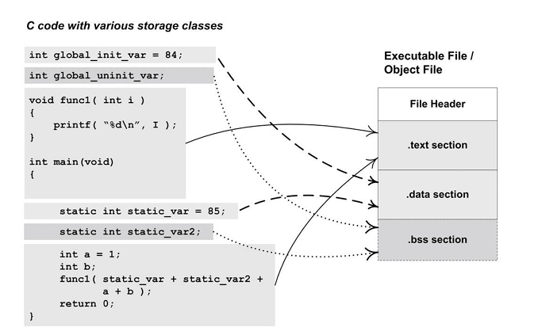

#### 3.1 目标文件格式

* PE（Portable Executable）和ELF（Executable Linkable Format）都是COFF（Common file format）的变种 
* 目标文件：windows .obj   linux .o

#### 3.2 目标文件内容

* 目标文件包含：机器指令代码 符号表 调试信息 字符串

* File Header：描述文件属性，它描述了整个⽂件的⽂件属性， 包括⽂件是否可执⾏、是静态链接还是动态链接及⼊⼝地址（如果是 可执⾏⽂件）、⽬标硬件、⽬标操作系统等信息，⽂件头还包括⼀个 段表（ Section Table ），段表其实是⼀个描述⽂件中各个段的数组。 段表描述了⽂件中各个段在⽂件中的偏移位置及段的属性等，从段表 ⾥⾯可以得到每个段的所有信息。
* 代码段：.text .code
* 未初始化的全局变量和静态局部变量：.bss
* 全局变量、局部静态变量：数据段：.data
* 分段有很多好处
  * .text可读 .data可读写，增加安全性
  * 提升CPU缓冲命中
  * .text 共享空间节约内存
* 常用段名

#### 3.5 链接的接⼝ —— 符号

* 定义在本⽬标⽂件的全局符号，可以被其他⽬标⽂件引⽤
* 段名，这种符号往往由编译器产⽣，它的值就是该段的起始地址。
* 局部符号，这类符号只在编译单元内部可⻅。调试器可以使⽤这些符号来分析程 序或崩溃时的核⼼转储⽂件。这些局部符号对于链接过程没有作⽤， 链接器往往也忽略它们。
* ⾏号信息，即⽬标⽂件指令与源代码中代码⾏的对应关系，它也是可选的。